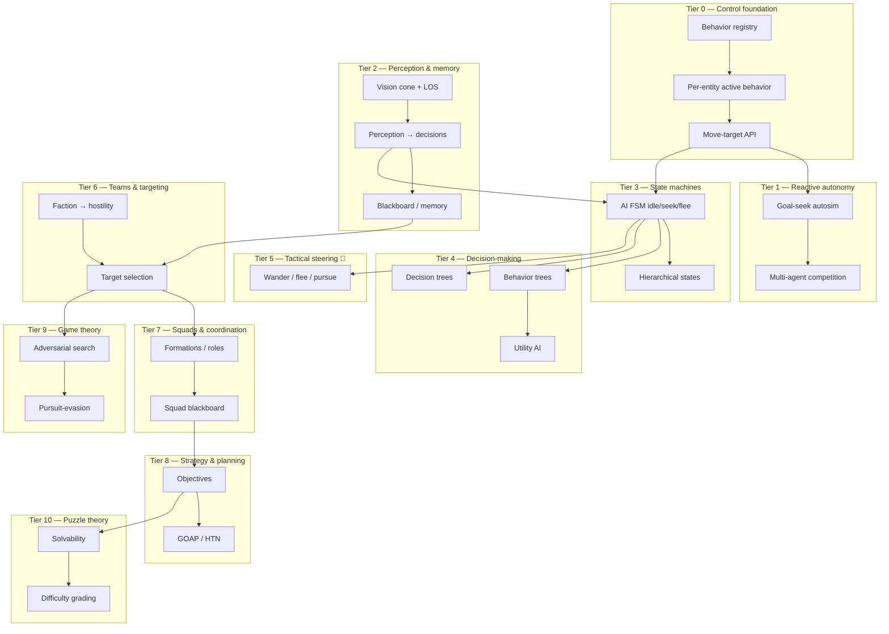

# AI engine — research tree

Progress tracker for agent intelligence: control foundations → reactive autonomy → perception → state machines → decision-making → tactics → teams/squads → strategy → game theory → puzzle theory. Read top-to-bottom like a tech tree: later tiers assume earlier ones. Percentages are **honest engineering completion** (wired and driving behavior) — not "a field exists in a struct."

**Legend:** ✅ shipped · 🟡 partial / scaffolding · ⬜ not started · 🔜 planned (`Plans/plan.md`) · 🔗 cross-doc dependency

**Overall engine maturity:** ~**30%** of a full game-AI stack. Still the **youngest** subsystem, but more capable than a first glance suggests: the snake runs a real **perception-gated intent FSM** (`seek` ↔ `explore`), backed by a **spatial working memory** (recency-ranked LRU of seen cells) that both **steers frontier exploration** *and* **biases A\* path cost** away from recently-seen cells (stigmergic anti-backtracking). What's still absent is the *breadth*: behavior trees, utility scoring, multi-state FSMs, flee/pursue, squads, strategy, game theory, and puzzle solvability. So the decision *loop* exists and is genuinely sophisticated for one agent; the decision *library* does not.

> **Honest framing:** the engine has strong *movement intelligence* (`pathfinding.md`) and now a real but **narrow** *decision intelligence* — one agent (snake) perceives, remembers, and chooses seek-vs-explore. The roadmap from here is **generalizing and broadening** that loop (more states, scoring, more agent types), not building it from nothing.

> **Audit correction (PR2):** an earlier draft of this doc rated AI ~18% and called perception "inert" with "no FSM/memory." That was wrong — `Libraries/AI/brain/` (spatial memory + nav step penalty) and the `snakeAutosim` intent FSM were missed. Corrected below.

---

## Where this sits vs pro game AI

The yardstick is the game-AI canon: Unreal's **Behavior Trees + EQS + AI Perception**, Unity NavMesh Agents, F.E.A.R.-style **GOAP**, Halo/Bungie **behavior trees**, The Sims **utility/needs AI**, and adversarial search (Chess/Go **minimax/MCTS**).

| Capability | This engine | Pro game AI (Unreal BT/EQS · F.E.A.R. GOAP · The Sims utility) |
|---|---|---|
| Agent control / dispatch | ✅ per-entity active behavior + tick | Behavior component + controller per pawn |
| Reactive autonomy | ✅ vision-gated seek + frontier explore | BT leaf tasks / steering |
| Perception | ✅ vision cone + LOS **driving decisions** | AI Perception (sight/hearing/teams), stimuli |
| Memory / knowledge | 🟡 spatial cell memory (recency LRU) | Blackboard, perceived-target memory, last-known-pos |
| State machines | 🟡 2-state intent FSM (seek/explore) | Animation + AI FSM, hierarchical states |
| Decision-making | 🟡 perception-gated + memory-biased | Behavior trees, utility AI, decision trees |
| Tactical steering | 🟡 explore/seek (no flee/pursue/flock) | Wander/flee/pursue, EQS spatial queries |
| Teams / factions | 🟡 metadata + UI label only | Team IDs drive perception, targeting, friendly fire |
| Squads / coordination | ⬜ none | Formations, role assignment, squad blackboard |
| Strategy / planning | ⬜ none (nav "goal" ≠ AI objective) | GOAP / HTN planners, commander/strategic layer |
| Game theory | ⬜ none | Minimax/alpha-beta, MCTS, pursuit-evasion |
| Puzzle solvability | ⬜ none (geometric stamping only) | Solver/validator, difficulty estimation |

**Takeaway:** the **control plumbing** is at parity; the **brain** is empty. That's normal for an engine that grew physics/nav/rendering first — and it means the AI roadmap is long but unobstructed.

---

## Tree overview



---

## Tier 0 — Agent control foundation

| Item | Status | % | Notes / modules |
|------|--------|---|-----------------|
| Behavior registry (`behaviorById`) | ✅ | 85 | `createSandboxController.js`, `mountSandboxController.js` |
| Per-entity active behavior id | ✅ | 80 | `sandboxEntityMeta.js`, `setActiveBehaviorId` |
| Behavior eligibility per asset | ✅ | 75 | `sandboxCapabilities.js`, `resolveSandboxBehaviors` |
| Global `tickWorld` + per-prop run state | ✅ | 80 | nav behaviors hold per-prop `Map`s |
| Move-target API | ✅ | 80 | `setMoveTarget` / `hasMoveTarget` |
| Per-prop behavior overrides / input gates | 🟡 | 55 | `sandboxBehaviorConfig.js`, `inputGates.js` (gates *player* input) |
| Per-agent "brain" (memory store) | 🟡 | 55 | `AI/brain/createBrain.js` + `syncSpatialBrain.js`; snake via `snakeBrain.js` |
| Behavior priority / interrupt / resume | ⬜ | 0 | one active behavior, no stack |
| Automatic behavior selection from world state | ⬜ | 0 | only manual / editor / autosim sets it |

**Branch progress: 55%**

---

## Tier 1 — Reactive autonomy (what exists today)

| Item | Status | % | Notes / modules |
|------|--------|---|-----------------|
| Generic goal-seek autosim | ✅ | 75 | `autosim/goalSeekAutosim.js` (greedy nearest) |
| Snake eat → grow → replenish loop | ✅ | 80 | `snakeAutosim.js`, `snakeGoals.js` |
| **Vision-gated target selection** | ✅ | 75 | `findNearestVisibleSnakeGoal` — only seeks goals in the vision cone |
| **Frontier explore when no goal visible** | ✅ | 75 | `enterExplore` → `pickExploreDestination` (`Navigation/steering/exploreSteering.js`) |
| Multi-agent population | ✅ | 75 | `setupSnakeGame.js`, `Config/games/snake.js` (`snakeCount`) |
| Implicit competition (shared goal pool) | 🟡 | 50 | first-to-eat wins; no awareness of rivals |
| Flee / chase / interact autosim | ⬜ | 0 | no threat/avoid intent yet |
| Agent-agent avoidance during seek | ⬜ | 0 | 🔗 `pathfinding.md` Tier 7 (separation) |

**Branch progress: 60%**

---

## Tier 2 — Perception & knowledge

| Item | Status | % | Notes / modules |
|------|--------|---|-----------------|
| Grid-cell vision cone | ✅ | 70 | `Navigation/perception/gridCellVision.js`, `collectVisibleGridCells` |
| Line-of-sight queries | ✅ | 70 | `Spatial/query/lineOfSight.js`, grid LOS |
| Heading from velocity/facing | ✅ | 70 | `resolveObserverHeading` drives cone |
| **Perception feeding decisions** | ✅ | 70 | vision gates goal seeking + stamps memory each tick (`snakeBrain.sync`) |
| **Spatial working memory** | ✅ | 65 | `AI/brain/spatialCellMemory.js` — recency-ranked LRU (cap 128), `getRecencyRankFromNewest` |
| **Memory → A\* cost penalty** | ✅ | 70 | `AI/brain/navStepPenalty.js` → `basePenalty·falloff^rank`, applied in worker A\* (`createNavStepPenaltyLookup`) — stigmergic anti-backtrack |
| Vision debug overlays | ✅ | 70 | `snakeVisionOverlays.js`, `spatialCellMemoryOverlay.js` |
| Target memory / last-known-position | ⬜ | 0 | memory is *cells seen*, not *entities tracked* |
| Blackboard (shared/per-agent facts) | 🟡 | 25 | the brain *is* a per-agent store; not a general typed blackboard |
| Hearing / non-visual stimuli; fog of war | ⬜ | 0 | sight only |

**Branch progress: 52%** · *Perception is wired into both **target choice** and **path cost** — no longer a debug overlay.*

---

## Tier 3 — Finite state machines (AI intent)

| Item | Status | % | Notes / modules |
|------|--------|---|-----------------|
| **AI intent FSM** (`seek` ↔ `explore`) | ✅ | 65 | `AI/agentIntent/createSeekExploreIntent.js`; snake mounts via `snakeAutosim.js` |
| **Perception-gated transitions** | ✅ | 70 | visible goal → seek; none → explore |
| Per-state behavior binding | ✅ | 65 | each state sets active behavior + HPA move target |
| Generic FSM transition infra | 🟡 | 40 | `Libraries/FSM/transition.js` (separate; seek/explore uses dedicated intent module) |
| **Reusable / multi-agent intent FSM** | 🟡 | 55 | `createSeekExploreIntent` — inject `resolveVisibleGoal` + `resolveExploreCell`; snake is one consumer |
| Richer states (idle / flee / return / regroup) | 🔜 | 0 | snake death trilogy PR2: `flee` + `seek_prey` on top of seek/explore |
| Hierarchical / nested states | ⬜ | 0 | |

**Branch progress: 44%** · *A real 2-state perception-gated FSM exists — but it's snake-specific, not a reusable agent FSM. WorldProp's lifecycle `normal` state is unrelated scaffolding.*

---

## Tier 4 — Decision-making (trees & utility)

| Item | Status | % | Notes |
|------|--------|---|-------|
| Decision tree (branch on conditions) | ⬜ | 0 | simplest first step above FSM |
| Behavior tree (selector/sequence/decorator) | ⬜ | 0 | the workhorse of pro game AI |
| Utility AI (score → pick best action) | ⬜ | 0 | great fit for "which goal / flee vs eat" |
| Action set / task leaves | ⬜ | 0 | would wrap existing behaviors as leaves |
| Blackboard-backed conditions | ⬜ | 0 | 🔗 depends on Tier 2 |

**Branch progress: 0%**

---

## Tier 5 — Tactical steering primitives 🔗

Shared with `pathfinding.md` Tier 7 — these are the *movement verbs* AI decisions select between. Tracked here because they're the bridge from "decide" to "move."

| Item | Status | % | Notes |
|------|--------|---|-------|
| Seek / arrive / path-follow | ✅ | 80 | already shipped (see `pathfinding.md` Tier 6) |
| **Memory-aware explore (frontier pick)** | ✅ | 70 | `pickExploreDestination` (fresh > fringe > stale > far) |
| Wander (jittered heading) | 🟡 | 30 | explore covers ambient roaming; no smooth random-heading wander |
| Flee / evade | ⬜ | 0 | negated / predicted seek |
| Pursue / intercept | ⬜ | 0 | seek predicted future position |
| Separation / flocking | ⬜ | 0 | 🔗 `pathfinding.md` Tier 7 |

**Branch progress: 32%**

---

## Tier 6 — Teams, factions & targeting

| Item | Status | % | Notes / modules |
|------|--------|---|-----------------|
| Faction metadata + UI ("Team") | 🟡 | 50 | `sandboxFaction.js` (alpha/bravo/charlie), inspector |
| Faction persisted in scene snapshot | ✅ | 70 | `sandboxSceneSnapshot.js` |
| **Faction → hostility relations** | ⬜ | 0 | no ally/enemy/neutral logic |
| Target selection (pick whom to engage) | 🔜 | 0 | snake death trilogy PR2: visible snake heads ranked by size delta |
| Threat / priority scoring | ⬜ | 0 | |
| Friendly-fire / team filtering | ⬜ | 0 | |
| Per-snake team assignment | ⬜ | 0 | all spawn `SANDBOX_DEFAULT_FACTION` |

**Branch progress: 17%** · *Factions are a data field + UI label with **no gameplay behavior** attached yet.*

---

## Tier 7 — Squads & coordination

| Item | Status | % | Notes |
|------|--------|---|-------|
| Spawn groups (physics/input) | 🟡 | 40 | `spawnGroupId` exists for chains/racks — **not** tactical squads |
| Squad membership / leader | ⬜ | 0 | |
| Role assignment (tank/flank/support) | ⬜ | 0 | |
| Formations (hold shape while moving) | ⬜ | 0 | 🔗 pathfinding group movement |
| Shared squad blackboard | ⬜ | 0 | depends on Tier 2 memory |
| Coordinated maneuvers (flank, surround) | ⬜ | 0 | |

**Branch progress: 6%**

---

## Tier 8 — Strategy & planning

| Item | Status | % | Notes |
|------|--------|---|-------|
| AI objectives (distinct from nav goal) | ⬜ | 0 | "goal" in code = nav destination only |
| GOAP (goal-oriented action planning) | ⬜ | 0 | preconditions/effects over action set |
| HTN (hierarchical task network) | ⬜ | 0 | |
| Resource / territory model | ⬜ | 0 | |
| Commander / strategic layer (group plans) | ⬜ | 0 | |
| Plan execution + replan on failure | ⬜ | 0 | mirrors nav replan philosophy |

**Branch progress: 0%**

---

## Tier 9 — Game theory (adversarial)

| Item | Status | % | Notes |
|------|--------|---|-------|
| Pursuit-evasion (predator/prey) | 🔜 | 0 | snake death trilogy PR2 — size-based hunt/flee (not minimax) |
| Minimax / alpha-beta | ⬜ | 0 | for turn-like or discrete decisions |
| MCTS | ⬜ | 0 | for large branching |
| Payoff / opponent modeling | ⬜ | 0 | |
| Nash / equilibrium reasoning | ⬜ | 0 | mostly academic for this engine |

**Branch progress: 0%**

---

## Tier 10 — Puzzle theory (solvability & difficulty)

Bridges to the future `procedural.md` / `levels.md`. Today puzzles are **geometric stamps** with **mechanism tests**, but nothing proves they're *winnable* or grades difficulty.

| Item | Status | % | Notes / modules |
|------|--------|---|-----------------|
| Puzzle template stamping | ✅ | 70 | `RoomGraph/puzzleTemplateBeltCrate.js`, `roomGraphLockedRoom.js` |
| Mechanism correctness tests | ✅ | 65 | `puzzleTemplateBeltCrate.test.js`, `lockedRoom.test.js` |
| **Solvability checking** (is it winnable?) | ⬜ | 0 | no solver/validator |
| Constraint-satisfaction validation | ⬜ | 0 | |
| Solution search / enumeration | ⬜ | 0 | reuse A*/HPA over *puzzle state*, not space |
| Difficulty grading / estimation | ⬜ | 0 | no `difficulty` concept anywhere |
| Automated playtest (prove completable) | ⬜ | 0 | completion is emergent, unverified |

**Branch progress: 16%**

---

## Tier 11 — Tuning, difficulty & authoring

| Item | Status | % | Notes / modules |
|------|--------|---|-----------------|
| Per-game config tuning | ✅ | 65 | `Config/games/snake.js`, `snakeGameConfig.js` |
| Population / scarcity knobs | ✅ | 70 | `snakeCount`, `goalCount` |
| Head speed / physics tuning | ✅ | 70 | `headMaxSpeed` → roll config |
| Named difficulty presets | ⬜ | 0 | no difficulty tiers |
| AI personalities (aggression/skill) | ⬜ | 0 | |
| Adaptive / dynamic difficulty | ⬜ | 0 | |
| Behavior-tree / FSM authoring tools | ⬜ | 0 | editor support for AI graphs |
| AI decision debug overlay | 🟡 | 55 | vision cones + memory heatmap + optional physics iter HUD (`showKineticSolverStats`) |

**Branch progress: 38%**

---

## Tier 12 — Advanced (moonshots / out of scope)

| Item | Status | % |
|------|--------|---|
| Learning agents (RL / imitation) | ⬜ | 0 |
| Emergent ecosystem (predator-prey balance) | ⬜ | 0 |
| Director AI (paces challenge, à la L4D) | ⬜ | 0 |
| Designer co-pilot (auto-generate + grade puzzles) | ⬜ | 0 |
| Natural-language behavior authoring | ⬜ | 0 |
| Deterministic AI replay (debugging / netcode) | ⬜ | 0 |

**Branch progress: 0%**

---

## Fundamentals checklist — textbook AI coverage

Does the codebase contain the building blocks of game AI? `[x]` implemented & wired · `[~]` present as a narrow/special case · `[ ]` absent.

### Control & autonomy
- [x] **Reactive control loop** — per-entity active behavior + per-tick `sync`/`tick` (`snakeAutosim`).
- [x] **Perception-driven action** — vision cone gates target selection (`findNearestVisibleSnakeGoal`).
- [~] **Multi-agent population** — N independent agents; no inter-agent coordination.

### State & decision-making
- [x] **Finite state machine** — 2-state (`seek`/`explore`), perception-gated transitions. *Snake-specific, not reusable.*
- [ ] **Hierarchical / layered FSM** — single flat level.
- [ ] **Behavior tree** (selector / sequence / decorator) — absent; the workhorse of pro game AI.
- [ ] **Decision tree** — absent.
- [ ] **Utility AI** (multi-attribute action scoring) — absent; natural next for "which of several visible goals."
- [ ] **GOAP / HTN planning** (A\* / decomposition over an action space) — absent.

### Knowledge & perception
- [x] **Ray-cast / grid line-of-sight** — `lineOfSight.js`, `gridCellVision`.
- [x] **Vision cone** (angular + LOS gating) — `collectVisibleGridCells`.
- [x] **Spatial working memory** — recency-ranked LRU of seen cells (`spatialCellMemory.js`).
- [~] **Per-agent blackboard** — the brain *is* a store, but not a general typed fact base.
- [ ] **Entity/target tracking** (last-known-position, belief) — memory is cells, not tracked entities.
- [ ] **Non-visual stimuli** (hearing), **fog of war** — absent.

### Spatial reasoning for decisions
- [x] **Frontier exploration** — fresh > fringe > stale cell preference (`pickExploreDestination`).
- [x] **Stigmergic cost biasing** — memory → A\* step penalty (`basePenalty · falloff^rank`), discourages backtracking; penalty rebuild skipped when `spatial.generation` unchanged.
- [ ] **Environment Query System** (rank spatial options by scored tests, à la UE EQS) — absent; the explore picker is a hardcoded special case of this.
- [ ] **Influence / threat maps** — absent.

### Steering verbs (🔗 `pathfinding.md` Tier 7)
- [x] Seek · [x] Arrive · [x] Path-follow · [~] Explore/roam
- [ ] Wander (smooth) · [ ] Flee · [ ] Pursue/intercept · [ ] Separation/flocking

### Adversarial / multi-agent theory
- [ ] Minimax / alpha-beta · [ ] MCTS · [ ] Pursuit-evasion · [ ] Opponent modeling — all absent.

> **Read:** the **perception → memory → decision → cost-biased nav** loop is genuinely complete for one agent; the gaps are **generality** (reusable agent FSM, not snake-bound), **decision structures** (BT/utility/EQS instead of hardcoded if-ladders), and **breadth of states/verbs** (flee, pursue, coordinate).

---

## What exists vs what's a field

Two honest distinctions worth keeping straight:

1. **`prop.strategy` is NOT AI.** It's the WorldProp capability/config pattern (collision, render, sprite keys) — same name, different concept. AI strategy (Tier 8) doesn't exist.
2. **"Goal" in code means a nav destination**, not an AI objective. Snake orbs and HPA target cells are *where to move*, not *what to accomplish*. (The snake's `seek`/`explore` modes are intent, but still resolve to a move target.) **Factions remain inert** — a saved "Team" field with no targeting/hostility logic.

## The keystone: generalize the loop beyond the snake

The decision loop **already exists and is sophisticated** — but it's hardwired inside `snakeAutosim.js`. The highest-leverage move now is **extracting a reusable agent intent system**: lift `seek`/`explore`/`refreshIntent` + the brain into a generic FSM (or a small behavior tree) that any agent type can mount, with states as data and transitions as perception predicates. That unlocks: a third **`flee`/threat** state, **utility scoring** when multiple goals are visible, and **non-snake agents** — all without re-deriving perception or memory.

That progression — **generic agent FSM → utility/EQS action choice → flee/pursue states → faction-aware targeting** — is the realistic path from "one smart snake" to "an AI system."

---

## Recommended next unlocks (short path)

1. **Snake death trilogy (see `Plans/plan.md`)** — lifecycle FSM + split-on-impact → flee/pursue intent → inert fracture. Delivers predator–prey without waiting for full utility AI or factions.
2. **Extract a reusable agent FSM** — promote `snakeAutosim`'s intent modes into a generic mount; PR2 of snake trilogy partially does this for flee/prey states.
3. **Utility scoring among visible goals** — when several goals are in view, score by distance / contested-ness / memory-freshness instead of nearest.
4. **Generalize the explore picker into an EQS-style query** — scored spatial option ranking reusable beyond exploration.
5. **Faction → hostility** — give the "Team" field meaning; optional once snake uses size-based prey/threat without factions.

> **Sequencing note:** the spine (Tiers 0–3) is now *built* for one agent — the work is **generalizing** it (reusable FSM, scored decisions) before reaching for squads, strategy, game theory, or puzzle solvers.

---

## Key file map

```
Apps/Editor/world/mountSandboxController.js — registers behaviors
Libraries/SandboxEditor/createSandboxController.js — behavior registry + tick
GameState/sandboxEntityMeta.js — per-entity active behavior id
Libraries/Sandbox/autosim/goalSeekAutosim.js — generic goal-seek autosim
Libraries/Game/snake/snakeAutosim.js — the intent FSM (seek/explore) + eat/grow loop
Libraries/Game/snake/snakeBrain.js — wires perception → spatial memory → nav penalty
Libraries/AI/brain/createBrain.js, spatialCellMemory.js — recency-ranked spatial working memory (LRU)
Libraries/AI/brain/navStepPenalty.js — memory → per-cell A* cost (stigmergic)
Libraries/Pathfinding/navStepPenalty.js — worker-side penalty lookup (applied in A*)
Libraries/Navigation/steering/exploreSteering.js — frontier explore destination pick
Libraries/Navigation/perception/gridCellVision.js — vision cone + LOS (drives decisions)
Libraries/AI/brain/spatialCellMemoryOverlay.js, Game/snake/snakeMemoryOverlays.js — memory debug draw
Libraries/Spatial/query/lineOfSight.js — LOS query
Libraries/Sandbox/sandboxFaction.js — faction metadata (no gameplay logic yet)
Libraries/RoomGraph/puzzleTemplateBeltCrate.js, roomGraphLockedRoom.js — puzzle stamps
Config/games/snake.js — vision/memory/explore tuning (visionCone, spatialMemoryCapacity, navMemoryStep*)
tests/brain.test.js, navStepPenalty.test.js, snakeIntent.test.js, snakeAutosim.test.js,
  gridCellVision.test.js, lineOfSight.test.js
```

Cross-doc: tactical steering → `pathfinding.md` Tier 7 · memory-biased A\* cost → `pathfinding.md` (navStepPenalty) · puzzle solvability → future `procedural.md` / `levels.md` · vision rendering → `rendering.md`.

---

*Last updated: PR2 audit correction (mirrors `physics.md` / `pathfinding.md` / `rendering.md` / `procedural.md`). Found and documented `Libraries/AI/brain/` (spatial memory + nav step penalty) and the `snakeAutosim` perception-gated intent FSM that the initial draft missed — AI bumped ~18% → ~30%. The decision loop exists for one agent; the keystone is now **generalizing** it into a reusable agent FSM + scored (utility/EQS) decisions. Revisit when the intent system is lifted out of `snakeAutosim`.*
