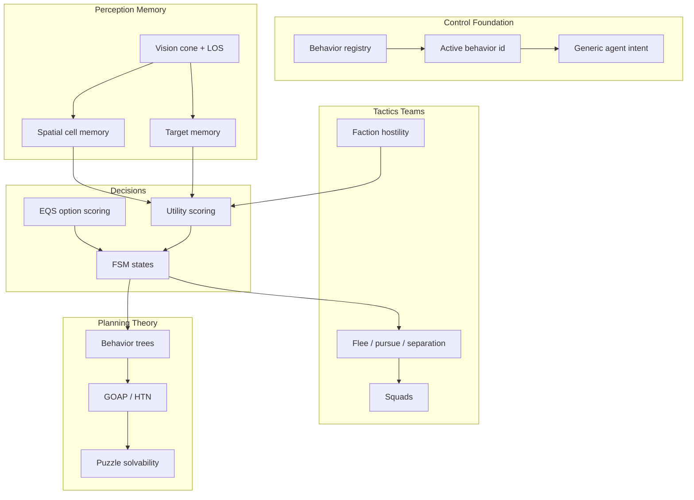

# AI engine — research tree

Progress tracker for agent intelligence: control → perception → memory → state machines → utility/EQS decisions → tactics → teams → strategy/game theory → puzzle solvability.

**Legend:** ✅ shipped · 🟡 partial / scaffolding · ⬜ not started · 🔗 cross-doc dependency.

**Overall AI maturity:** ~**46%** of a full game-AI stack. The engine now has real generic AI primitives, not just snake-specific behavior: `createAgentIntent`, spatial memory, target memory, utility scoring, and EQS-style option scoring. Snake is the first full consumer and proves a 4-mode forage FSM: `explore`, `seek_food`, `seek_prey`, `flee`.

---

## Where this sits vs pro game AI

| Capability | This engine | Pro game AI | Gap |
|---|---|---|---|
| Control / dispatch | ✅ per-entity behavior registry and active behavior id | controller / behavior component | parity for plumbing |
| Reactive autonomy | ✅ generic goal seek + snake forage loop | BT leaf tasks / steering | one rich game consumer |
| Perception | ✅ vision cone + LOS drives decisions and memory | sight/hearing/team perception | sight only |
| Spatial memory | ✅ recency-ranked cell memory + A* step penalty | blackboard / influence maps | no shared maps |
| Target memory | ✅ TTL entity target records with confidence and distance | target tracking / last-known pos | first consumer is snake |
| FSM | ✅ generic agent intent host; snake mounts 4 states | FSM / hierarchical FSM | no hierarchy |
| Utility AI | 🟡 generic score core; snake uses value/reach/cost/net | broad utility action library | no authoring layer |
| EQS | 🟡 generic weighted option scorer; explore uses it | Unreal EQS | no query catalog/debug UI |
| Tactical verbs | 🟡 seek, arrive, explore, flee, pursue-by-target | flee/evade/pursue/flock | no separation/flocking |
| Teams/factions | 🟡 metadata and persistence | team-aware targeting | hostility rules absent |
| Strategy / planning | ⬜ none | GOAP / HTN / commander | future |
| Game theory | ⬜ none | minimax/MCTS/pursuit-evasion | future |
| Puzzle theory | ⬜ mechanism tests only | solver/difficulty estimator | future procedural bridge |

**Takeaway:** the control loop is no longer empty. The current gap is breadth and reuse: prove the generic primitives with a second non-snake consumer, then add behavior-tree/utility authoring, faction rules, and tactical/crowd steering.

---

## Tree overview



---

## Tier 0 — Control foundation

| Item | Status | % | Notes / modules |
|---|---|---:|---|
| Behavior registry | ✅ | 85 | `SandboxEditor/createSandboxController.js`, mount wiring |
| Per-entity active behavior id | ✅ | 80 | `GameState/sandboxEntityMeta.js` |
| Move-target API | ✅ | 80 | sandbox ground-nav behaviors |
| Generic agent intent host | ✅ | 75 | `Libraries/AI/agentIntent/createAgentIntent.js` |
| Behavior priority / stack | ⬜ | 0 | one active behavior at a time |
| Automatic behavior selection for generic props | ⬜ | 0 | snake autosim selects itself; sandbox props mostly manual |

**Branch progress: 64%**

---

## Tier 1 — Reactive autonomy

| Item | Status | % | Notes / modules |
|---|---|---:|---|
| Generic goal-seek autosim | ✅ | 75 | `Libraries/Sandbox/autosim/goalSeekAutosim.js` |
| Snake eat / grow / replenish loop | ✅ | 85 | `snakeAutosim.js`, `snakeStarvation.js`, `snakeScene.js` |
| Snake 4-mode forage FSM | ✅ | 80 | `createSnakeForageIntent.js`, `snakeIntentStates.js` |
| Multi-agent snake population | ✅ | 75 | `setupSnakeGame.js`, `snakeMulti.test.js` |
| Effort-aware prey/food decisions | ✅ | 75 | `snakeDecisionModel.js`, `effort.md` implemented |
| Agent-agent avoidance during seek | ⬜ | 0 | 🔗 `pathfinding.md` local separation |

**Branch progress: 65%**

---

## Tier 2 — Perception and memory

| Item | Status | % | Notes / modules |
|---|---|---:|---|
| Grid-cell vision cone | ✅ | 75 | `Navigation/perception/gridCellVision.js` |
| Observer vision frame | ✅ | 75 | `Navigation/perception/observerVisionFrame.js` |
| Line of sight | ✅ | 75 | `Spatial/query/lineOfSight.js` |
| Spatial working memory | ✅ | 70 | `AI/brain/spatialCellMemory.js` |
| Memory -> A* cost penalty | ✅ | 70 | `AI/brain/navStepPenalty.js` -> `Pathfinding/navStepPenalty.js` |
| Generic target memory | ✅ | 70 | `AI/memory/targetMemory.js`; snake tracks threat/prey/food |
| Blackboard facts | 🟡 | 45 | snake decision blackboard exists; no generic typed fact store |
| Hearing / non-visual stimuli | ⬜ | 0 | sight only |

**Branch progress: 64%**

---

## Tier 3 — State machines

| Item | Status | % | Notes / modules |
|---|---|---:|---|
| Generic flat intent FSM | ✅ | 75 | `createAgentIntent` |
| Snake state adapters | ✅ | 75 | explore, seek_food, seek_prey, flee |
| Per-state effects/context | ✅ | 70 | `createSnakeForageIntent` effects/context |
| Mode exit delay / interruption | ✅ | 60 | flee delay, policy transitions |
| Hierarchical / nested states | ⬜ | 0 | future |
| Second non-snake consumer | ⬜ | 0 | next proof of reuse |

**Branch progress: 58%**

---

## Tier 4 — Decision-making: utility, EQS, trees

| Item | Status | % | Notes / modules |
|---|---|---:|---|
| Utility scoring core | ✅ | 70 | `AI/utility/utilityScoring.js` |
| Snake domain utility scorers | ✅ | 70 | flee/prey/food/explore with effort details |
| Decision snapshots | ✅ | 70 | score maps, score details, chosen intent |
| EQS-style option scoring | ✅ | 55 | `AI/eqs/scoreOptions.js` |
| Explore as first EQS consumer | ✅ | 55 | `Navigation/steering/exploreSteering.js` |
| Behavior tree skeleton | ⬜ | 0 | next abstraction above FSM |
| Generic action/task catalog | ⬜ | 0 | future |

**Branch progress: 46%**

---

## Tier 5 — Tactical steering verbs

| Item | Status | % | Notes |
|---|---|---:|---|
| Seek / arrive / path-follow | ✅ | 80 | 🔗 `pathfinding.md` |
| Memory-aware explore | ✅ | 75 | EQS-scored candidate cells |
| Flee | ✅ | 60 | snake picks flee cells away from threat |
| Pursue | 🟡 | 55 | snake seeks smaller prey target; no intercept prediction |
| Wander | 🟡 | 30 | explore covers roaming, not smooth wander |
| Separation / flocking | ⬜ | 0 | 🔗 pathfinding local avoidance |
| Obstacle avoidance steering | ⬜ | 0 | beyond grid nav |

**Branch progress: 43%**

---

## Tier 6 — Teams, factions, targeting

| Item | Status | % | Notes |
|---|---|---:|---|
| Faction metadata + UI | 🟡 | 50 | `sandboxFaction.js`, inspector |
| Faction persisted in snapshots | ✅ | 70 | scene snapshot |
| Size-based snake threat/prey targeting | ✅ | 60 | current snake game |
| Faction hostility relations | ⬜ | 0 | next AI/gameplay bridge |
| Friendly-fire / team filtering | ⬜ | 0 | future |
| Target priority scoring across teams | ⬜ | 0 | future |

**Branch progress: 30%**

---

## Tier 7 — Squads and coordination

| Item | Status | % | Notes |
|---|---|---:|---|
| Spawn groups | 🟡 | 40 | physics/input grouping, not tactics |
| Squad membership / leader | ⬜ | 0 | |
| Role assignment | ⬜ | 0 | |
| Formations | ⬜ | 0 | depends on pathfinding group movement |
| Shared squad blackboard | ⬜ | 0 | depends on generic blackboard/factions |

**Branch progress: 6%**

---

## Tier 8 — Strategy, planning, game theory, puzzle theory

| Area | Status | Notes |
|---|---|---|
| AI objectives | ⬜ | “goal” still usually means movement target |
| GOAP / HTN | ⬜ | future |
| Minimax / MCTS | ⬜ | future discrete/adversarial work |
| Puzzle solvability | ⬜ | room/puzzle stamps have mechanism tests, not solution search |
| Difficulty grading | ⬜ | future procedural/AI bridge |

---

## Current snake-proven stack

```text
createAgentIntent (generic)
  -> createSnakeForageIntent (snake adapter)
    -> snakeIntent.js (perception)
    -> snakeIntentMemory.js -> AI/memory/targetMemory.js
    -> snakeDecisionModel.js -> AI/utility/utilityScoring.js
    -> snakeIntentStates.js
Navigation/steering/exploreSteering.js -> AI/eqs/scoreOptions.js
```

This is the pattern to preserve: generic loop in `Libraries/AI`, domain facts/scorers in the game adapter.

---

## Recommended next unlocks

1. **Second non-snake agent intent consumer.** Proves `createAgentIntent`, target memory, utility scoring, and EQS are engine packages, not snake leftovers.
2. **Faction hostility.** Turns saved “Team” metadata into target filtering and opens squads/game theory later.
3. **Behavior tree skeleton.** Keep it tiny: selector/sequence/action leaves over existing intent/effect primitives.
4. **Path smoothing + local separation.** AI decisions already choose targets; movement still needs path polish and crowd behavior.
5. **Generic blackboard fact store.** Snake has a domain blackboard; extract only after a second consumer shows the shared shape.
6. **Puzzle solvability prototype.** Later: use search over puzzle state, not spatial pathfinding, to validate generated rooms.

---

## File map

```text
Libraries/AI/agentIntent/createAgentIntent.js — generic intent FSM host
Libraries/AI/brain/ — spatial cell memory and nav penalty producer
Libraries/AI/memory/targetMemory.js — generic TTL target records
Libraries/AI/utility/utilityScoring.js — generic score details / candidate maps
Libraries/AI/eqs/scoreOptions.js — generic weighted option scoring
Libraries/Navigation/perception/ — vision cone, observer frame, LOS feeding decisions
Libraries/Navigation/steering/exploreSteering.js — first EQS consumer
Libraries/Game/snake/createSnakeForageIntent.js — snake adapter over generic intent
Libraries/Game/snake/snakeDecisionModel.js — snake facts and scorers
Libraries/Game/snake/snakeIntentMemory.js — snake target-memory adapter
Libraries/Game/snake/snakeIntentStates.js — domain states
Libraries/Game/snake/snakeAutosim.js — snake game orchestration
tests/targetMemory.test.js, utilityScoring.test.js, eqsScoreOptions.test.js
tests/snakeDecisionModel.test.js, snakeFsmTransitions.test.js, snakeIntent.test.js
```

Cross-doc: movement polish -> [pathfinding.md](./pathfinding.md), puzzle solvability -> [procedural.md](./procedural.md), rendering debug overlays -> [rendering.md](./rendering.md).

---

*Last updated: after generic agent intent, utility scoring, target memory, EQS explore, effort-aware snake decisions, and 4-mode snake forage FSM landed.*
