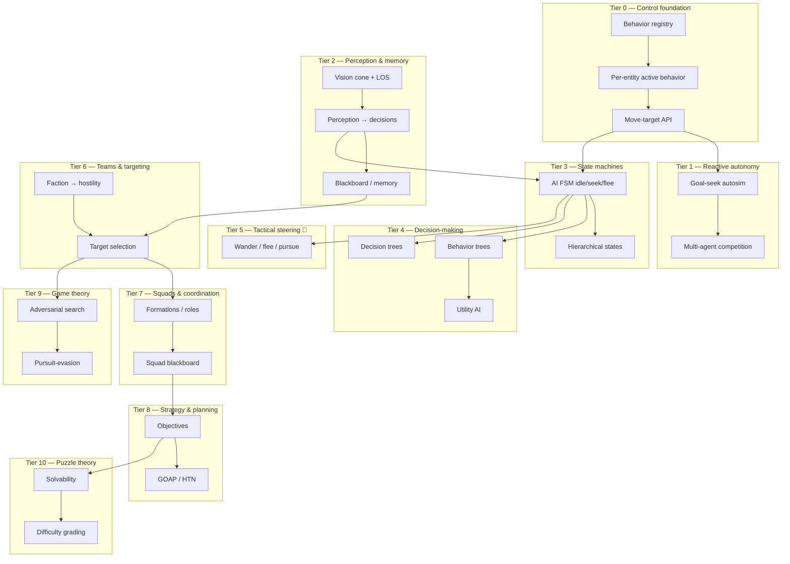

# AI engine — research tree

Progress tracker for agent intelligence: control foundations → reactive autonomy → perception → state machines → decision-making → tactics → teams/squads → strategy → game theory → puzzle theory. Read top-to-bottom like a tech tree: later tiers assume earlier ones. Percentages are **honest engineering completion** (wired and driving behavior) — not "a field exists in a struct."

**Legend:** ✅ shipped · 🟡 partial / scaffolding · ⬜ not started · 🔜 planned (`Plans/plan.md`) · 🔗 cross-doc dependency

**Overall engine maturity:** ~**18%** of a full game-AI stack. This is the **youngest** subsystem in the engine, and the percentage is honest, not pessimistic: there's a solid **agent-control layer** and **one greedy goal-seek autosim** (the snake), plus **perception queries** — but they're a thin slice. Everything that reads as "classical game AI" (FSM intent, behavior/decision trees, utility scoring, squads, strategy, game theory, puzzle solvability) is **planned or absent**. The good news: the foundation (per-entity behavior dispatch + nav + perception primitives) is exactly the right base to build the rest on.

> **Honest framing:** the engine today has *movement intelligence* (it knows how to **go** somewhere — see `pathfinding.md`) but almost no *decision intelligence* (it barely decides **where** or **whether** to go). This doc is the roadmap for the second half.

---

## Where this sits vs pro game AI

The yardstick is the game-AI canon: Unreal's **Behavior Trees + EQS + AI Perception**, Unity NavMesh Agents, F.E.A.R.-style **GOAP**, Halo/Bungie **behavior trees**, The Sims **utility/needs AI**, and adversarial search (Chess/Go **minimax/MCTS**).

| Capability | This engine | Pro game AI (Unreal BT/EQS · F.E.A.R. GOAP · The Sims utility) |
|---|---|---|
| Agent control / dispatch | ✅ per-entity active behavior + tick | Behavior component + controller per pawn |
| Reactive autonomy | 🟡 greedy nearest-goal seek | BT leaf tasks / steering |
| Perception | 🟡 vision cone + LOS **(debug overlay only)** | AI Perception (sight/hearing/teams), stimuli |
| Memory / knowledge | ⬜ none | Blackboard, perceived-target memory, last-known-pos |
| State machines | ⬜ (non-AI stub only) | Animation + AI FSM, hierarchical states |
| Decision-making | ⬜ none | Behavior trees, utility AI, decision trees |
| Tactical steering | ⬜ none (🔗 pathfinding Tier 7) | Wander/flee/pursue, EQS spatial queries |
| Teams / factions | 🟡 metadata + UI label only | Team IDs drive perception, targeting, friendly fire |
| Squads / coordination | ⬜ none | Formations, role assignment, squad blackboard |
| Strategy / planning | ⬜ none (nav "goal" ≠ AI objective) | GOAP / HTN planners, commander/strategic layer |
| Game theory | ⬜ none | Minimax/alpha-beta, MCTS, pursuit-evasion |
| Puzzle solvability | ⬜ none (geometric stamping only) | Solver/validator, difficulty estimation |

**Takeaway:** the **control plumbing** is at parity; the **brain** is empty. That's normal for an engine that grew physics/nav/rendering first — and it means the AI roadmap is long but unobstructed.

---

## Tree overview



---

## Tier 0 — Agent control foundation

| Item | Status | % | Notes / modules |
|------|--------|---|-----------------|
| Behavior registry (`behaviorById`) | ✅ | 85 | `createSandboxController.js`, `mountSandboxController.js` |
| Per-entity active behavior id | ✅ | 80 | `sandboxEntityMeta.js`, `setActiveBehaviorId` |
| Behavior eligibility per asset | ✅ | 75 | `sandboxCapabilities.js`, `resolveSandboxBehaviors` |
| Global `tickWorld` + per-prop run state | ✅ | 80 | nav behaviors hold per-prop `Map`s |
| Move-target API | ✅ | 80 | `setMoveTarget` / `hasMoveTarget` |
| Per-prop behavior overrides / input gates | 🟡 | 55 | `sandboxBehaviorConfig.js`, `inputGates.js` (gates *player* input) |
| Generic per-entity "brain"/controller | ⬜ | 0 | behaviors are shared singletons + state bags, not agent instances |
| Behavior priority / interrupt / resume | ⬜ | 0 | one active behavior, no stack |
| Automatic behavior selection from world state | ⬜ | 0 | only manual / editor / autosim sets it |

**Branch progress: 55%**

---

## Tier 1 — Reactive autonomy (what exists today)

| Item | Status | % | Notes / modules |
|------|--------|---|-----------------|
| Goal-seek autosim (greedy nearest) | ✅ | 75 | `autosim/goalSeekAutosim.js` |
| Snake eat → grow → replenish loop | ✅ | 80 | `snakeAutosim.js`, `snakeGoals.js` |
| Nearest-goal target selection | ✅ | 70 | `findNearestSnakeGoal` (Euclidean, no LOS) |
| Multi-agent population (30 snakes) | ✅ | 75 | `setupSnakeGame.js`, `Config/games/snake.js` |
| Implicit competition (shared goal pool) | 🟡 | 50 | first-to-eat wins; no awareness of rivals |
| Patrol / wander / explore autosim | ⬜ | 0 | 🔜 `Plans/plan.md` (intent FSM) |
| Flee / chase / interact autosim | ⬜ | 0 | |
| Agent-agent avoidance during seek | ⬜ | 0 | 🔗 `pathfinding.md` Tier 7 (separation) |

**Branch progress: 47%**

---

## Tier 2 — Perception & knowledge

| Item | Status | % | Notes / modules |
|------|--------|---|-----------------|
| Grid-cell vision cone | 🟡 | 60 | `Navigation/perception/gridCellVision.js` |
| Line-of-sight queries | ✅ | 70 | `Spatial/query/lineOfSight.js`, `gridCellVision` LOS |
| Heading from velocity/facing | ✅ | 65 | drives cone direction |
| Vision debug overlays | ✅ | 70 | `snakeVisionOverlays.js`, `gridCellVisionOverlay.js` |
| **Perception feeding decisions** | ⬜ | 0 | autosim still uses global nearest, ignores vision |
| Agent memory / last-known-position | ⬜ | 0 | no `lastSeen`, no belief map |
| Blackboard (shared/per-agent facts) | ⬜ | 0 | |
| Hearing / non-visual stimuli | ⬜ | 0 | |
| Fog of war / partial observability | ⬜ | 0 | |

**Branch progress: 28%** · *Perception exists as **visualization**, not yet as decision input — closing that gap is the keystone unlock.*

---

## Tier 3 — Finite state machines (AI intent)

| Item | Status | % | Notes / modules |
|------|--------|---|-----------------|
| Generic FSM transition infra | 🟡 | 40 | `Libraries/FSM/transition.js` (enter/exit hooks) |
| WorldProp lifecycle state | 🟡 | 30 | `WorldProp.js` — single empty `normal` state |
| **AI intent FSM** (idle/seek/flee/return) | ⬜ | 0 | 🔜 `Plans/plan.md` PR2 (seek/explore/wander) |
| State transition conditions (perception-gated) | ⬜ | 0 | depends on Tier 2 → decisions |
| Hierarchical / nested states | ⬜ | 0 | |
| Per-state steering binding | ⬜ | 0 | e.g. flee→flee-steer, seek→HPA-nav |

**Branch progress: 12%** · *Scaffolding exists (`transitionEntity`, prop state hook) but no AI states are defined; `transitionPhase` is unused.*

---

## Tier 4 — Decision-making (trees & utility)

| Item | Status | % | Notes |
|------|--------|---|-------|
| Decision tree (branch on conditions) | ⬜ | 0 | simplest first step above FSM |
| Behavior tree (selector/sequence/decorator) | ⬜ | 0 | the workhorse of pro game AI |
| Utility AI (score → pick best action) | ⬜ | 0 | great fit for "which goal / flee vs eat" |
| Action set / task leaves | ⬜ | 0 | would wrap existing behaviors as leaves |
| Blackboard-backed conditions | ⬜ | 0 | 🔗 depends on Tier 2 |

**Branch progress: 0%**

---

## Tier 5 — Tactical steering primitives 🔗

Shared with `pathfinding.md` Tier 7 — these are the *movement verbs* AI decisions select between. Tracked here because they're the bridge from "decide" to "move."

| Item | Status | % | Notes |
|------|--------|---|-------|
| Seek / arrive / path-follow | ✅ | 80 | already shipped (see `pathfinding.md` Tier 6) |
| Wander | ⬜ | 0 | jittered heading; cheap idle/ambient |
| Flee / evade | ⬜ | 0 | negated / predicted seek |
| Pursue / intercept | ⬜ | 0 | seek predicted future position |
| Separation / flocking | ⬜ | 0 | 🔗 `pathfinding.md` Tier 7 |

**Branch progress: 16%**

---

## Tier 6 — Teams, factions & targeting

| Item | Status | % | Notes / modules |
|------|--------|---|-----------------|
| Faction metadata + UI ("Team") | 🟡 | 50 | `sandboxFaction.js` (alpha/bravo/charlie), inspector |
| Faction persisted in scene snapshot | ✅ | 70 | `sandboxSceneSnapshot.js` |
| **Faction → hostility relations** | ⬜ | 0 | no ally/enemy/neutral logic |
| Target selection (pick whom to engage) | ⬜ | 0 | snake uses goal orbs, not agents |
| Threat / priority scoring | ⬜ | 0 | |
| Friendly-fire / team filtering | ⬜ | 0 | |
| Per-snake team assignment | ⬜ | 0 | all spawn `SANDBOX_DEFAULT_FACTION` |

**Branch progress: 17%** · *Factions are a data field + UI label with **no gameplay behavior** attached yet.*

---

## Tier 7 — Squads & coordination

| Item | Status | % | Notes |
|------|--------|---|-------|
| Spawn groups (physics/input) | 🟡 | 40 | `spawnGroupId` exists for chains/racks — **not** tactical squads |
| Squad membership / leader | ⬜ | 0 | |
| Role assignment (tank/flank/support) | ⬜ | 0 | |
| Formations (hold shape while moving) | ⬜ | 0 | 🔗 pathfinding group movement |
| Shared squad blackboard | ⬜ | 0 | depends on Tier 2 memory |
| Coordinated maneuvers (flank, surround) | ⬜ | 0 | |

**Branch progress: 6%**

---

## Tier 8 — Strategy & planning

| Item | Status | % | Notes |
|------|--------|---|-------|
| AI objectives (distinct from nav goal) | ⬜ | 0 | "goal" in code = nav destination only |
| GOAP (goal-oriented action planning) | ⬜ | 0 | preconditions/effects over action set |
| HTN (hierarchical task network) | ⬜ | 0 | |
| Resource / territory model | ⬜ | 0 | |
| Commander / strategic layer (group plans) | ⬜ | 0 | |
| Plan execution + replan on failure | ⬜ | 0 | mirrors nav replan philosophy |

**Branch progress: 0%**

---

## Tier 9 — Game theory (adversarial)

| Item | Status | % | Notes |
|------|--------|---|-------|
| Pursuit-evasion (predator/prey) | ⬜ | 0 | natural first fit (multi-snake) |
| Minimax / alpha-beta | ⬜ | 0 | for turn-like or discrete decisions |
| MCTS | ⬜ | 0 | for large branching |
| Payoff / opponent modeling | ⬜ | 0 | |
| Nash / equilibrium reasoning | ⬜ | 0 | mostly academic for this engine |

**Branch progress: 0%**

---

## Tier 10 — Puzzle theory (solvability & difficulty)

Bridges to the future `procedural.md` / `levels.md`. Today puzzles are **geometric stamps** with **mechanism tests**, but nothing proves they're *winnable* or grades difficulty.

| Item | Status | % | Notes / modules |
|------|--------|---|-----------------|
| Puzzle template stamping | ✅ | 70 | `RoomGraph/puzzleTemplateBeltCrate.js`, `roomGraphLockedRoom.js` |
| Mechanism correctness tests | ✅ | 65 | `puzzleTemplateBeltCrate.test.js`, `lockedRoom.test.js` |
| **Solvability checking** (is it winnable?) | ⬜ | 0 | no solver/validator |
| Constraint-satisfaction validation | ⬜ | 0 | |
| Solution search / enumeration | ⬜ | 0 | reuse A*/HPA over *puzzle state*, not space |
| Difficulty grading / estimation | ⬜ | 0 | no `difficulty` concept anywhere |
| Automated playtest (prove completable) | ⬜ | 0 | completion is emergent, unverified |

**Branch progress: 16%**

---

## Tier 11 — Tuning, difficulty & authoring

| Item | Status | % | Notes / modules |
|------|--------|---|-----------------|
| Per-game config tuning | ✅ | 65 | `Config/games/snake.js`, `snakeGameConfig.js` |
| Population / scarcity knobs | ✅ | 70 | `snakeCount`, `goalCount` |
| Head speed / physics tuning | ✅ | 70 | `headMaxSpeed` → roll config |
| Named difficulty presets | ⬜ | 0 | no difficulty tiers |
| AI personalities (aggression/skill) | ⬜ | 0 | |
| Adaptive / dynamic difficulty | ⬜ | 0 | |
| Behavior-tree / FSM authoring tools | ⬜ | 0 | editor support for AI graphs |
| AI decision debug overlay | 🟡 | 30 | vision cones only; no state/score readout |

**Branch progress: 35%**

---

## Tier 12 — Advanced (moonshots / out of scope)

| Item | Status | % |
|------|--------|---|
| Learning agents (RL / imitation) | ⬜ | 0 |
| Emergent ecosystem (predator-prey balance) | ⬜ | 0 |
| Director AI (paces challenge, à la L4D) | ⬜ | 0 |
| Designer co-pilot (auto-generate + grade puzzles) | ⬜ | 0 |
| Natural-language behavior authoring | ⬜ | 0 |
| Deterministic AI replay (debugging / netcode) | ⬜ | 0 |

**Branch progress: 0%**

---

## What exists vs what's a field

Three honest distinctions worth keeping straight:

1. **`prop.strategy` is NOT AI.** It's the WorldProp capability/config pattern (collision, render, sprite keys) — same name, different concept. AI strategy (Tier 8) doesn't exist.
2. **"Goal" in code means a nav destination**, not an AI objective. `goalSeekAutosim`, snake orbs, and HPA target cells are all *where to move*, not *what to accomplish*.
3. **Perception and factions are real code but inert.** Vision cones render; faction is a saved field with a "Team" label — neither changes a single decision yet. They're scaffolding, correctly placed, waiting to be wired.

## The keystone: wire perception → decisions

The single highest-leverage move is closing the **Tier 2 gap**: make `gridCellVision` actually feed target selection (snake seeks the *nearest visible* goal, not the nearest global one). That one change:
- turns perception from a debug overlay into a real input,
- creates the first genuine *decision* in the engine,
- and gives you a reason to add the Tier 3 FSM (seek when goal visible, wander when not).

That trio — **perception-gated targeting → wander/seek FSM → utility pick among goals** — is the realistic "AI actually exists now" milestone.

---

## Recommended next unlocks (short path)

1. **Perception-gated targeting** — snake picks nearest *visible* goal (`gridCellVision` + `lineOfSight`), not nearest global. First real decision. Cheap, high signal.
2. **Snake intent FSM** — `seek` (goal visible) ↔ `wander` (none visible) ↔ `flee` (optional). Build on `Libraries/FSM/transition.js`; defines the first AI states (🔜 `Plans/plan.md` PR2).
3. **Wander steering** — needed for the FSM's idle state; 🔗 also `pathfinding.md` Tier 7.
4. **Utility scoring for goal choice** — when multiple goals are visible, score by distance/safety/contested-ness; first taste of utility AI.
5. **Faction → hostility** — give the "Team" field meaning: target filtering by faction; unblocks predator-prey (Tier 9) and squads (Tier 7).

> **Sequencing note:** Tiers 0–4 are the spine — get a real FSM/decision layer reading perception before reaching for squads, strategy, game theory, or puzzle solvers. The advanced tiers are exciting but rest entirely on "an agent can perceive and decide," which is the work in Tiers 2–4.

---

## Key file map

```
Apps/Editor/world/mountSandboxController.js — registers behaviors
Libraries/SandboxEditor/createSandboxController.js — behavior registry + tick
GameState/sandboxEntityMeta.js — per-entity active behavior id
Libraries/Sandbox/sandboxCapabilities.js — eligible behaviors per asset
Libraries/Sandbox/autosim/goalSeekAutosim.js — the one autonomous agent
Libraries/Game/snake/snakeAutosim.js, snakeGoals.js, setupSnakeGame.js — snake AI
Libraries/Navigation/perception/gridCellVision.js — vision cone + LOS (debug only)
Libraries/Game/snake/snakeVisionOverlays.js — vision debug draw
Libraries/Spatial/query/lineOfSight.js — wall-segment LOS
Libraries/FSM/transition.js — FSM enter/exit infra (no AI states yet)
Libraries/Sandbox/sandboxFaction.js — faction metadata (no gameplay logic)
Libraries/RoomGraph/puzzleTemplateBeltCrate.js, roomGraphLockedRoom.js — puzzle stamps
Config/games/snake.js — the only game/AI tuning config
tests/goalSeekAutosim.test.js, snakeAutosim.test.js, snakeMulti.test.js,
  gridCellVision.test.js, lineOfSight.test.js
```

Cross-doc: tactical steering → `pathfinding.md` Tier 7 · puzzle solvability → future `procedural.md` / `levels.md` · vision rendering → `rendering.md`.

---

*Last updated: initial AI tree (mirrors `physics.md` / `pathfinding.md` / `rendering.md`). The youngest subsystem: control foundation + greedy goal-seek + perception scaffolding exist; FSM intent, decision/behavior trees, squads, strategy, game theory, and puzzle solvability are planned or absent. The keystone unlock is wiring perception into decisions (Tier 2→3). Revisit percentages when the first AI FSM ships.*
