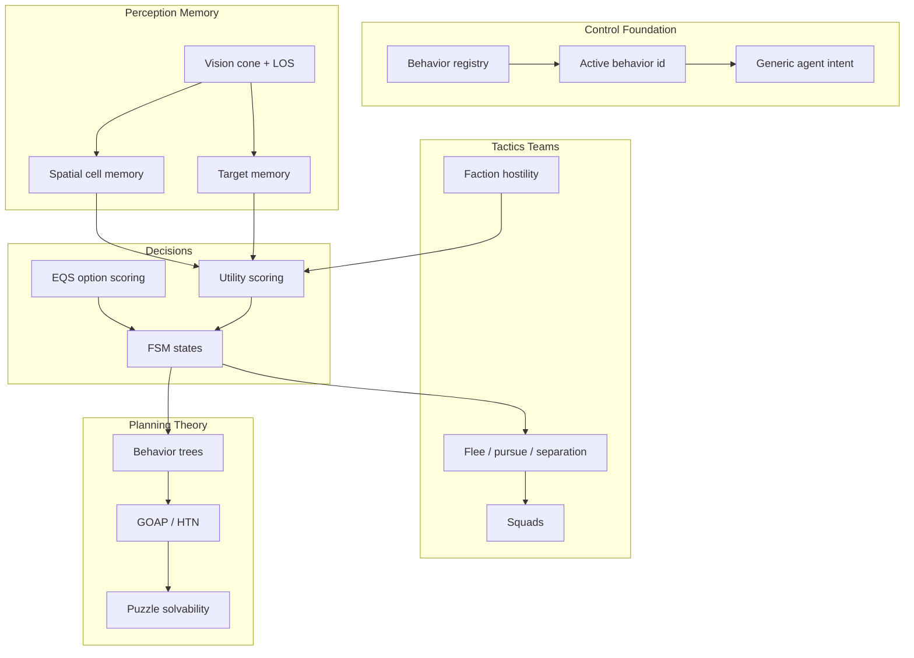

# AI engine — research tree

Progress tracker for agent intelligence: control → perception → memory → state machines → utility/EQS decisions → tactics → teams → strategy/game theory → puzzle solvability.

**Legend:** ✅ shipped · 🟡 partial / scaffolding · ⬜ not started · 🔗 cross-doc dependency.

**Overall AI maturity:** ~**52%** of a full game-AI stack. The engine has real generic AI primitives plus **two full intent consumers**: snake (4-mode forage + team hunting) and flee agents (4-mode explore/flee/seek_food/seek_ally). Shared perception (`classifyAgentVision`), target memory, utility scoring, and faction-aware relationship resolution are wired end-to-end for both species.

---

## Where this sits vs pro game AI

| Capability | This engine | Pro game AI | Gap |
|---|---|---|---|
| Control / dispatch | ✅ per-entity behavior registry and active behavior id | controller / behavior component | parity for plumbing |
| Reactive autonomy | ✅ snake forage + flee 4-mode loop | BT leaf tasks / steering | flee is second consumer |
| Perception | ✅ vision + LOS + shared agent classifier | sight/hearing/team perception | sight only; ally slot shipped |
| Spatial memory | ✅ recency-ranked cell memory + A* step penalty | blackboard / influence maps | no shared influence maps |
| Target memory | ✅ TTL records (threat/prey/food/ally) | target tracking / last-known pos | snake + flee consumers |
| FSM | ✅ generic host; snake + flee 4 modes each | FSM / hierarchical FSM | no hierarchy |
| Utility AI | ✅ generic core; snake + flee mode scoring | broad utility action library | no authoring layer |
| EQS | 🟡 generic weighted option scorer; explore uses it | Unreal EQS | no query catalog/debug UI |
| Tactical verbs | 🟡 seek, flee, regroup; no flocking | flee/evade/pursue/flock | separation absent |
| Teams/factions | 🟡 relationships + ally cohesion prep | team-aware targeting | snake regroup + pack flee pending |
| Strategy / planning | ⬜ none | GOAP / HTN / commander | future |
| Game theory | ⬜ none | minimax/MCTS/pursuit-evasion | future |
| Puzzle theory | ⬜ mechanism tests only | solver/difficulty estimator | future procedural bridge |

**Takeaway:** control loop and generic packages are proven with **two consumers**. The current gap is cohesion behavior breadth (snake regroup, flee pack flee), movement polish (path smoothing, crowds), and optional abstractions (behavior-tree skeleton, generic slot pipeline). Local flow-field horizons (see [Future: local flow horizons](#future-local-flow-horizons)) are the highest-leverage nav+AI bridge.

---

## Tree overview



---

## Tier 0 — Control foundation

| Item | Status | % | Notes / modules |
|---|---|---:|---|
| Behavior registry | ✅ | 85 | `SandboxEditor/createSandboxController.js`, mount wiring |
| Per-entity active behavior id | ✅ | 80 | `GameState/sandboxEntityMeta.js` |
| Move-target API | ✅ | 80 | sandbox ground-nav behaviors |
| Generic agent intent host | ✅ | 75 | `Libraries/AI/agentIntent/createAgentIntent.js` |
| Behavior priority / stack | ⬜ | 0 | one active behavior at a time |
| Automatic behavior selection for generic props | ⬜ | 0 | snake autosim selects itself; sandbox props mostly manual |

**Branch progress: 64%**

---

## Tier 1 — Reactive autonomy

| Item | Status | % | Notes / modules |
|---|---|---:|---|
| Generic goal-seek autosim | ✅ | 75 | `Libraries/Sandbox/autosim/goalSeekAutosim.js` |
| Snake eat / grow / replenish loop | ✅ | 85 | `snakeAutosim.js`, `snakeStarvation.js`, `snakeScene.js` |
| Snake 4-mode forage FSM | ✅ | 80 | `createSnakeForageIntent.js`, `snakeIntentStates.js` |
| Multi-agent snake population | ✅ | 75 | `setupSnakeGame.js`, `snakeMulti.test.js` |
| Effort-aware prey/food decisions | ✅ | 75 | `snakeDecisionModel.js`, `effort.md` implemented |
| Flee agent 4-mode FSM | ✅ | 75 | `createFleeExploreIntent.js` — explore, seek_food, seek_ally, flee |
| Multi-agent flee population | ✅ | 70 | `spawnFleeAgent.js`, `FleeAgentInstance.js`, flee autosim hooks |
| Effort-aware flee decisions | ✅ | 70 | `fleeDecisionModel.js`; hunger, sprint reserves, multi-threat flee |
| Agent-agent avoidance during seek | ⬜ | 0 | 🔗 `pathfinding.md` local separation / flow horizons |

**Branch progress: 72%**

---

## Tier 2 — Perception and memory

| Item | Status | % | Notes / modules |
|---|---|---:|---|
| Grid-cell vision cone | ✅ | 75 | `Navigation/perception/gridCellVision.js` |
| Observer vision frame | ✅ | 75 | `Navigation/perception/observerVisionFrame.js` |
| Line of sight | ✅ | 75 | `Spatial/query/lineOfSight.js` |
| Spatial working memory | ✅ | 70 | `AI/brain/spatialCellMemory.js` |
| Memory -> A* cost penalty | ✅ | 70 | `AI/brain/navStepPenalty.js` -> `Pathfinding/navStepPenalty.js` |
| Generic target memory | ✅ | 75 | `AI/memory/targetMemory.js`; snake tracks threat/prey/food/**ally**; flee tracks threat/food/**ally** |
| Shared agent vision classifier | ✅ | 70 | `AI/perception/classifyAgentVision.js` — threat/prey/ally slots in one pass |
| Blackboard facts | 🟡 | 55 | snake + flee decision blackboards; `allyState`, score snapshots; no generic typed fact store |
| Hearing / non-visual stimuli | ⬜ | 0 | sight only |

**Branch progress: 68%**

---

## Tier 3 — State machines

| Item | Status | % | Notes / modules |
|---|---|---:|---|
| Generic flat intent FSM | ✅ | 75 | `createAgentIntent` |
| Snake state adapters | ✅ | 80 | explore, seek_food, seek_prey, flee |
| Flee agent state adapters | ✅ | 75 | explore, seek_food, seek_ally, flee — `createFleeExploreIntent.js` |
| Per-state effects/context | ✅ | 70 | snake + flee effects/context |
| Mode exit delay / interruption | ✅ | 65 | flee hysteresis (snake + flee), policy latch |
| Hierarchical / nested states | ⬜ | 0 | future |
| Generic slot pipeline refactor | ⬜ | 0 | deferred; duplicate perception/memory paths today |

**Branch progress: 68%**

---

## Tier 4 — Decision-making: utility, EQS, trees

| Item | Status | % | Notes / modules |
|---|---|---:|---|
| Utility scoring core | ✅ | 70 | `AI/utility/utilityScoring.js` |
| Snake domain utility scorers | ✅ | 75 | flee/prey/food/explore; config-driven enemy prey value |
| Flee domain utility scorers | ✅ | 70 | flee/food/seek_ally/explore; faction cohesion bonuses |
| Decision snapshots | ✅ | 75 | score maps, score details, chosen intent, sprint intent (flee) |
| EQS-style option scoring | ✅ | 55 | `AI/eqs/scoreOptions.js` |
| Explore as first EQS consumer | ✅ | 55 | `Navigation/steering/exploreSteering.js` |
| Behavior tree skeleton | ⬜ | 0 | next abstraction above FSM |
| Generic action/task catalog | ⬜ | 0 | future |

**Branch progress: 52%**

---

## Tier 5 — Tactical steering verbs

| Item | Status | % | Notes |
|---|---|---:|---|
| Seek / arrive / path-follow | ✅ | 80 | 🔗 `pathfinding.md`; snakes/flee use HPA cell-target nav |
| Memory-aware explore | ✅ | 75 | EQS-scored candidate cells |
| Flee | ✅ | 70 | snake + flee; flee cells + threat-aware sprint |
| Pursue | 🟡 | 55 | snake seeks prey; no intercept prediction |
| Regroup / seek ally | 🟡 | 50 | flee `seek_ally` shipped; snake regroup (4c) not started |
| Wander | 🟡 | 30 | explore covers roaming, not smooth wander |
| Separation / flocking | ⬜ | 0 | 🔗 pathfinding local avoidance / flow horizons |
| Obstacle avoidance steering | ⬜ | 0 | beyond grid nav |

**Branch progress: 48%**

---

## Tier 6 — Teams, factions, targeting

| Item | Status | % | Notes |
|---|---|---:|---|
| Faction metadata + UI | 🟡 | 55 | `sandboxFaction.js`, inspector |
| Faction persisted in snapshots | ✅ | 70 | scene snapshot |
| Species relationship resolver | ✅ | 70 | `snakeSpecies`, `fleeAgentSpecies` — ally/rival/prey/threat/neutral |
| Rival band (size-gap prey/threat) | ✅ | 65 | config `rivalBand.maxSegmentGap` |
| Ally perception + memory | ✅ | 70 | shared classifier; TTL ally slot; `allyState` on snapshots |
| Flee treats all snakes as threat | ✅ | 75 | flee never hunts snakes |
| Flee same-faction regroup (`seek_ally`) | ✅ | 65 | safe + satisfied; large friendly arrival radius |
| Snake size-scaled regroup | ⬜ | 0 | phase 4c — explore bias or light seek when satisfied |
| Flee pack vector while fleeing | ⬜ | 0 | phase 4d — blend flee direction toward ally centroid |
| Friendly-fire / team filtering in combat | 🟡 | 40 | relationships filter perception; kinetic ram still faction-blind |
| Target priority scoring across teams | 🟡 | 45 | config prey value; no multi-target utility catalog |

**Branch progress: 52%**

---

## Tier 7 — Squads and coordination

| Item | Status | % | Notes |
|---|---|---:|---|
| Spawn groups | 🟡 | 40 | physics/input grouping, not tactics |
| Squad membership / leader | ⬜ | 0 | |
| Role assignment | ⬜ | 0 | |
| Formations | ⬜ | 0 | depends on pathfinding group movement |
| Shared squad blackboard | ⬜ | 0 | ally memory is per-agent today |
| Pack flee blend | ⬜ | 0 | phase 4d |

**Branch progress: 8%**

---

## Tier 8 — Strategy, planning, game theory, puzzle theory

| Area | Status | Notes |
|---|---|---|
| AI objectives | ⬜ | “goal” still usually means movement target |
| GOAP / HTN | ⬜ | future |
| Minimax / MCTS | ⬜ | future discrete/adversarial work |
| Puzzle solvability | ⬜ | room/puzzle stamps have mechanism tests, not solution search |
| Difficulty grading | ⬜ | future procedural/AI bridge |

---

## Team hunting & faction cohesion — shipped vs next

Phases completed on the snake game proving ground:

| Phase | Status | Summary |
|---|---|---|
| **1–2 Team hunting** | ✅ | Faction metadata drives `resolveRelationship`; shared vision classifier |
| **3 Prey/threat scoring** | ✅ | Config `enemySnakePreyValue`, rival band by segment gap |
| **Flee threat fix** | ✅ | Flee agents treat all snakes as threat; never hunt snakes |
| **4a Ally perception** | ✅ | `ally`, `allyCount`, `allyCentroid`, `allyDist` (cells) on world view |
| **Prep Ally memory + blackboard** | ✅ | TTL ally slot, `known.ally`, `allyState`, `ALLY_SEEN` / `ALLY_REMEMBERED` |
| **4b Flee `seek_ally`** | ✅ | Regroup when safe + satisfied; faction cohesion config; friendly arrival radius |
| **4c Snake regroup** | ⬜ | Size-scaled explore bias or light seek when satisfied only |
| **4d Flee pack flee** | ⬜ | Blend flee vector toward ally centroid while in flee mode |
| **Slot pipeline refactor** | ⬜ | Generic perception→memory→blackboard pipeline (deferred) |

Locomotion for both species still uses **per-agent HPA** (`cellTargetHpaNav`). Flow fields exist globally for sandbox drag-nav but are **not** wired into snake/flee intent steering yet.

---

## Current stacks (snake + flee)

```text
createAgentIntent (generic)
  -> createSnakeForageIntent (snake)
    -> classifyAgentVision via snakeIntent / agentWorldPerception
    -> snakeIntentMemory -> AI/memory/targetMemory.js
    -> snakeDecisionModel.js -> AI/utility/utilityScoring.js
  -> createFleeExploreIntent (flee)
    -> classifyAgentVision via fleeWorldPerception
    -> fleeIntentMemory
    -> fleeDecisionModel.js
Navigation/steering/exploreSteering.js -> AI/eqs/scoreOptions.js
Libraries/Game/snake/species/snakeSpecies.js — ally/rival/prey/threat
Libraries/Game/snake/species/fleeAgentSpecies.js — ally vs threat vs neutral
```

Pattern to preserve: generic loop in `Libraries/AI`, domain facts/scorers in game adapters.

---

## Future: local flow horizons

The pathfinding stack already has the building blocks for **per-agent sliding flow windows**: centered grid frame (`FlowFieldWindow`), range-limited backward BFS (`computeFlowField` `range`), direction sampling (`sampleFlowDirection`), reachability checks, and worker offload (`FlowFieldWorkerEntry`). Today one shared `FlowFieldGrid` recenters for sandbox drag-nav; snakes/flee use HPA polylines instead.

**Concept:** each agent (or a pooled subset) carries a small window centered on its occupied cell. Rebuild a local field backward from the active goal, capped at **R path steps**. Steer by sampling the byte field at the agent position — same as `driveFlowGroundNav`, but scoped and per-agent.

### Phased integration (lowest risk first)

1. **Decision-only fields** — use local BFS distance for utility `reach` / `netScoreDetail` without changing locomotion. Fixes “straight-line distance lies about effort” for prey, food, and ally scoring.
2. **Flee-ball locomotion** — high agent count, short horizons; `seek_ally`, flee, and explore all benefit from local gradients. Snakes keep HPA for long hunts.
3. **Hybrid snake stack** — HPA produces corridor waypoint; local flow executes until invalidation or waypoint reached.
4. **Multi-source fields** — compose attraction (food, ally) and repulsion (threat) into one cost field for flee and pack behavior (4d).

### Features this unlocks

| Feature | Mechanism |
|---|---|
| Reachability-aware perception | “I see prey” → “prey reachable within R steps” gates hunt |
| Better utility reach costs | True path-step effort in `scoreFoodDetail` / `scoreSeekAllyDetail` |
| Crowd lanes | Many agents sharing a goal sample the same local downhill |
| Field-based flee | Threat repulsion gradient instead of single `pickFleeCell` |
| Cohesion / pack flee (4d) | Goal = ally centroid; flee = blend threat repulsion + ally attraction |
| Memory-aware explore | Raise cost on visited cells; explore = follow low-cost gradient |
| Debug overlays | Intent cones as arrow fields in a local HUD radius |

### Costs and limits

- **Compute:** `agents × windowCells × refreshRate` — mitigate with cell-boundary recenter, goal-change invalidation, slot pooling, worker batching.
- **Horizon:** R-step window does not replace cross-map HPA; distant goals need hierarchical plan + local execution (see [pathfinding.md](./pathfinding.md) hybrid notes).
- **Dynamic blockers:** moving snake bodies stale fields quickly; tie invalidation to `nav.topologyKey()` like HPA replan.
- **Multi-goal:** flee may need blended fields (threat + food + ally) or priority-stacked rebuilds.

Cross-doc: flow field implementation detail → [pathfinding.md](./pathfinding.md) Tier 3; locomotion wiring → `flowGroundNavBehavior.js`, `cellTargetHpaNav.js`.

---

## Recommended next unlocks

1. **Phase 4c — snake regroup.** Light cohesion when satisfied; reuses ally memory already on blackboard.
2. **Phase 4d — flee pack flee.** Blend flee direction toward ally centroid; natural follow-on to `seek_ally`.
3. **Local flow for utility reach (decision-only).** Wire `FlowFieldWindow.checkReachability` / range-limited distance into scorers before touching locomotion.
4. **Path smoothing + local separation.** Complements flow horizons for snake chase feel.
5. **Behavior tree skeleton.** Thin selector/sequence layer over existing intent/effect primitives.
6. **Generic slot pipeline.** Extract shared perception→memory→blackboard only if a third consumer appears or duplication becomes painful.

---

## File map

```text
Libraries/AI/agentIntent/createAgentIntent.js — generic intent FSM host
Libraries/AI/perception/classifyAgentVision.js — shared threat/prey/ally vision pass
Libraries/AI/brain/ — spatial cell memory and nav penalty producer
Libraries/AI/memory/targetMemory.js — generic TTL target records
Libraries/AI/utility/utilityScoring.js — generic score details / candidate maps
Libraries/AI/eqs/scoreOptions.js — generic weighted option scoring
Libraries/Navigation/perception/ — vision cone, observer frame, LOS
Libraries/Navigation/steering/exploreSteering.js — first EQS consumer
Libraries/Game/snake/createSnakeForageIntent.js — snake adapter
Libraries/Game/snake/snakeDecisionModel.js — snake facts and scorers
Libraries/Game/snake/snakeIntentMemory.js — snake target-memory adapter
Libraries/Game/snake/fleeAgent/createFleeExploreIntent.js — flee adapter
Libraries/Game/snake/fleeAgent/fleeDecisionModel.js — flee scorers + sprint intent
Libraries/Game/snake/fleeAgent/fleeIntentMemory.js — flee target-memory adapter
Libraries/Game/snake/species/ — relationship resolvers per species
Config/games/snake.js — fleeAgent, rivalBand, intentMemory, faction cohesion knobs
tests/agentAllyPerception.test.js, agentAllyMemory.test.js, snakeTeamRelationship.test.js
tests/fleeAgentDecision.test.js, fleeAgentSpawn.test.js, snakeDecisionModel.test.js
```

Cross-doc: movement polish and flow fields → [pathfinding.md](./pathfinding.md), puzzle solvability → [procedural.md](./procedural.md), debug overlays → [rendering.md](./rendering.md).

---

*Last updated: team hunting phases 1–3, ally perception/memory (4a), flee `seek_ally` (4b), shared `classifyAgentVision`, dead-code cleanup (striker / flee scale). Local flow horizon direction documented.*
