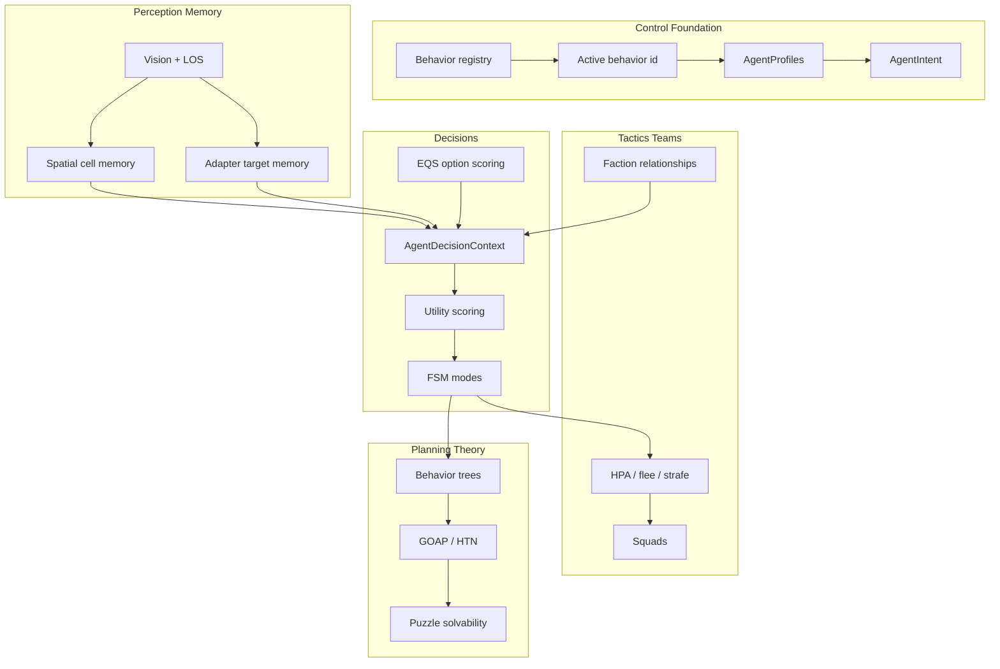

# AI Engine — Research Tree

Progress tracker for agent intelligence: control → perception → memory → state machines → utility/EQS decisions → tactics → teams → strategy/game theory → puzzle solvability.

**Snake-game adapter:** [games/snake.md](./games/snake.md) — species, session, combat, HUD, config.  
**Active FSM plan:** [current/fsmroadmap.md](./current/fsmroadmap.md).

**Legend:** ✅ shipped · 🟡 partial / scaffolding · ⬜ not started · 🔗 cross-doc dependency.

**Overall AI maturity:** ~**72%** of a full game-AI stack. The engine has a real generic control loop plus profile-driven agent species (`snake`, `flee_agent`, `squid`), frame orchestration, target memory, utility scoring, EQS-style option scoring, shared perception, faction relationships, regroup/pack behavior, and flee-agent gun/ammo combat. The main gaps are local flow locomotion, path smoothing/crowd behavior, squad-level blackboards, and higher-level planning.

---

## Where This Sits Vs Pro Game AI

| Capability | This engine | Pro game AI | Gap |
|---|---|---|---|
| Control / dispatch | ✅ per-entity behavior registry and active behavior id | controller / behavior component | parity for plumbing |
| Reactive autonomy | ✅ profile-driven snake/flee/squid agents | BT leaf tasks / steering | behavior-tree layer optional |
| Perception | ✅ vision + LOS + shared agent classifier | sight/hearing/team perception | sight only |
| Spatial memory | ✅ recency-ranked cell memory + A* step penalty | blackboard / influence maps | no shared influence maps |
| Target memory | ✅ TTL records inside the snake-game intent adapter | target tracking / last-known pos | domain-owned today |
| FSM | ✅ generic flat intent host | FSM / hierarchical FSM | no hierarchy |
| Utility AI | ✅ generic scoring helpers + profile mode schemas | broad utility action library | no authoring UI |
| EQS | 🟡 generic weighted option scorer; explore uses it | Unreal EQS | no query catalog/debug UI |
| Tactical verbs | 🟡 seek, flee, regroup, strafe | flee/evade/pursue/flock | separation absent |
| Teams/factions | ✅ relationships, regroup, pack flee blend | team-aware targeting | no squad roles |
| Strategy / planning | ⬜ none | GOAP / HTN / commander | future |
| Puzzle theory | ⬜ mechanism tests only | solver/difficulty estimator | future procedural bridge |

**Takeaway:** the current generic packages are proven by the snake game’s three active profiles. The highest-leverage next bridge is still local flow-field locomotion: the pathfinding stack already has flow infrastructure, and AI already uses flow-backed reach for decisions.

---

## Tree Overview



---

## Tier 0 — Control Foundation

| Item | Status | % | Notes / modules |
|---|---|---:|---|
| Behavior registry | ✅ | 85 | `SandboxEditor/createSandboxController.js`, mount wiring |
| Per-entity active behavior id | ✅ | 80 | `GameState/sandboxEntityMeta.js` |
| Move-target API | ✅ | 80 | sandbox ground-nav behaviors |
| Generic agent intent host | ✅ | 80 | `Libraries/AI/agentIntent/AgentIntent.js` |
| Profile-driven agent config | ✅ | 85 | `Libraries/AI/agents/AgentProfiles.js`, `Config/games/snake.js` |
| Frame orchestration | ✅ | 85 | `snakeAgentSession.js` admission budget |
| Behavior priority / stack | ⬜ | 0 | one active behavior at a time |
| Automatic behavior selection for generic props | ⬜ | 0 | game agents select themselves; sandbox props mostly manual |

**Branch progress: 68%**

---

## Tier 1 — Reactive Autonomy

| Item | Status | % | Notes / modules |
|---|---|---:|---|
| Generic goal-seek autosim | ✅ | 75 | `Libraries/Sandbox/autosim/goalSeekAutosim.js` |
| Snake eat / grow / replenish loop | ✅ | 85 | `AgentInstance.js`, `snakeFood.js` |
| Snake profile FSM | ✅ | 85 | explore, food, prey, flee, ally via `GroundNavIntentAdapter.js` |
| Flee profile FSM | ✅ | 85 | flee, enemy, ammo, food, ally, explore |
| Squid profile FSM | ✅ | 65 | cluster/chain-combat profile, prey/flee/food/explore |
| Multi-agent dynamic population | ✅ | 85 | `spawnPopulationInScene.js`, `AgentProfiles.js`, `AgentInstance.js` |
| Ranged combat / gun agent states | ✅ | 85 | `GroundNavIntentAdapter.js`, `gunAgent/gunBulletSystem.js` |
| Agent callouts | ✅ | 65 | `FleeAgentCalloutDirector` |
| Agent-agent avoidance during seek | ⬜ | 0 | 🔗 `pathfinding.md` local separation / flow horizons |

**Branch progress: 75%**

---

## Tier 2 — Perception And Memory

| Item | Status | % | Notes / modules |
|---|---|---:|---|
| Grid-cell vision cone | ✅ | 75 | `Navigation/perception/gridCellVision.js` |
| Observer vision frame | ✅ | 75 | `Navigation/perception/observerVisionFrame.js` |
| Line of sight | ✅ | 75 | `Spatial/query/lineOfSight.js` |
| Spatial working memory | ✅ | 70 | `AI/brain/brain.js` |
| Memory → A* cost penalty | ✅ | 70 | `AI/brain/brain.js` + `Pathfinding/navStepPenalty.js` |
| Target memory | ✅ | 75 | `GroundNavIntentAdapter.js`; profile slots include threat/prey/enemy/food/ammo/ally |
| Shared agent vision classifier | ✅ | 75 | `AI/perception/classifyAgentVision.js` |
| Agent world perception | ✅ | 70 | `AI/perception/agentWorldPerception.js` |
| Blackboard facts | 🟡 | 60 | `AgentDecisionContext.js`; no generic typed fact store |
| Hearing / non-visual stimuli | ⬜ | 0 | sight only |

**Branch progress: 70%**

---

## Tier 3 — State Machines

| Item | Status | % | Notes / modules |
|---|---|---:|---|
| Generic flat intent FSM | ✅ | 80 | `AgentIntent.js` |
| Profile state adapters | ✅ | 80 | `GroundNavIntentAdapter.js` reads profile decision schema |
| Per-state effects/context | ✅ | 75 | target commit, sprint, combat action, HPA handoff |
| Mode exit delay / interruption | ✅ | 70 | hysteresis and target sticky factors |
| Frame orchestrator | ✅ | 85 | `snakeAgentSession.js` |
| Hierarchical / nested states | ⬜ | 0 | future |
| Generic slot pipeline refactor | ⬜ | 0 | deferred until another game mode needs it |

**Branch progress: 58%**

---

## Tier 4 — Decision-Making: Utility, EQS, Trees

| Item | Status | % | Notes / modules |
|---|---|---:|---|
| Utility scoring core | ✅ | 70 | `AI/utility/utilityScoring.js` |
| Schema-driven decision context | ✅ | 80 | `AI/agents/AgentDecisionContext.js` |
| Snake domain scoring | ✅ | 75 | profile modes + chain/faction facts |
| Flee domain scoring | ✅ | 75 | enemy/ammo/food/ally/flee with weapon state |
| Squid domain scoring | 🟡 | 60 | prey/flee/food/explore, cluster combat |
| Decision snapshots | ✅ | 75 | mode scores, details, chosen intent, sprint/combat facts |
| EQS-style option scoring | ✅ | 55 | `AI/eqs/scoreOptions.js` |
| Explore as first EQS consumer | ✅ | 55 | `Navigation/steering/exploreSteering.js` |
| Behavior tree skeleton | ⬜ | 0 | next abstraction above FSM |
| Generic action/task catalog | ⬜ | 0 | future |

**Branch progress: 56%**

---

## Tier 5 — Tactical Steering Verbs

| Item | Status | % | Notes |
|---|---|---:|---|
| Seek / arrive / path-follow | ✅ | 80 | 🔗 `pathfinding.md`; agents use HPA cell-target nav |
| Memory-aware explore | ✅ | 75 | EQS-scored candidate cells |
| Flee | ✅ | 70 | snake/flee/squid profile modes |
| Pursue / attack | 🟡 | 60 | snake/squid prey seek; flee ranged attack has no intercept prediction |
| Regroup / seek ally | ✅ | 70 | snake + flee `seek_ally` when safe and useful |
| Combat strafe | 🟡 | 55 | `AI/steering/pickCombatStrafeCell.js` for ranged flee |
| Wander | 🟡 | 30 | explore covers roaming, not smooth wander |
| Separation / flocking | ⬜ | 0 | 🔗 pathfinding local avoidance / flow horizons |
| Obstacle avoidance steering | ⬜ | 0 | beyond grid nav |

**Branch progress: 51%**

---

## Tier 6 — Teams, Factions, Targeting

| Item | Status | % | Notes |
|---|---|---:|---|
| Faction metadata + UI | 🟡 | 55 | sandbox factions, profile teams |
| Faction persisted in snapshots | ✅ | 70 | scene snapshot |
| Species relationship resolver | ✅ | 75 | size-band, proximity, and faction rules |
| Rival band / size-gap relationships | ✅ | 65 | snake and squid profile pressure |
| Ally perception + memory | ✅ | 70 | shared classifier, profile slots |
| Flee same-faction regroup | ✅ | 65 | safe + not desperate |
| Snake size-scaled regroup | ✅ | 70 | satisfied-only and leadworthy ally filter |
| Flee pack vector while fleeing | ✅ | 65 | `fleePackBlend` in flee steering |
| Friendly-fire filtering | 🟡 | 50 | relationship-aware combat paths; contact edge cases remain |
| Target priority scoring across teams | 🟡 | 50 | profile weights, not a generic target catalog |

**Branch progress: 56%**

---

## Tier 7 — Squads And Coordination

| Item | Status | % | Notes |
|---|---|---:|---|
| Spawn groups | 🟡 | 40 | profile populations and physics/input grouping |
| Pack flee blend | ✅ | 65 | ally centroid blended into flee choice |
| Squad membership / leader | ⬜ | 0 | future |
| Role assignment | ⬜ | 0 | future |
| Formations | ⬜ | 0 | depends on pathfinding group movement |
| Shared squad blackboard | ⬜ | 0 | ally memory is per-agent today |

**Branch progress: 18%**

---

## Tier 8 — Strategy, Planning, Game Theory, Puzzle Theory

| Area | Status | Notes |
|---|---|---|
| AI objectives | ⬜ | “goal” still usually means movement target |
| GOAP / HTN | ⬜ | future |
| Minimax / MCTS | ⬜ | future discrete/adversarial work |
| Puzzle solvability | ⬜ | room/puzzle stamps have mechanism tests, not solution search |
| Difficulty grading | ⬜ | future procedural/AI bridge |

---

## Team Hunting And Faction Cohesion

Shipped phases on the snake proving ground:

| Phase | Status | Summary |
|---|---|---|
| Team hunting | ✅ | Faction metadata drives relationships; shared vision classifier |
| Prey/threat scoring | ✅ | Configured profiles and relationship rules |
| Ally perception | ✅ | ally slot, counts, centroid |
| Ally memory + blackboard facts | ✅ | known slots and decision context facts |
| Flee `seek_ally` | ✅ | regroup when safe and not desperate |
| Snake regroup | ✅ | leadworthy/satisfied filter |
| Flee pack flee | ✅ | threat escape blended with ally centroid |
| Slot pipeline framework | ⬜ | deferred until another game mode needs it |

---

## Future: Local Flow Horizons

The pathfinding stack already has the building blocks for per-agent sliding flow windows: `FlowFieldWindow`, range-limited `computeFlowField`, `sampleFlowDirection`, worker offload, and flow-backed reach (`flowTargetSteps.js`). Today, snake-game agents still use HPA polylines for locomotion.

Planned integration:

1. **Decision-only reach ✅** — `flowTargetSteps.js` and `flowReachStaleCache.js`.
2. **Flee local flow locomotion ▶** — short-horizon flow windows for high-count flee agents.
3. **Hybrid snake locomotion** — HPA chooses corridor waypoint; local flow executes.
4. **Blended fields** — attraction to food/ammo/ally plus threat repulsion.

Costs and limits: rebuild cost scales with `agents × windowCells × refreshRate`; dynamic blockers stale fields quickly; long-range goals still need HPA.

---

## Recommended Next Unlocks

1. **Local flow locomotion (Part 2).** Flee-agent first slice, then hybrid snake execution · [`current/fsmroadmap.md`](current/fsmroadmap.md)
2. **Path smoothing + local separation.** Complements flow horizons and improves chase/explore feel.
3. **FSM hot-path cleanup.** Remove wrapper allocations and stale pass-through naming where profiling points.
4. **Behavior tree skeleton.** Thin selector/sequence layer over existing intent primitives.
5. **Generic slot pipeline.** Only when a second non-snake game mode needs the same shape.

---

## File Map

```text
Libraries/AI/agentIntent/AgentIntent.js — generic flat intent FSM host
Libraries/AI/agents/AgentProfiles.js — profile ids, registry, engagement helpers
Libraries/AI/agents/AgentDecisionContext.js — schema-driven facts and scoring
Libraries/AI/perception/agentWorldPerception.js — shared world perception entry
Libraries/AI/perception/classifyAgentVision.js — threat/prey/ally/collectable classifier
Libraries/AI/brain/brain.js — spatial cell memory and nav penalty producer
Libraries/AI/utility/utilityScoring.js — utility score helpers
Libraries/AI/eqs/scoreOptions.js — weighted option scoring
Libraries/AI/steering/pickFleeCell.js — flee-cell scoring
Libraries/AI/steering/pickCombatStrafeCell.js — ranged-combat strafe cell scoring
Libraries/AI/identity/agentIdentity.js — agent naming and identity

Libraries/Game/snake/snakeAgentSession.js — session, DynamicSpeciesMap, frame orchestrator
Libraries/Game/snake/AgentInstance.js — runtime instance, autosim, metabolism, relationships
Libraries/Game/snake/GroundNavIntentAdapter.js — target memory, adapter, combat action phases
Libraries/Game/snake/gunAgent/gunBulletSystem.js — projectile simulation and contacts
Libraries/Game/snake/snakeCombat.js — contact combat and ram rules
Config/games/snake.js — profile schemas, combat, metabolism, sprint, AI budget

tests/agentFrameOrchestrator.test.js, fleeAgentDecision.test.js, fleeAgentCombat.test.js,
tests/ammoEconomy.test.js, gunBullet.test.js, createAgentSpecies.test.js,
tests/squidVsSquidCombat.test.js, squidVsFleeCombat.test.js
```

Cross-doc: movement polish and flow fields → [pathfinding.md](./pathfinding.md), snake adapter detail → [games/snake.md](./games/snake.md), rendering/debug overlays → [rendering.md](./rendering.md).

---

_Last updated: profile-driven snake/flee/squid stack, frame orchestrator, flee gun/ammo economy, and active flow-locomotion next step._
