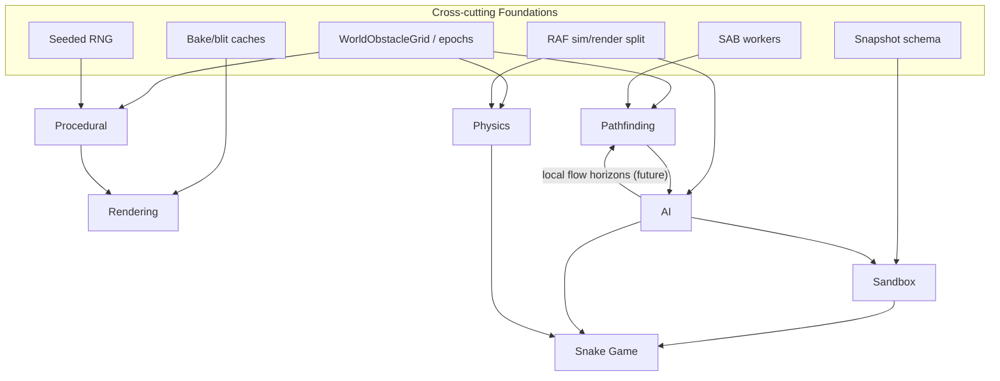

# Engine Roadmap

This is the hub for the 2D-canvas pseudo-3D sandbox engine. The spoke docs own domain detail; this file owns the dashboard, cross-engine comparison, cross-cutting foundations, and grab-list.

**Start here for naming:** [glossary.md](./glossary.md) · **Active queue:** [NOW.md](./NOW.md) · **Structural honesty:** [foundations/architecture-health.md](./foundations/architecture-health.md)

**Design constraints:** Canvas 2D only · single-threaded sim plus Web Worker offload · uniform grid as the shared substrate · bake-and-blit rendering caches · seeded determinism where wired.

**Legend:** ✅ shipped · 🟡 partial / scaffolding · ⬜ not started · ▶ next ship.

---

## 1. Maturity dashboard

| Subsystem | Maturity | Current state | CS core | ▶ Next ship | Doc |
|---|---:|---|---|---|---|
| **Physics** | ~75% | v1 rigid-body sandbox is maintenance-ready; warm-starting, islands, distance constraints, wall/fracture hooks | sequential impulse PGS, SAT, uniform-grid broadphase, island sleep | gameplay-driven joints / CCD only when needed | [physics.md](./physics.md) |
| **Pathfinding** | ~56% | pro-grade grid search + HPA/flow workers; missing smoothing and crowd layer | octile A*, HPA* Voronoi regions, flow-field BFS, SAB workers | funnel / string-pull smoothing | [pathfinding.md](./pathfinding.md) |
| **Rendering** | ~52% | radial pseudo-3D core is strong; no shadows/lighting pass yet | camera-relative elevation projection, painter sort, bake/blit LRU | projected drop shadows | [rendering.md](./rendering.md) |
| **Procedural** | ~42% | strong bake/resolution; weak authorship/generator layer | CA caves, room-graph bake, cardinal corridor A* | unified root seed | [procedural.md](./procedural.md) · algorithms → [Mazes.md](./Mazes.md) |
| **AI** | ~55% | two intent consumers; team hunting; cohesion 4c/4d; **`reachSteps` flow-backed reach** for utility/threat/cohesion | FSM, utility scoring, TTL target memory, faction relationships | Local flow locomotion (Part 2) | [AI.md](./AI.md) |

**Overall engine maturity: ~56%** _(manual unweighted roll-up)._ Recent AI work: flee agents as a second full intent consumer, faction relationship rules, ally perception/memory, and flee regroup (`seek_ally`). Pathfinding flow fields are now wired into snake/flee decision reach, but not yet into locomotion loops.

---

## 2. Engine vs professional baseline

### Simulation / physics

| Capability | This engine | Pro reference | Gap |
|---|---|---|---|
| Integration | ✅ semi-implicit Euler + fixed substeps | Box2D/Chipmunk standard | parity |
| Broadphase | ✅ uniform-grid spatial hash and id-ordered pair stream | SAP / dynamic BVH | grid clumps on uneven density |
| Narrow phase | ✅ SAT, circle fast lane, compound parts | SAT + GJK/EPA | no GJK/EPA distance |
| Contact solve | ✅ sequential impulse, friction, restitution, feature-id warm-start | PGS + block manifolds | limited multi-point manifold depth |
| Constraints | 🟡 distance constraints, chain links, island sleep | revolute/prismatic/weld/motor | only distance |
| CCD | ⬜ substeps only | TOI / conservative advancement | tunneling at high speed |

### Navigation / pathfinding

| Capability | This engine | Pro reference | Gap |
|---|---|---|---|
| Search | ✅ octile/cardinal/abstract A* | A* over navmesh graph | parity on grid |
| Hierarchy | ✅ HPA* Voronoi regions + CSR graph | Detour tiles | parity in grid representation |
| Many agents / one goal | ✅ flow fields (shared window) | bespoke | strong; per-agent flow distance slots wired for decision reach |
| Local agent horizon | 🟡 infra exists | continuum crowds / local fields | `FlowFieldWindow` + range BFS; per-agent flow slots for decision reach |
| Concurrency | ✅ SAB workers + slot leases | job system | parity |
| Dynamic repair | ✅ epoch invalidation + localized region patch | tile-cache rebuild | parity |
| Runtime topology | ✅ `NavRuntime` + `NavTopology` + worker navigation | nav service / tile cache | current naming is now documented |
| Path smoothing | ⬜ raw cell centers | funnel / string-pull | top feel gap |
| Local avoidance | ⬜ physics contact only | RVO / ORCA | no crowd layer |
| Representation | 🟡 uniform grid | navmesh | no variable agent radius |

### AI / decision-making

| Capability | This engine | Pro reference | Gap |
|---|---|---|---|
| Control dispatch | ✅ per-entity behavior + generic agent intent host | controller / behavior component | good plumbing |
| Perception | ✅ vision + LOS + ally/threat/prey classifier | AI perception | sight only |
| Memory | ✅ spatial + TTL target memory (incl. ally) | blackboard / target memory | no shared squad blackboard |
| FSM | ✅ generic host; snake + flee 4 modes each | FSM / behavior tree | no hierarchy |
| Utility scoring | ✅ generic core; snake + flee scorers | utility AI | no authoring layer |
| EQS | 🟡 generic option scorer; explore consumer | Unreal EQS | no debug UI |
| Teams/factions | 🟡 relationships + flee regroup | team-aware targeting | snake regroup + pack flee pending |
| Nav–AI bridge | 🟡 HPA locomotion; flow for sandbox only | local fields + global plan | decision reach uses flow distance slots |
| Strategy/game theory | ⬜ none | GOAP/HTN/MCTS/minimax | future |

### Rendering

| Capability | This engine | Pro reference | Gap |
|---|---|---|---|
| Projection | ✅ camera-relative radial elevation | fixed iso / 2.5D / raycaster | distinctive, not a gap |
| Depth | ✅ painter sort + per-face mesh sort | painter / z / BSP | no per-pixel z by design |
| Caching | ✅ quantized bake/blit LRU | atlas pipeline | parity |
| Texture | ✅ affine wall and prop surface texturing | sprite/sector texturing | affine only |
| Shadows/lighting | ⬜ shadow math exists, unwired | baked/contact shadows | biggest visual gap |
| Perspective modes | 🟡 radial full, flat2d partial | multiple modes | top-down/isometric incomplete |

### Procedural / level generation

| Capability | This engine | Pro reference | Gap |
|---|---|---|---|
| Cave carving | ✅ cellular automata | CA / random walk / noise | parity |
| Bake to geometry | ✅ room graph -> grid, rails, corridors, locks, puzzle template | tunnel/templates | strong |
| Maze helpers | ✅ rail/corridor/belt/split-layout helpers | maze post-processing | growing |
| Unified seed | 🟡 per-system seeds | master seed | root seed missing |
| Layout generator | ⬜ manual room placement | BSP / packing / MST / grammar | headline gap |
| Solvability/difficulty | ⬜ mechanism tests only | solver / difficulty estimator | future AI/procedural bridge |

---

## 3. Architecture map

The desired direction remains: snake proves pressure, generic packages move into `Libraries/AI`, `Libraries/Navigation`, `Libraries/Pathfinding`, `Libraries/Sandbox`, or other engine homes. **Current coupling and debt:** [foundations/architecture-health.md](./foundations/architecture-health.md).

---

## 4. Cross-cutting foundations

### 4.1 Grid / topology contract 🟡→✅

`WorldObstacleGrid`, `gridNavEpoch`, edge stores, floor cells, `NavTopology`, `bakeNavTopology`, and worker SAB topology are the shared substrate. This replaces older nav context language.

- [x] Shared obstacle/topology epochs route grid edits to nav/perception/worker sync.
- [x] Grid consumer contract documented → [foundations/grid-contract.md](./foundations/grid-contract.md).
- [ ] Dynamic kinetic-prop occupancy remains future work.

### 4.2 Seeded determinism 🟡

Per-system seeded RNG exists; one root seed that derives cavern, room graph, placement, and tuning streams does not.

- [ ] ▶ Unified root seed.
- [ ] Purge bare random generation in procedural paths.

### 4.3 Workers / SAB ✅

`SabSlotWorkerHost`, HPA worker, and flow worker are solid. Worker crash recovery is still shallow.

- [ ] Worker resilience for graph patch / worker errors.
- [ ] Reuse host shape for a second non-nav worker domain if needed.

### 4.4 Render caches ✅

Quantized sprite, baked sprite, affine texture, and offscreen caches are core infrastructure.

- [ ] ▶ Cache-pressure telemetry: hit/miss/eviction counts and scene unique key counts.

### 4.5 Persistence 🟡

Scene snapshots persist props, constraints, chains, room graph, factions, and visual overrides.

- [ ] ▶ Schema round-trip test for persisted fields.

### 4.6 Sim/render split 🟡

Physics/game hook boundary is peeled; render still reads live sim state without interpolation.

- [ ] Fixed-step accumulator + render interpolation investigation.

---

## 5. Spoke synopsis

### Physics

- [x] Rigid body core, SAT, sequential impulse, island sleep, distance constraints.
- [x] Warm-start/contact coherence stack is shipped.
- [x] Snake and sandbox chains exercise v1.
- [ ] Revolute/motor, CCD, breakable/mixed-shape chains only when gameplay demands them.

### Pathfinding

- [x] A*, HPA*, flow fields, SAB workers, incremental replan.
- [x] Runtime topology now lives in `Libraries/Navigation` (`NavRuntime`, `NavTopology`).
- [ ] ▶ Funnel/string-pull smoothing.
- [ ] Local separation / RVO-style crowd.
- [ ] **Local flow locomotion (Part 2)** — 2a flee flow steering, 2b hybrid HPA → 3 blended fields · [`current/fsmroadmap.md`](current/fsmroadmap.md)
- [ ] **AI consumer dedupe & FSM hygiene (Part 4)** — dedupe snake/flee; generic derives in `Libraries/AI/` · [`current/fsmroadmap.md`](current/fsmroadmap.md)
- [ ] **Per-agent local flow horizons (locomotion Part 2)** — 2a flee flow → 2b hybrid HPA → 3 blended fields · [AI.md](./AI.md#future-local-flow-horizons)

### Rendering

- [x] Four rendering pipelines: prop cache, grid stamp cache, wall atlas, overlays.
- [x] Radial pseudo-3D projection and bake/blit cache are mature.
- [ ] ▶ Projected shadows.
- [ ] Top-down / fixed isometric mode ladder.

### Procedural

- [x] CA caves, room-graph bake, corridor solver, locked-room and puzzle template bakes.
- [x] `Procedural/Mazes` adds maze/corridor/split helpers — algorithm catalog → [Mazes.md](./Mazes.md).
- [ ] ▶ Unified root seed.
- [ ] Room-graph generator v1.

### AI

- [x] Generic agent intent host.
- [x] Spatial memory, target memory, utility scoring, EQS option scoring.
- [x] Snake 4-mode forage FSM with effort-aware decisions and debug snapshots.
- [x] Flee agent second consumer — explore, seek_food, seek_ally, flee.
- [x] Team hunting — faction relationships, rival band, config prey value, shared `classifyAgentVision`.
- [x] Ally perception + memory + blackboard (`allyState`, TTL ally slot).
- [x] Flee `seek_ally` regroup when safe and satisfied.
- [x] Cohesion **4c** (snake regroup) and **4d** (flee pack flee blend).
- [x] **FSM reach (`reachSteps`)** — Flow-backed reach ✅ · [`current/fsmroadmap.md`](current/fsmroadmap.md)
- [ ] **Local flow locomotion (Part 2)** — 2a flee flow steering, 2b hybrid HPA → 3 blended fields · [`current/fsmroadmap.md`](current/fsmroadmap.md)
- [ ] **AI consumer dedupe & FSM hygiene (Part 4)** — dedupe snake/flee; generic derives in `Libraries/AI/` not `snakeDecisionModel.js`
- [ ] Behavior-tree skeleton over existing intent primitives.

---

## 6. Library map

The detailed map lives in [library-audit.md](./library-audit.md). Condensed:

| Concern | Current homes |
|---|---|
| Physics | `Libraries/Motion`, `Libraries/Spatial/collision`, `Systems/World` |
| Pathfinding | `Libraries/Pathfinding`, `Libraries/Navigation`, `Libraries/Workers` |
| AI | `Libraries/AI/agentIntent`, `AI/brain`, `AI/memory`, `AI/utility`, `AI/eqs`, `Agent` |
| Rendering | `Libraries/Render`, `Canvas`, `WorldSurface`, `Spatial/iso`, `Render` |
| Procedural | `Libraries/CA`, `RoomGraph`, `Procedural/Mazes`, `Procedural/Motifs`, `Config/procedural` |
| Sandbox | `Libraries/Sandbox`, `SandboxEditor`, `Editor`, `UI`, `Pipeline` | [sandbox-editor.md](./sandbox-editor.md) |
| Snake game | `Libraries/Game/snake`, `Config/games/snake.js`, snake-specific props | [games/snake.md](./games/snake.md) |

---

## 7. Active tasks available to grab

See [NOW.md](./NOW.md) for the short weekly queue. This section is the longer strategic grab-list.

### Highest strategic overlap

1. **Local flow locomotion (Part 2)** — 2a flee flow steer, 2b hybrid HPA, 3 blended fields · [`current/fsmroadmap.md`](current/fsmroadmap.md)
2. **AI consumer dedupe & FSM hygiene (Part 4)** — snake/flee cleanup; generic derives in `Libraries/AI/` · same doc
3. **Funnel / string-pull path smoothing** — pathfinding feel win, visibly improves snake chase/explore.
4. **Unified root seed** — procedural reproducibility, regression tests, future level generator.
5. **Render cache telemetry** — supports dense snake/sandbox scenes and sizes caches from evidence.

### By domain

| Domain | Grab-list |
|---|---|
| AI | local flow locomotion 2a–3; **FSM hygiene & dedupe (Part 4)**; behavior-tree skeleton; decision debug view |
| Pathfinding | path smoothing; per-agent local flow window pool; local separation; hybrid HPA waypoint + flow execution; worker resilience |
| Procedural | unified root seed; seed golden tests; room-graph generator v1; Poisson/min-distance placement |
| Rendering | projected shadows; cache telemetry; projection/viewport tests; top-down 2D completion |
| Physics | revolute/motor joints, CCD, breakable links only after a gameplay feature needs them |
| Foundations | snapshot round-trip tests; fixed-step accumulator investigation · grid contract → [foundations/grid-contract.md](./foundations/grid-contract.md) |

---

## 8. Limitations

- Maturity percentages are **manual snapshots** — not auto-computed from tier checkboxes. Prefer spoke tier status or [NOW.md](./NOW.md) for what to work on next.
- This hub intentionally summarizes; spoke docs hold detail.
- The docs should be refreshed when a generic package lands from a snake proving-ground feature.
- Naming traps and doc boundaries → [glossary.md](./glossary.md).

---

## 9. Spokes

[glossary.md](./glossary.md) · [NOW.md](./NOW.md) · [physics.md](./physics.md) · [pathfinding.md](./pathfinding.md) · [rendering.md](./rendering.md) · [procedural.md](./procedural.md) · [Mazes.md](./Mazes.md) · [AI.md](./AI.md) · [library-audit.md](./library-audit.md)

**Domain:** [games/snake.md](./games/snake.md) · [foundations/grid-contract.md](./foundations/grid-contract.md) · [foundations/architecture-health.md](./foundations/architecture-health.md) · [sandbox-editor.md](./sandbox-editor.md)

*Last updated: FSM reach phase 1 (flow-backed reach) complete · [`current/fsmroadmap.md`](current/fsmroadmap.md)*
