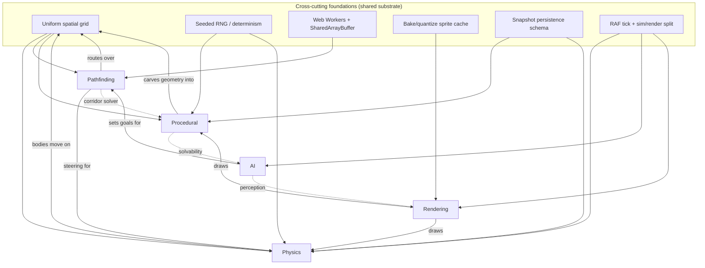

# Engine Roadmap — the bible

The single hub for this engine: a **2D-canvas, pseudo-3D sandbox engine** (no WebGL, by design). This doc consolidates the five subsystem roadmaps into one map of **what exists, in what state, what it's actually doing computer-scientifically, and what realistically ships next**. Spokes hold the detail; this hub holds the dashboard, the cross-engine comparison, the shared foundations, the library audit, and the master backlog.

**Thesis:** measure honestly against the professional 2D / pseudo-3D engine canon (Box2D/Chipmunk, Recast/Detour, Unreal BT/EQS, Spelunky/WFC procgen, sprite-iso & Build-engine renderers) — then always keep *one realistic, foundational task* on the path.

**Design constraints (load-bearing):** Canvas 2D only · single-threaded sim + Web Worker offload · uniform grid as the spatial substrate · bake-and-blit caching over live redraw · seeded determinism where it's wired.

---

## Conventions

**Status:** ✅ shipped · 🟡 partial / scaffolding · ⬜ not started · 🔗 owned by another doc · ▶ next ship (the one-step-away task)

**Percentages** are *honest engineering completion* (working, wired, exercised) — not file existence. Subsystem % is hand-tallied from its spoke; the overall figure is an **unweighted mean (manual roll-up)** — see [Limitations](#limitations).

**CS-grounding convention:** every capability is annotated with *what is actually being computed* — the algorithm, data structure, or numerical method — so this reads as a design doc, not a feature list. Example: "sleep" → *island-based temporal-coherence deactivation*; "nav" → *octile A\* over a binary min-heap with a consistent heuristic*.

**Ownership rule (why the docs stop overlapping):** each concern has exactly **one owner doc**; everything else `🔗`-references it. Geometry is carved in `procedural`, drawn in `rendering`, routed through in `pathfinding`, judged by `AI`, simulated by `physics`. Shared substrate lives in [Cross-cutting foundations](#cross-cutting-foundations).

**Per-doc template:** intro → legend → maturity % → vs-pro table → Mermaid tree → tiers (with CS annotations + ▶ next) → next unlocks → file map → footer.

---

## 1. Maturity dashboard

| Subsystem | Maturity | One-line state | CS core | ▶ Next ship | Doc |
|---|---|---|---|---|---|
| **Physics** | ~58% | rigid-body core solid; no CCD, no joints beyond distance | sequential-impulse PGS solver, SAT, uniform-grid broadphase | persistent contact manifolds (feature-id warm-start) | [physics.md](./physics.md) |
| **Pathfinding** | ~55% | pro planning core; no local avoidance or smoothing | octile A\* + HPA\* Voronoi abstraction + flow-field BFS, off-thread on SAB | funnel / string-pull path smoothing | [pathfinding.md](./pathfinding.md) |
| **Rendering** | ~52% | distinctive radial pseudo-3D; no lighting/shadows | camera-relative elevation projection + painter's sort + bake/blit LRU | wire projected drop shadows (math exists) | [rendering.md](./rendering.md) |
| **Procedural** | ~40% | strong *resolution*, weak *authorship* | cellular-automata caves + room-graph bake + cardinal-A\* corridors | unified root seed → derived subsystem seeds | [procedural.md](./procedural.md) |
| **AI** | ~30% | one agent with a real perception-gated FSM + memory; snake-bound, narrow | vision-gated intent FSM + recency-LRU spatial memory + stigmergic A\* cost penalty | generalize the loop into a reusable agent FSM | [AI.md](./AI.md) |

**Overall engine maturity: ~47%** *(unweighted mean of the five pillars; manual)* — a genuinely capable physics/nav/render core with a distinctive projection, a young procedural layer, and a narrow-but-real decision-AI layer (one smart agent, not yet a system).

---

## 2. Engine vs professional — master comparison

Grouped by domain. Each row: the capability, **what you have (with the CS technique)**, the pro reference, and the gap. This is the centerpiece.

### Simulation / physics

| Capability | This engine | Pro (Box2D · Chipmunk · Rapier) | Gap |
|---|---|---|---|
| Integration | ✅ semi-implicit (symplectic) Euler + fixed substeps | same + sub-stepping | parity |
| Broadphase | ✅ uniform-grid spatial hash, id-ordered pair stream | SAP / dynamic BVH | grid clumps on uneven density |
| Narrow phase | ✅ SAT (poly/poly), circle tiers | SAT + GJK/EPA | no GJK/EPA distance |
| Contact solve | ✅ sequential impulse (PGS), Baumgarte position correction, Coulomb friction, restitution | same + block solver | single-point manifolds, partial warm-start |
| Continuous collision | ⬜ substeps only | conservative advancement / TOI | tunneling at speed |
| Constraints | 🟡 distance joints, island sleep | revolute/prismatic/weld/motor + soft constraints | only distance |
| Determinism | 🟡 fixed dt | fixed-point / cross-platform determinism | float, non-deterministic |

### Navigation / pathfinding

| Capability | This engine | Pro (Recast/Detour · UE Nav) | Gap |
|---|---|---|---|
| Search | ✅ octile A\* (binary min-heap, consistent heuristic) | A\* over poly graph | parity on grid |
| Hierarchy | ✅ HPA\* (distance-transform Voronoi regions → CSR abstract graph) | Detour tiles | parity |
| Many-agents-one-goal | ✅ flow field (backward BFS / unweighted Dijkstra, 9-dir encoding) | bespoke | ahead of most |
| Concurrency | ✅ Web Worker + SharedArrayBuffer slot pools, lease/handshake | job system | parity |
| Dynamic repair | ✅ epoch invalidation + localized region-graph patch | Detour tile-cache rebuild | parity |
| Representation | 🟡 uniform grid | polygon **navmesh** | no mesh, no agent-radius variation |
| Local avoidance | ⬜ grid blocking only | **RVO / ORCA** crowd | none |
| Smoothing | ⬜ raw cell waypoints | funnel / string-pull | blocky paths |

### Rendering

| Capability | This engine | Pro (sprite-iso · Build/Doom) | Gap |
|---|---|---|---|
| Projection | ✅ **camera-relative radial elevation** (distinctive) | fixed dimetric / first-person ray | novel, not a gap |
| Depth | ✅ painter's algorithm (distance² back-to-front) + per-face mesh sort | painter's / z / BSP | no per-pixel z (intentional) |
| Caching | ✅ offscreen bake + quantized LRU (spatial/angular/zoom buckets) | atlas pipeline | parity |
| Texture | ✅ affine quad mapping for walls | sprite blit / perspective columns | affine only |
| Shading | 🟡 fake fixed-vector directional gradient | baked / sector light | no real model |
| Shadows | ⬜ math exists, **unwired** | baked / contact | absent in pass |
| Perspective modes | 🟡 radial ✅, flat2d/top-down 🟡, isometric ⬜, first-person ⬜🔀 | many | one full mode |
| Redraw | ⬜ full clear each frame | dirty-rect / damage | no incremental |

### Procedural / level generation

| Capability | This engine | Pro (Spelunky · DCSS · WFC) | Gap |
|---|---|---|---|
| Cave carving | ✅ cellular automata (Moore majority-rule smoothing) | CA / walk / noise | parity |
| Seeded RNG | ✅ LCG, scoped `Math.random` | master seed | partial coverage |
| Bake to geometry | ✅ room-graph → grid (cardinal-A\* corridors, locked-room mechanisms) | tunneling / templates | strong |
| **Layout generation** | ⬜ manual room placement | BSP / packing / MST / grammars | the headline gap |
| Constraint layout | ⬜ none | **WFC** / CSP | none |
| World scale | 🟡 single expandable region | chunk-streamed | no streaming |

### AI / decision-making

| Capability | This engine | Pro (UE BT/EQS · F.E.A.R. GOAP · Sims utility) | Gap |
|---|---|---|---|
| Control dispatch | ✅ per-entity active behavior + tick | behavior controller | parity (plumbing) |
| Autonomy | ✅ vision-gated seek + frontier explore | BT leaf tasks | snake-bound |
| Perception | ✅ vision cone + LOS **driving decisions & nav cost** | AI perception (sight/teams) | sight only |
| Memory | 🟡 recency-LRU spatial cell memory → stigmergic A\* penalty | blackboard / target tracking | cells, not entities |
| State / decisions | 🟡 2-state intent FSM (seek/explore), hardcoded | FSM + BT + utility AI | no BT/utility, not reusable |
| Squads / strategy / game theory | ⬜ faction metadata only | formations, GOAP/HTN, minimax/MCTS | none |

---

## 3. Architecture & dependency map

The arrows are the `🔗` handoffs the spokes reference. The **grid** is the universal substrate; everything else is a layer over it.

---

## 4. Cross-cutting foundations

The shared spine every spoke leans on but none should own. This is their home. Each gets state + CS grounding + the realistic next step.

### 4.1 Uniform spatial grid 🟡→✅ (~80%)
The substrate: `WorldObstacleGrid` (16 px cells, voxel walls, edge barriers, floor store), `EntityGrid` broadphase index, `canStep` topology, `gridTopologyEpoch` invalidation channels.
- **CS:** uniform-grid spatial hashing; cell-indexed neighbor queries; epoch-stamped cache invalidation.
- [ ] ▶ **Next:** document the grid's three consumers (physics broadphase, nav topology bake, procedural stamp) as one contract so changes don't silently desync epochs.
- [ ] Dynamic kinetic-prop occupancy (props as transient obstacles) — currently nav ignores moving bodies.

### 4.2 Seeded determinism 🟡 (~40%)
`Libraries/Random/seededRandom.js` + `Libraries/Math/SeededRng.js` — a linear congruential generator (LCG), scoped `Math.random` patch.
- **CS:** LCG PRNG; deterministic stream from integer seed.
- [ ] ▶ **Next:** a **unified root seed** that deterministically derives per-subsystem seeds (cavern, room-graph, placement, physics jitter) via hashing — the prerequisite for reproducible everything.
- [ ] Purge bare `Math.random` from generation paths.

### 4.3 Web Workers + SharedArrayBuffer ✅ (~80%)
`SabSlotWorkerHost` + nav workers. Off-thread planning with shared-memory slot pools.
- **CS:** SharedArrayBuffer double-buffering; `requestId`/`readyId` atomics handshake; lease/release slot allocation; lock-free-ish read of baked results.
- [ ] ▶ **Next:** generalize the host so a *second* domain (e.g. surface bakes already exist; future procedural gen) reuses it cleanly.
- [ ] Worker crash recovery (currently `graphPatchError` logs only).

### 4.4 Bake / quantize sprite cache ✅ (~80%)
`QuantizedSpriteCache`, `BakedSpriteCache`, `AffineTexture`, `offscreenCanvas`.
- **CS:** memoized rasterization keyed by quantized parameters (spatial offset, angle index, zoom bucket); LRU eviction; affine image warp via triangle/quad decomposition.
- [ ] ▶ **Next:** cache-pressure telemetry (hit rate, eviction count) to size LRUs against real scenes instead of fixed caps.

### 4.5 Snapshot persistence 🟡 (~70%)
Scene snapshot **schema v9** — flat props, kinetic constraints, chain head, room graph, factions.
- **CS:** versioned serialization with explicit schema migration at the load boundary.
- [ ] ▶ **Next:** a schema-version test that round-trips every persisted field, so bumps to v10 can't silently drop data.

### 4.6 RAF tick + sim/render split 🟡 (~50%)
`Apps/Editor/engine.js` RAF loop → sim tick (when unpaused) → `drawLabFrame`.
- **CS:** variable-timestep RAF with dt clamping; render reads sim `gameTime` directly (no interpolation).
- [ ] ▶ **Next:** decouple a fixed-step sim accumulator from render, with render-side interpolation — removes timestep coupling that touches physics *and* animation.

---

## 5. The five roadmaps (synopsis + checklist)

Collapsed tier checklists; click through to the spoke for CS detail and per-tier `▶ next`.

<b>Physics</b> — ~58% · rigid-body sandbox · <a href="./physics.md">physics.md</a>

- [x] Body model + uniform-grid broadphase (SAT narrow phase)
- [x] Semi-implicit Euler integration, fixed substeps, island sleep
- [x] Sequential-impulse contact solve, distance constraints, chains
- [x] Static voxel/rail walls, fracture, snake autosim payoff
- [ ] ▶ Persistent contact manifolds (feature-id warm-start) + substep early-out
- [ ] Revolute / motor joints; CCD (TOI); mixed-shape breakable chains

<b>Pathfinding</b> — ~55% · grid HPA\* + flow fields + workers · <a href="./pathfinding.md">pathfinding.md</a>

- [x] Octile + cardinal + abstract A\* (binary min-heap)
- [x] HPA\* Voronoi region abstraction (distance transform, CSR graph)
- [x] Flow-field BFS, off-thread SAB workers, incremental replan
- [x] Corridor routing (room authoring), snake nav payoff
- [ ] ▶ Funnel / string-pull path smoothing (reuses LOS; transfers to navmesh)
- [ ] Local separation/RVO; navmesh + variable agent radius (long-term)

<b>Rendering</b> — ~52% · radial pseudo-3D, Canvas 2D · <a href="./rendering.md">rendering.md</a>

- [x] Camera-relative radial elevation projection + painter's depth sort
- [x] Four pipelines (prop / grid-stamp / wall-atlas / overlay) on one bake cache
- [x] Affine wall texturing, mesh props, viewport + back-face culling
- [x] Vector debug mode, animated surface flipbooks
- [ ] ▶ Wire projected drop shadows (`shadowProjection.js` exists, unwired)
- [ ] Finish top-down 2D + fixed isometric; first-person Build/DOOM (🔀 divergent)

<b>Procedural</b> — ~40% · resolution strong, authorship weak · <a href="./procedural.md">procedural.md</a>

- [x] Cellular-automata caverns (seeded), shape masks, voxel + rail stamp
- [x] Room-graph model + bake → geometry (cardinal-A\* corridors, locked rooms)
- [x] One puzzle template (probe-before-commit), open-cell placement
- [ ] ▶ Unified root seed (shared with [4.2](#42-seeded-determinism-))
- [ ] Room-graph generator (rect packing / MST) feeding the existing bake — the keystone
- [ ] WFC / BSP / template library / biome map (long-term)

<b>AI</b> — ~30% · one agent with perception-gated FSM + memory · <a href="./AI.md">AI.md</a>

- [x] Per-entity behavior dispatch + active-behavior id + tick model
- [x] Vision-gated intent FSM: `seek` (goal visible) ↔ `explore` (`snakeAutosim`)
- [x] Spatial working memory (recency-LRU) → frontier explore + stigmergic A\* step penalty
- [x] Perception (vision cone + LOS) **drives both target choice and path cost**
- [ ] ▶ Extract a reusable agent FSM (lift seek/explore + brain out of `snakeAutosim`)
- [ ] Utility/EQS-style scored decisions; flee/pursue states; behavior trees
- [ ] Faction hostility, squads, strategy, game theory, puzzle solvability (long-term)

---

## 6. Library audit

Every major code home, its owner doc, state, and CS role. **Condensed below — the full per-file map, naming-traps table, test-coverage map, and "where do I add X?" index live in [library-audit.md](./library-audit.md).** Start there if a folder name is confusing.

| Path | Owner | State | What it is (CS) |
|---|---|---|---|
| `Libraries/Motion/` | physics | ✅ | integration, damping, sleep, distance constraints, wall resolution |
| `Libraries/Spatial/collision/` | physics | ✅ | broadphase (grid hash), SAT narrow phase, sequential-impulse solver, pair stream |
| `Libraries/Spatial/grid/` | 🔗 foundations | ✅ | `WorldObstacleGrid`, edges, floor store, nav topology, epochs |
| `Libraries/Spatial/indexes/` | 🔗 foundations | ✅ | `EntityGrid` broadphase index |
| `Libraries/Spatial/query/` | pathfinding/AI | ✅ | LOS, ray cast, circle cast (Bresenham/DDA stepping) |
| `Libraries/Spatial/iso/` | rendering | ✅ | radial elevation projection, elevation camera, shadow math (unwired) |
| `Libraries/Pathfinding/` | pathfinding | ✅ | A\*, HPA\*, flow fields, sessions, SAB pools |
| `Libraries/Pathfinding/Corridor/` | pathfinding | ✅ | cardinal-A\* corridor solver (used by procedural bake) |
| `Libraries/Workers/` | 🔗 foundations | ✅ | SAB slot worker host, nav workers |
| `Libraries/Render/` | rendering | ✅ | Props3D meshes, Structure3D wall atlas, overlays, surface texturing |
| `Libraries/Canvas/` | 🔗 foundations | ✅ | quantized/baked sprite cache, affine texture, offscreen |
| `Libraries/Viewport/` | rendering | ✅ | pan/zoom transform, visibility AABBs |
| `Libraries/WorldSurface/` | rendering/procedural | ✅ | chunk surface atlases, worker bake coordinator |
| `Libraries/CA/` | procedural | ✅ | cellular-automata cave generator |
| `Libraries/RoomGraph/` | procedural | ✅ | room-graph model + bake → geometry, locked rooms, puzzle template |
| `Libraries/Random/`, `Libraries/Math/` | 🔗 foundations | 🟡 | LCG PRNG, seeded RNG, angle utils |
| `Libraries/Procedural/` | 🔗 rendering | ✅ | Perlin / Voronoi — **textures, not geometry** (naming trap) |
| `Libraries/Sandbox/` | mixed | ✅ | behaviors, groundNav, autosim, chain links, floor occupancy, map gen |
| `Libraries/SandboxEditor/` | tooling | ✅ | controller, overlay collector, inspectors |
| `Libraries/AI/brain/` | AI | ✅ | spatial cell memory (recency LRU), nav step penalty (memory → A\* cost) |
| `Libraries/Navigation/perception/` | AI | ✅ | vision cone + grid LOS — **drives target choice + memory stamping** |
| `Libraries/Navigation/steering/` | AI | ✅ | `exploreSteering` — frontier explore destination pick |
| `Libraries/FSM/` | AI | 🟡 | generic transition infra (snake FSM is hand-rolled in `snakeAutosim`) |
| `Libraries/Agent/` | AI | ✅ | pose + steering result contracts |
| `Libraries/Game/snake/` | AI/game | ✅ | intent FSM (`snakeAutosim`), brain wiring (`snakeBrain`), goals, multi-snake |
| `Libraries/DataStructures/` | 🔗 foundations | ✅ | binary min-heap, grid BFS toolkit, **LRU map, packed cell keys** |
| `Entities/`, `Systems/`, `GameState/` | mixed | ✅ | WorldProp + strategy, KineticSpatialFrame, NavigationService, shared state |
| `Render/`, `Apps/Editor/` | rendering/tooling | ✅ | render loop, draw passes, editor shell, map gen entry |
| `Core/`, `Config/` | foundations | ✅ | perspective, procedural design, engine globals, game/world config |

---

## 7. Master backlog — biased to one-step-away

Cross-subsystem priority queue. Ordered by **foundational leverage** (unblocks the most, lowest risk), every item realistic from where the code is *today*. This is the "always a task on the path" guarantee.

- [ ] **1. Unified root seed** (`foundations 4.2` + `procedural T10`) — derive all subsystem seeds from one root; unblocks reproducible generation and regression tests. *Cheap, high leverage.*
- [ ] **2. Reusable agent FSM** (`AI T3`) — lift `snakeAutosim`'s `seek`/`explore` + `createBrain` into a generic agent intent system any prop can mount; the decision loop already works for the snake, this generalizes it.
- [ ] **3. Funnel path smoothing** (`pathfinding T6`) — string-pull over octile paths using existing LOS; immediate feel win, transfers to a future navmesh.
- [ ] **4. Projected drop shadows** (`rendering T10`) — wire the existing `shadowProjection.js` into the prop/wall pass; biggest visual payoff for least effort.
- [ ] **5. Persistent contact manifolds** (`physics T4/T7`) — feature-id keyed warm-start; stabilizes stacking and dogpiles.
- [ ] **6. Room-graph generator v1** (`procedural T11`) — rect packing + MST connectivity → existing bake; flips the engine to true procedural authorship.
- [ ] **7. Utility/EQS scored decisions** (`AI T4`) — generalize `pickExploreDestination` into a scored spatial query; pick among multiple visible goals by distance/contested-ness. Builds on #2.
- [ ] **8. Top-down 2D mode** (`rendering T11`) — true orthographic projection; rung 2 of the perspective ladder.

> **Pairing note:** #1 and #6 chain (seed → reproducible generator); #2 and #7 chain (generic FSM → scored decisions on it); #3 and #4 are independent quick wins. A natural first sprint is **#1 + #2 + #4** — one per domain, all one-step-away.
> **Shipped since hub v1:** perception-gated target selection and a 2-state intent FSM (seek/explore) — both were on the original backlog and are now done in `snakeAutosim`; backlog re-pointed to *generalizing* them.

---

## 8. Limitations of this doc {#limitations}

- **Roll-up percentages are manual.** Markdown can't compute; the overall % is an unweighted mean. A future data-driven source (YAML → generated dashboard) or a Cursor Canvas would compute it live.
- **No transclusion in vanilla md** — spoke content is *linked*, not embedded, to avoid drift. A build tool (mdBook / MkDocs includes) would allow a true single rendered view.
- **Mermaid/`
`** render on GitHub & Obsidian; verify in your viewer of choice.

---

## 9. Spokes & changelog

**Spokes:** [physics.md](./physics.md) · [pathfinding.md](./pathfinding.md) · [rendering.md](./rendering.md) · [procedural.md](./procedural.md) · [AI.md](./AI.md)
**Reference:** [library-audit.md](./library-audit.md) — full per-file map, naming traps, "where do I add X?"

*Last updated: **PR2** — every spoke now carries a CS-grounded **Fundamentals checklist** (textbook-coverage lens) alongside its feature tiers, and the **library audit** caught a real miss: `Libraries/AI/brain/` (recency-LRU spatial memory + memory→A\* step penalty) and the `snakeAutosim` perception-gated intent FSM were undocumented — **AI re-rated ~18% → ~30%**, overall ~45% → ~47%, and the master backlog re-pointed off the now-shipped "perception → decision" / "intent FSM" items. Next: PR3 — make it living (every tier ends with a `▶ Next ship`, computed roll-ups from a data source). Revisit when any ▶ next-ship task lands.*

> **Changelog**
> - **hub v1** — dashboard, CS-grounded master comparison, architecture/dependency map, cross-cutting foundations, condensed library audit, master backlog.
> - **PR2** — fundamentals checklists on all five spokes; AI audit correction (brain/memory/FSM); library-audit rows for `AI/brain`, `Navigation/steering`, `DataStructures` (LRU/cell-keys); backlog re-pointed.
> - **PR2 (audit)** — added [library-audit.md](./library-audit.md): full per-file map of ~411 modules, naming-traps disambiguation, test-coverage map, and a "where do I add X?" index.
