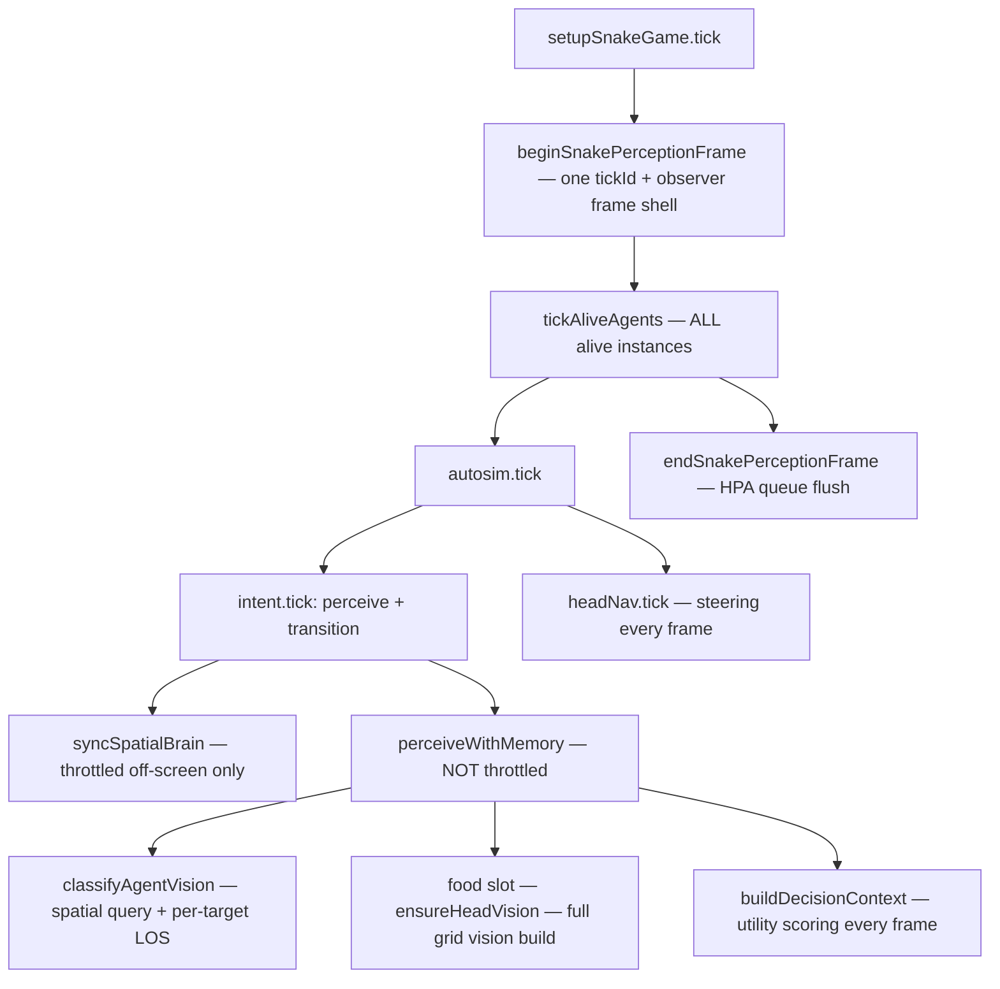

# AI / Vision Throttling — Current State and All Options

## What runs today (every frame, every alive agent)



**Entry points:** [`Libraries/Game/snake/setupSnakeGame.js`](Libraries/Game/snake/setupSnakeGame.js), [`Libraries/Game/snake/snakeAgentSession.js`](Libraries/Game/snake/snakeAgentSession.js), [`Libraries/Game/snake/agentAutosim.js`](Libraries/Game/snake/agentAutosim.js), [`Libraries/Game/snake/groundNavIntentProfiles.js`](Libraries/Game/snake/groundNavIntentProfiles.js) (`tick` → `perceive` + `transition`), [`Libraries/AI/agentIntent/createAgentIntent.js`](Libraries/AI/agentIntent/createAgentIntent.js).

### Throttling that already exists

| Layer                        | Mechanism                                                                                                            | What it actually skips                                                  | Config / constant                                                                                                                             |
| ---------------------------- | -------------------------------------------------------------------------------------------------------------------- | ----------------------------------------------------------------------- | --------------------------------------------------------------------------------------------------------------------------------------------- |
| **Perception tick batching** | `beginSnakePerceptionFrame` sets one `simTick` per game frame; all agents share the same observer vision frame shell | Duplicate frame _setup_ (not duplicate work per agent)                  | [`snakePerception.js`](Libraries/Game/snake/snakePerception.js)                                                                               |
| **Vision pose cache**        | `lookupHeadVisionCache` — same agent, same grid cell + range + `perceptionTick`                                      | Rebuilding `collectVisibleGridCells` when cache still valid within tick | [`observerVisionFrame.js`](Libraries/Navigation/perception/observerVisionFrame.js)                                                            |
| **Brain spatial stamp**      | `frame.shouldSyncBrain(agent)` — on-screen every pass; off-screen every N passes                                     | `ensureHeadVision` + `brain.stampSeenCells` only (not FSM/decisions)    | `brainSyncOffScreenInterval: 4` in [`Config/games/snake.js`](Config/games/snake.js)                                                           |
| **HPA replan budget**        | `HpaPathSession` — max new replans/frame + peak inflight + 15-frame cooldown per nav state                           | Worker path _starts_ (not steering follow)                              | `HPA_REPLAN_FRAME_START_BUDGET = 12`, `HPA_REPLAN_PEAK_INFLIGHT_CAP = 16` in [`hpaReplanPolicy.js`](Libraries/Pathfinding/hpaReplanPolicy.js) |
| **Off-screen replan gate**   | `obstacleReplanAllowed` / `sandboxReplanAllowed` — off-screen agents only replan when stuck                          | Off-screen _replan requests_ (on-screen always eligible)                | [`hpaGroundNavSession.js`](Libraries/Sandbox/groundNav/hpaGroundNavSession.js)                                                                |
| **FSM hysteresis**           | `modeExitDelayTicks`, flee latch, target sticky factor, intent memory TTLs                                           | Mode _flapping_ (gameplay, not CPU)                                     | shared config in [`Config/games/snake.js`](Config/games/snake.js)                                                                             |
| **Physics sleep**            | `kineticSleep` on props — bodies can sleep when still                                                                | Collision solve cost for sleeping chains                                | unrelated to AI think                                                                                                                         |

### What is NOT throttled today

- **Full FSM think path** — every alive agent, every frame: `perceiveWithMemory` → agent classification → food vision → memory enrich → flow reach steps → utility scoring → policy pick.
- **Agent classification** — [`classifyAgentVision`](Libraries/AI/perception/classifyAgentVision.js) does `entityRegistry.queryView` + `hasGridCellLineOfSight` per candidate every think (does not use the cached cell set).
- **Food visibility** — [`resolveVisibleCategoryInVision`](Libraries/AI/perception/agentWorldPerception.js) calls `ensureHeadVision` → full `collectVisibleGridCells` per agent per think.
- **Perf test expectation** — [`tests/snakePerfBudget.test.js`](tests/snakePerfBudget.test.js) asserts `visionFullBuilds <= snakes × ticks`, i.e. **one full vision build per snake per tick is the designed baseline**, not an accident.

**Your instinct is correct:** the main-thread cost is dominated by per-agent perception + decisions every frame; physics/collision may be a smaller slice than you feared once think is budgeted.

---

## Plans folder coverage (gap)

| Doc                                                            | Mentions throttling?                                                     |
| -------------------------------------------------------------- | ------------------------------------------------------------------------ |
| [`Plans/games/snake.md`](Plans/games/snake.md)                 | Perception _batching_ (shared tickId), not think budgets                 |
| [`Plans/current/performance.md`](Plans/current/performance.md) | Micro-opts (LOS inline, registry fallback) — no scheduler                |
| [`Plans/physics.md`](Plans/physics.md)                         | Future item: **"Off-screen snake sleep + replan budget"** — not designed |
| [`Plans/AI.md`](Plans/AI.md)                                   | Observer frame + classifier — no tick scheduler                          |
| [`Plans/ROADMAP.md`](Plans/ROADMAP.md)                         | No AI scheduling row                                                     |

**No existing plan** defines a throttling framework, FSM skip semantics, or config surface. That would be new documentation in `Plans/` once you pick an approach.

---

## How professional engines typically handle this

| Pattern                  | Examples                                              | Idea                                                          |
| ------------------------ | ----------------------------------------------------- | ------------------------------------------------------------- |
| **Perception interval**  | UE `UAIPerceptionComponent`, Source `Think` intervals | Sight/hearing update every 0.1–0.5s, not every frame          |
| **Think interval**       | Source `NextThink`, Quake AI schedules                | Decision/behavior tick at `0.1s` while physics runs at `60Hz` |
| **Significance / LOD**   | UE Significance Manager, Frostbite tiers              | Near camera = full AI; far = reduced rate; off-map = dormant  |
| **Time-sliced budget**   | Job systems, UE mass entity                           | "Process N agents this frame" round-robin queue               |
| **Spatial amortization** | Shared visibility queries                             | One query per sector/cell, many agents read cached results    |
| **Sleep / dormant**      | UE `AActor` tick disabled, Unity `enabled = false`    | Zero AI + often zero sim until awakened                       |
| **Async workers**        | Nav on workers (you already have this for HPA)        | Main thread only consumes results                             |

Your codebase already has **worker nav budgeting** and **off-screen replan gating** — the missing piece is a **main-thread think/perception scheduler** analogous to `HpaPathSession`.

---

## Option menu — all approaches on the table

### A. Micro-optimization only (no scheduler)

**What:** Faster LOS, shared LOS between agent classification and food, inline grid checks, registry query fixes ([`performance.md`](Plans/current/performance.md) §2.1–2.2).

**Pros:** No behavior change; no FSM semantics to define.

**Cons:** Still O(agents × tick); does not scale to hundreds of snakes; does not address decision scoring cost.

**FSM impact:** None.

---

### B. Unify vision paths (reduce duplicate work within one think)

**What:**

- Run `ensureHeadVision` once per think; pass cell set into `classifyAgentVision` for agent LOS instead of per-target Bresenham.
- Or invert: classify agents via spatial query only, food via cell set only — but **one** full build per think, not two code paths.

**Pros:** Cuts redundant LOS; may halve vision-adjacent cost without changing tick rate.

**Cons:** Still every agent every frame; classification still does spatial query every think.

**FSM impact:** None if outputs are identical.

---

### C. Raise `brainSyncOffScreenInterval` / extend same pattern to think

**What:** Reuse `shouldSyncBrain` logic (viewport `circleInBounds` + modulo pass counter) but apply to **full `perceiveWithMemory`** or subsets (vision only, decide only).

**Pros:** Minimal new architecture; config knob already familiar (`brainSyncOffScreenInterval`).

**Cons:** Ad-hoc; easy to apply wrong layer (brain already throttled but food vision not); round-robin fairness not guaranteed — agents with same pass phase bunch up.

**FSM impact:** Skipped frames reuse last `decisionContext` / last mode; need explicit "stale think" rules for transitions.

---

### D. Per-agent think interval (fixed Hz)

**What:** Each agent has `nextThinkTick`; only run `intent.tick` (or only `transition`) when `simTick >= nextThinkTick`; increment by `thinkIntervalTicks` (e.g. 3 = ~20Hz at 60fps).

**Variants:**

- **D1** — Think slower for everyone (global interval).
- **D2** — Off-screen multiplier (on-screen every frame, off-screen every 4th frame).
- **D3** — Per-species intervals (snake vs flee).

**Pros:** Simple; predictable; matches Source/UE think patterns.

**Cons:** Stagger not automatic — all agents with interval 3 still align if spawned together unless seeded offsets.

**FSM impact:** On skip — either run `headNav.tick` only (locomotion continues) or skip entire `autosim` AI slice. `ticks` counter in `createAgentIntent` should only increment on think frames.

---

### E. Round-robin time slice ("32 agents per frame")

**What:** `AgentThinkScheduler` with rotating cursor over alive registry; budget `maxThinksPerFrame = 32` (config). Each frame processes budget agents fully; others skip think.

**Variants:**

- **E1** — **Think only** — skip perceive/decide; still run `headNav.tick` + physics (recommended starting point).
- **E2** — **Think + nav** — skip think and defer off-screen replans further; follow existing path.
- **E3** — **Full skip** — no think, no `headNav.tick` for off-budget agents (aggressive).

**Pros:** Hard ceiling on main-thread think cost; scales to任意 population; fair rotation.

**Cons:** Needs priority lanes (threat on-screen, player-focused agent) to avoid starving important agents.

**FSM impact:** Same as D; plus scheduler owns "who thinks this frame."

---

### F. Priority tiers / significance

**What:** Assign tier per agent each frame:

| Tier     | Think rate                | Examples                                                   |
| -------- | ------------------------- | ---------------------------------------------------------- |
| Critical | Every frame               | Player camera target, engaged combat, lethal threat nearby |
| High     | Every 2 frames            | On-screen                                                  |
| Low      | Every 4–8 frames          | Off-screen                                                 |
| Dormant  | Every 30+ frames or never | Far off-map                                                |

**Pros:** Pro-engine pattern; protects gameplay-critical agents under budget.

**Cons:** More policy code; tier assignment must be cheap (viewport check + engagement read).

**FSM impact:** Tier drives effective think interval; can combine with E's budget cap.

---

### G. Off-screen full sleep (physics.md direction)

**What:** Off-screen agents: no `autosim.tick` AI slice, no nav updates; optional kinetic sleep for whole chain.

**Wake triggers:** Enter viewport expanded radius, combat event, engagement publish, timer failsafe.

**Pros:** Maximum savings; matches "sleep" wording in [`physics.md`](Plans/physics.md).

**Cons:** Off-screen snakes frozen or only physics-drifting; pack tactics / distant ecosystem stops; wake latency; engagement blackboard goes stale for off-screen leaders.

**FSM impact:** Large — frozen agents don't publish engagement; followers may seek stale allies.

---

### H. Split perceive vs decide budgets

**What:** Two budgets per frame:

- **Vision budget** — `ensureHeadVision` + classification (expensive LOS/grid).
- **Decision budget** — utility scoring only, using cached visible world from last vision frame.

**Pros:** Can refresh sight less often than policy; useful if scoring is cheaper than vision (may not be true today).

**Cons:** Two stale dimensions; more state (`lastVisibleWorld`, `lastVisionTick`).

**FSM impact:** Mode could persist while visible world ages; need TTL on cached perception.

---

### I. Sector / shared visibility cache

**What:** Bucket agents by grid sector; one `collectVisibleGridCells` per sector per tick (or per N ticks); agents in same sector share cell set (approximate).

**Pros:** Amortizes vision when many agents cluster (factions, spawns).

**Cons:** Wrong for agents at sector boundaries; approximate LOS; complex correctness.

**FSM impact:** Low if shared cache is conservative (union of cells).

---

### J. Async perception worker (heavy lift)

**What:** Worker thread runs vision/classification for batch of agents; main thread consumes prior frame results.

**Pros:** True parallel; scales further.

**Cons:** 1-frame staleness; snapshot grid/agents for worker; largest engineering cost; you already use workers for HPA not perception.

**FSM impact:** Decisions always 1 frame behind; need snapshot discipline.

---

## FSM integration — what must be decided for any scheduler (D–F, H)

Regardless of option, skipping think requires explicit rules in [`createAgentIntent`](Libraries/AI/agentIntent/createAgentIntent.js) and [`createGroundNavIntentAdapter`](Libraries/Game/snake/createGroundNavIntentAdapter.js):

1. **What runs on skip?**
    - Locomotion (`headNav.tick`) — usually **yes**
    - Metabolism / eat checks — usually **yes** (gameplay)
    - `intent.ticks` / mode exit delays — **only on think frames** or wall-clock?

2. **Stale policy output**
    - Reuse `lastDecisionContext` and skip `pickPolicy`?
    - Or hold mode but allow `state.update` with stale `world`?

3. **Memory / engagement**
    - `intentMemory.update` only on think frames → off-screen memory ages slower
    - `publishAgentEngagement` only on think → followers see stale engagement (matters for seek_ally)

4. **Insertion point (pick one)**
    - **Gate `tickAliveAgents`** — central, species-agnostic
    - **Gate `autosim.tick`** — per autosim, profile-specific intervals
    - **Gate `intent.tick`** in `groundNavIntentProfiles.extendReturn` — FSM-local
    - **Gate inside `createAgentIntent.transition`** — generic AI layer

Recommended wiring for most options:

```text
tickAliveAgents
  scheduler.beginFrame(simTick)
  for (instance of aliveAgents)
    if scheduler.shouldThink(instance)) instance.tick(...)
    else instance.tickLocomotionOnly(...)  // optional branch
  scheduler.endFrame()
```

---

## Config surface (if you add a scheduler)

Possible knobs in [`Config/games/snake.js`](Config/games/snake.js) / shared config:

- `thinkBudgetPerFrame` (e.g. 32) — Option E
- `thinkIntervalTicks` — Option D
- `offScreenThinkMultiplier` — Option D2/F
- `visionBudgetPerFrame` — Option H
- `brainSyncOffScreenInterval` — already exists (brain only)
- `dormantOffScreen` — Option G
- `priorityFocusHeadId` — boost focused/debug agent to Critical tier

---

## Suggested evaluation order (no decision required yet)

1. **Profile confirm** — sample `getVisionFullBuildCount()` vs `classifyAgentVision` time vs `buildDecisionContext` time at 50 snakes (you may already have profiling notes in `performance.md`).
2. **Pick behavioral tier** — how wrong can off-screen AI be? (menu G vs E1 vs D2).
3. **Pick mechanism** — round-robin budget (E) vs fixed interval (D) vs significance (F); often **E + F combined**.
4. **Pick micro pass** — Option B almost always worth doing alongside scheduler.
5. **Document** — add `Plans/current/ai-throttling.md` + row in ROADMAP when approach is chosen.
6. **Update perf gate** — `snakePerfBudget` expectations change if vision builds per tick drop below `snakes × ticks`.

---

## Quick comparison matrix

| Option                     | Main-thread cap | Behavior change | Implementation size | Off-screen friendly |
| -------------------------- | --------------- | --------------- | ------------------- | ------------------- |
| A Micro-opts               | None            | None            | Small               | Neutral             |
| B Unify vision             | Soft            | None if exact   | Small–medium        | Neutral             |
| C Extend brainSync pattern | Soft            | Medium          | Small               | Medium              |
| D Think interval           | Soft            | Medium          | Small               | Medium              |
| E Round-robin budget       | **Hard**        | Medium          | Medium              | High                |
| F Significance tiers       | Hard/soft       | Medium          | Medium              | High                |
| G Full sleep               | **Hard**        | **Large**       | Medium              | Maximum             |
| H Split budgets            | Hard            | Medium–large    | Large               | High                |
| I Sector cache             | Soft            | Approximate     | Large               | Medium              |
| J Worker perception        | Hard            | Stale           | Very large          | High                |

**Most common pro combo:** **F (tiers) + E (budget cap) + B (unify vision)** with **E1** (locomotion every frame, think throttled).
