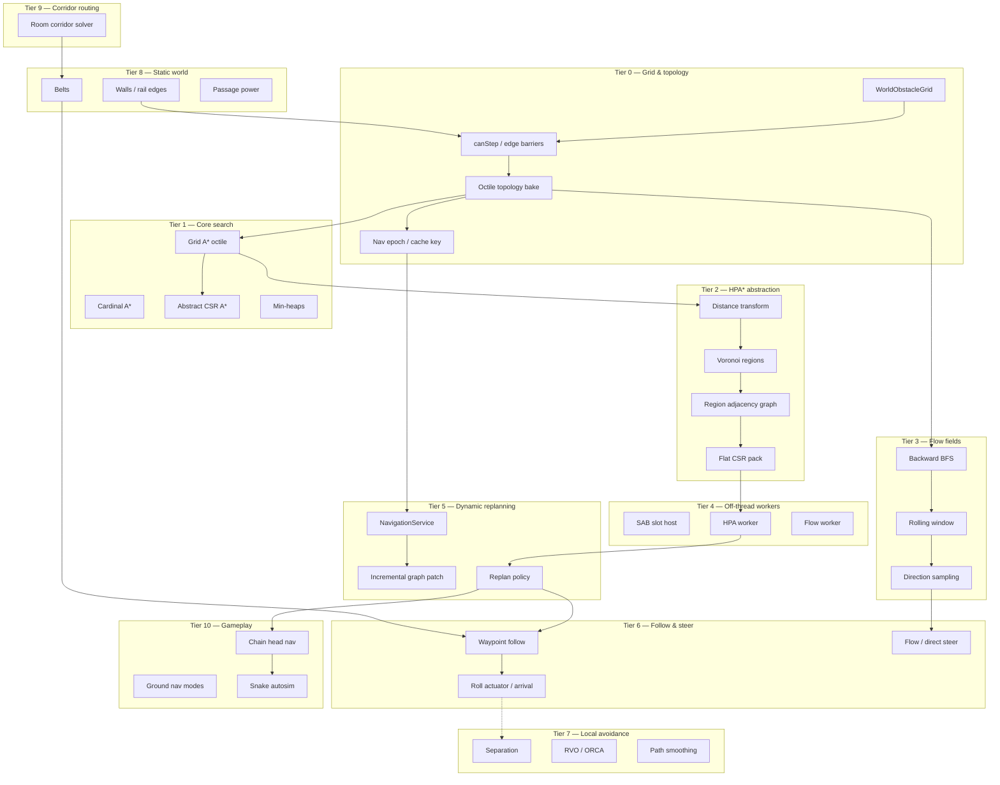

# Pathfinding engine — research tree

Progress tracker for the navigation stack: grid topology → A* → HPA* abstraction → flow fields → off-thread workers → dynamic replanning → steering. Read top-to-bottom like a tech tree: later tiers assume earlier ones. Percentages are **honest engineering completion** (working, wired, exercised) — not "we touched a file once."

**Legend:** ✅ shipped · 🟡 partial · ⬜ not started · 🔜 planned (named PR set)

**Overall engine maturity:** ~**55%** of a full multi-agent navigation engine. The *planning core* (A*, HPA*, flow fields, off-thread SAB workers, incremental replan) is genuinely production-grade — arguably the strongest part of this codebase. The gap to a pro stack is almost entirely **navmesh + crowd/local-avoidance + path smoothing**, not the search layer.

---

## Where this sits vs a professional nav stack

This is a **grid-based hierarchical planner**, not a navmesh-based crowd engine. That's an architectural choice, not a deficiency — but it's the honest frame for the percentages below.

| Capability | This engine | Recast/Detour · Unreal Nav · Unity NavMesh |
|---|---|---|
| Spatial representation | Uniform octile grid (16 px cells) | Polygon **navmesh** from geometry voxelization |
| Hierarchical abstraction | ✅ HPA* Voronoi regions + CSR abstract graph | Detour tiles / hierarchical A* (DotRecast `dtNavMeshQuery`) |
| Long-range search | ✅ abstract A* + local stitch | `findPath` over poly graph |
| Flow / many-agents-one-goal | ✅ rolling-window flow field worker | Usually per-agent paths; flow fields are bespoke |
| Off-thread planning | ✅ Web Workers + SharedArrayBuffer slot pools | Background tasks / job system |
| Incremental dynamic obstacles | ✅ epoch invalidation + localized region patch | Detour **tile cache** rebuild + temporary obstacles |
| Local avoidance (crowd) | ⬜ none (grid blocking only) | ✅ **RVO / ORCA** detour crowd |
| Path smoothing | ⬜ raw grid waypoints | ✅ funnel / string-pull |
| Variable agent radius | ⬜ single grid | ✅ per-agent radius (multiple navmeshes / erosion) |
| Off-mesh / jump links | ⬜ (passage edges only) | ✅ off-mesh connections |
| Area costs / weighted regions | 🟡 belts bias, no general cost field | ✅ area flags + cost modifiers |

**Takeaway:** the search and worker architecture is at or above hobby-engine parity; what separates it from Recast/Detour is the **representation (grid vs mesh)** and the **agent layer (no crowd/avoidance/smoothing)**.

---

## Tree overview



---

## Fundamentals checklist — textbook algorithm coverage

A different lens from the feature tiers below: do the **CS-textbook building blocks** exist in the codebase? This is the "can I teach a pathfinding course from this repo" view. `[x]` = implemented and used; `[~]` = present only as a special case / derivable; `[ ]` = not in the codebase.

### Graph search

- [x] **Breadth-first search (BFS)** — generic toolkit `Libraries/DataStructures/gridBfs.js` (`bfsIndices`, `bfsColRowQueue`, `bfsTypedIndices`); used by flow fields, reachability, region flood-fill.
- [x] **A\*** — `Libraries/Pathfinding/AStar.js`: octile grid (`runLocalAStarFlat`), cardinal (`runCardinalAStarFlat`), weighted abstract graph (`runAbstractAStarFlat`). Indexed min-heap, admissible heuristics.
- [~] **Dijkstra (uniform-cost search)** — *no standalone function*, but present as special cases: flow-field BFS is unweighted Dijkstra, the distance transform is a multi-source Dijkstra map, and `runAbstractAStarFlat` with a zero heuristic *is* Dijkstra over the weighted region graph. **To add explicitly:** a `runDijkstraFlat` (A* with `h = 0`, reuse `IdxMinHeap`) for true weighted single-source costs — ~30 lines, no new infra.
- [ ] **Greedy best-first search** — not present. **To add:** A* variant with `f = h` only (ignore `g`); useful as a fast-but-suboptimal fallback for low-priority agents. Trivial fork of the existing A*.
- [ ] **Depth-first search (DFS)** — not used for navigation (BFS/A* cover all current needs). **To add only if** you need maze-carving or connectivity ordering; otherwise skip.
- [ ] **Bidirectional search** — not present. **To add:** dual-frontier A* meeting in the middle; meaningful only for very long single-agent queries that HPA* already shortcuts. Low priority.
- [ ] **Jump Point Search (JPS)** — not present (HPA* covers long-range instead). **To add:** symmetry-breaking jump scan in `runLocalAStarFlat`; biggest win on large open grids. See Tier 1.

### Grid & field algorithms

- [x] **Flood fill** — `floodFillRegion` (`VoronoiRegions.js`), capped region growth.
- [x] **Distance transform / Dijkstra map** — `computeDistanceTransform` (octile BFS from walls), feeds region seeding.
- [x] **Reachability test** — `gridReachabilityBfs.js`, `pruneUnreachableRegions` (`hpaRegionGraph.js`).
- [x] **Flow field (vector field from BFS)** — `flowFieldBfs.js` + `FlowFieldGrid.js`, 9-direction byte encoding.
- [x] **Line of sight / raycast** — `Libraries/Spatial/query/lineOfSight.js`, grid + wall-proxy traversal.
- [ ] **Path smoothing (funnel / string-pull)** — not present. **To add:** post-process octile cell paths before follow; reuse `lineOfSight.js` for the visibility test. Top recommended unlock — transfers to navmesh later.
- [ ] **Any-angle (Theta\*)** — not present. **To add:** LOS-relaxed A* parent check; alternative "smooth feel" without a mesh (Tier 13).

### Data structures

- [x] **Binary min-heap / priority queue** — `Libraries/DataStructures/MinHeap.js` (`MinHeap`, `IdxMinHeap`).
- [x] **Typed-array frontier / visited stamps** — `runId`-stamped scratch arrays reused across searches (no per-query alloc).
- [ ] **Bucketed / radix priority queue** — not present; only needed if A* heap profiling shows it. Skip until measured.

### Steering primitives (Reynolds set)

- [x] **Seek** — `directGroundNavBehavior.js`, `goalSeekAutosim.js`.
- [x] **Arrive** — `steerRollToward` with `stopRadius` + `decelerateRoll` (`kineticRollActuator.js`); waypoint arrival in `hpaPathSlot.js`.
- [x] **Path following** — `computeSabPathSteering` (waypoint seek + advance).
- [x] **Flow following** — `flowSteering.js` (bilinear field sample).
- [ ] **Wander** — not present. **To add:** small per-agent steering with a jittered heading target (random walk on a projected circle); cheap idle/ambient behavior for non-seeking agents. ~20 lines feeding `steerRollToward`.
- [ ] **Flee / Evade** — not present. **To add:** negated seek / predicted-position seek; needed for predator-prey or "scatter from threat" gameplay.
- [ ] **Pursue / Intercept** — not present. **To add:** seek toward a target's *predicted* future position using its velocity.
- [ ] **Separation** — not present (agents only push apart via rigid-body contact, which is physics, not steering). **To add:** neighbor query + repulsion blended into desired velocity. First slice of Tier 7; representation-agnostic, survives a navmesh migration.
- [ ] **Cohesion / Alignment (flocking)** — not present. **To add:** group-center pull + average-heading match; builds on the same neighbor query as separation.
- [ ] **Obstacle avoidance (steering, not grid)** — not present. **To add:** short-horizon feeler/whisker raycasts (reuse `lineOfSight.js`) that nudge desired velocity around dynamic props the grid doesn't know about.

> **Reading this checklist:** the **graph-search core is essentially complete** (BFS, A*, fields, the data structures) — Dijkstra and greedy are one small file each since the infra already exists. The real gaps are **steering behaviors beyond seek/arrive/follow** (wander, flee, pursue, flocking, steering-level avoidance), which is the same Tier 7 work the rest of the roadmap flags.

---

## Tier 0 — Grid model & topology

| Item | Status | % | Notes / modules |
|------|--------|---|-----------------|
| `WorldObstacleGrid` (walls/floors/edges) | ✅ | 90 | `Libraries/Spatial/grid/WorldObstacleGrid.js`, 16 px cells, 150×150 |
| `isBlocked` voxel walls | ✅ | 90 | Uint8 `grid[]`, height-level stamps |
| `canStep` + edge barriers | ✅ | 85 | rail walls, passages, belt rails via `edgeStore` |
| Vertex passability (diagonal corner check) | ✅ | 85 | `vertexPassability.js`, no corner-cutting |
| Octile topology bake (neighbors + predecessors) | ✅ | 85 | `navTopologySab.js`, packed to SAB |
| Edge pool serialization | ✅ | 80 | `navEdgePoolSab.js` |
| Nav epoch / cache key invalidation | ✅ | 85 | `gridNavEpoch.js`, `gridTopologyEpoch`, floor/passage channels |
| Grid expand / remap (`expandToCoverAabb`) | ✅ | 75 | bumps topology epoch |
| Kinetic props as dynamic obstacles | ⬜ | 0 | balls/crates **not** written to nav grid (chain can clip — `chainVsWallGrowth.test.js`) |
| Variable agent radius / grid erosion | ⬜ | 0 | single shared grid, point-agent assumption |

**Branch progress: 78%**

---

## Tier 1 — Core search (A*)

| Item | Status | % | Notes / modules |
|------|--------|---|-----------------|
| Grid A* (8-connected octile) | ✅ | 90 | `runLocalAStarFlat`, `AStar.js` |
| Cardinal A* (4-connected, no cut) | ✅ | 90 | `runCardinalAStarFlat`, corridor routing |
| Abstract CSR graph A* | ✅ | 85 | `runAbstractAStarFlat`, region graph |
| Indexed min-heap (`IdxMinHeap`) | ✅ | 90 | `DataStructures/MinHeap.js`, f-score arrays |
| Scratch reuse + `runId` visited stamps | ✅ | 85 | no per-search alloc on worker |
| Octile / Manhattan heuristics | ✅ | 85 | admissible, tie-aware offsets |
| Path-length caps (`maxPathLen`) | ✅ | 80 | `HPA_LOCAL_MAX_LEN = 96`, fail-loud over cap |
| Jump Point Search (JPS) | ⬜ | 0 | not implemented (HPA covers long-range instead) |
| Weighted / area-cost search | ⬜ | 0 | uniform step cost only |

**Branch progress: 78%**

---

## Tier 2 — HPA* hierarchical abstraction

| Item | Status | % | Notes / modules |
|------|--------|---|-----------------|
| Distance transform (octile BFS from walls) | ✅ | 85 | `computeDistanceTransform`, `VoronoiRegions.js` |
| Voronoi region flood-fill clustering | ✅ | 85 | `generateVoronoiRegions`, cap `maxCellsPerChunk = 64` |
| Small-region merge | ✅ | 80 | `mergeSmallRegions`, min 8 cells |
| Region adjacency detection | ✅ | 85 | `findRegionAdjacencies`, cardinal boundary scan |
| Inter-region edges (chebyshev cost) | ✅ | 80 | `connectRegionPair` |
| Edge validation vs real `canStep` | ✅ | 80 | `validateRegionEdges` — belts/forcefields honored |
| Flat CSR pack for worker (`cellToRegion`) | ✅ | 85 | `packRegionGraphFlat`, Int16 arrays |
| Temp start/target node injection | ✅ | 80 | `hpaReplanPrep.js`, local connect legs |
| Abstract path → cell stitch | ✅ | 80 | `stitchAbstractCellPath`, per-leg local A* |
| Local-vs-HPA mode selection | ✅ | 80 | `hpaPathRequest.js`, 32-cell threshold |
| Graph node cap | ✅ | 75 | `MAX_HPA_GRAPH_NODES = 4096` (throws over) |
| Multi-level hierarchy (3+ tiers) | ⬜ | 0 | single abstraction level only |
| Precomputed intra-region distances | 🟡 | 40 | recomputed per stitch, not cached |

**Branch progress: 73%**

---

## Tier 3 — Flow fields

| Item | Status | % | Notes / modules |
|------|--------|---|-----------------|
| Backward BFS from goal | ✅ | 85 | `computeFlowField`, `flowFieldBfs.js` |
| Reverse octile-predecessor adjacency | ✅ | 80 | shares HPA blocked + predecessor SABs |
| Rolling window (recenter on move) | ✅ | 80 | `flowFieldWindow.js`, `FlowFieldGrid.js` |
| 9-direction byte encoding | ✅ | 85 | `sampleFlowDirection.js`, 255 = unreachable |
| Bilinear direction sampling | ✅ | 80 | `decodeFlowFieldCell`, smooth-ish desired dir |
| Flow → steering | ✅ | 80 | `flowSteering.js`, `computeFlowFieldSteering` |
| Target field cache | ✅ | 75 | `MAX_CACHE = 100` goal slots |
| Range-limited fields | ✅ | 70 | optional BFS `range` cap |
| Reachability check | ✅ | 75 | `gridReachabilityBfs.js` |
| Integration/cost-field blending | ⬜ | 0 | direction only, no potential-field cost blend |

**Branch progress: 78%**

---

## Tier 4 — Off-thread worker architecture

| Item | Status | % | Notes / modules |
|------|--------|---|-----------------|
| Generic SAB slot worker host | ✅ | 85 | `SabSlotWorkerHost.js`, requestId/readyId handshake |
| HPA worker entry | ✅ | 85 | `HpaWorkerEntry.js`, topology + graph + replan |
| Flow field worker entry | ✅ | 85 | `FlowFieldWorkerEntry.js` |
| SharedArrayBuffer pools (paths/graph/cell→region) | ✅ | 85 | `hpaWorkerSab.js`, growable cell→region |
| Slot leasing (512 in-flight) | ✅ | 85 | `MAX_HPA_REPLAN_SLOTS`, lease/release |
| Async wait (HPA) + poll (flow) | ✅ | 80 | `waitForSlot` Promise vs `isReady` |
| Message protocol (init/buildNav/patch/replan) | ✅ | 85 | clean staged pipeline, trace-visible |
| Worker restart / crash recovery | ⬜ | 0 | `graphPatchError` logs only, no respawn |
| Worker pool scaling (N workers) | ⬜ | 0 | single HPA + single flow worker |

**Branch progress: 77%**

---

## Tier 5 — Dynamic obstacles & replanning

| Item | Status | % | Notes / modules |
|------|--------|---|-----------------|
| `NavigationService` obstacle sync | ✅ | 85 | `Systems/Navigation/NavigationService.js` |
| `onObstaclesChanged(damageBounds)` | ✅ | 85 | bumps `obstacleGeneration`, invalidates flow |
| Full region graph rebuild | ✅ | 85 | on topology epoch / empty bounds |
| Incremental localized patch | ✅ | 80 | `rebuildDamagedRegionGraph`, 12-cell pad |
| Unreachable region prune | ✅ | 70 | BFS reachability from seed point |
| Per-entity replan policy | ✅ | 85 | `hpaReplanPolicy.js`, epoch/target/stuck/off-path |
| Stuck detection | ✅ | 80 | `stuckReplanFrames = 20`, < 1.5 px movement |
| Off-path replan w/ cooldown | ✅ | 80 | `REPLAN_OFF_PATH_COOLDOWN_MS = 250` |
| Visibility gating (defer off-screen) | ✅ | 75 | off-screen entities wait unless stuck |
| Request coalescing + priority tiers | ✅ | 80 | `HpaPathSession.js`, supersede in-flight |
| Passage-power dynamic edges | ✅ | 75 | button hold toggles passability → resync |
| Detour-style temporary obstacle carve | ⬜ | 0 | obstacles are grid edits, not runtime cylinders |
| Fallback path on planner failure | ⬜ | 0 | clears path by design (no degraded mode) |

**Branch progress: 73%**

---

## Tier 6 — Path following & basic steering

| Item | Status | % | Notes / modules |
|------|--------|---|-----------------|
| Waypoint following (SAB path) | ✅ | 80 | `computeSabPathSteering`, `hpaPathSlot.js` |
| Progress index + arrival advance | ✅ | 80 | `PATH_WAYPOINT_ARRIVAL_PX = 16` |
| Off-path detection | ✅ | 80 | `pathOffPathDistance = 80` |
| Roll actuator (accel-limited velocity) | ✅ | 80 | `kineticRollActuator.js`, `steerRollToward` |
| Arrival / stop radius | ✅ | 80 | `stopRadius`, `decelerateRoll` |
| Flow-field steering | ✅ | 80 | `flowGroundNavBehavior.js` |
| Direct seek (no planning) | ✅ | 85 | `directGroundNavBehavior.js` |
| Belt entry-snap + on-belt handoff | ✅ | 70 | `resolveFloorBeltSteerTarget`, yields to belt physics |
| Velocity-aware steering | 🟡 | 30 | `agentPose` carries vx/vy but steer ignores it |
| Path smoothing (funnel / string-pull) | ⬜ | 0 | raw grid-cell waypoints |
| Lookahead / spline follow | ⬜ | 0 | single-waypoint seek |

**Branch progress: 66%**

---

## Tier 7 — Local avoidance & crowd (biggest gap)

| Item | Status | % | Notes / modules |
|------|--------|---|-----------------|
| Multi-agent grid blocking | 🟡 | 30 | agents don't block each other's grid; rely on physics contact |
| Separation steering | ⬜ | 0 | none in nav layer |
| Collision avoidance (predictive) | ⬜ | 0 | no velocity obstacles |
| RVO / ORCA crowd solver | ⬜ | 0 | the headline pro-engine feature missing |
| Boids / flocking | ⬜ | 0 | |
| Local obstacle avoidance beyond grid | ⬜ | 0 | grid blocking only |
| Agent priority / right-of-way | 🟡 | 20 | only replan priority tiers, not motion yield |

**Branch progress: 11%**

---

## Tier 8 — Static environment integration

| Item | Status | % | Notes / modules |
|------|--------|---|-----------------|
| Voxel walls → blocked cells | ✅ | 90 | `stampStaticWalls`, scene voxels |
| Rail wall edges → `canStep` | ✅ | 80 | `setBoundary`, `commitBoundaryEdit` |
| Floor belts (nav-aware) | ✅ | 70 | `FloorCell.js`, entry/exit snap |
| Belt rail lateral barriers | ✅ | 70 | `syncFloorBeltRailEdges` |
| Passage power network | ✅ | 75 | `syncPassagePowerNetwork`, dynamic seal/unseal |
| Forcefields / one-way | 🟡 | 40 | grid stamps, partial nav honoring |
| Single-cell belt edit → nav resync | 🟡 | 50 | may skip `onObstaclesChanged` until next wall sync |
| Line-of-sight queries | ✅ | 70 | `lineOfSight.test.js`, wall proxies (not HPA) |

**Branch progress: 66%**

---

## Tier 9 — Corridor / procedural routing

Separate from runtime entity nav — used for **room-graph corridor authoring** (cardinal A* through wall holes).

| Item | Status | % | Notes / modules |
|------|--------|---|-----------------|
| Cardinal grid pathfinder (reserved footprints) | ✅ | 80 | `corridorGridPathfinder.js` |
| Corridor width footprints | ✅ | 80 | `corridorFootprint.js`, overlap checks |
| Lane routing through wall holes | ✅ | 75 | `corridorLanePath.js` |
| Multi-corridor bundle solver | ✅ | 75 | `corridorBundle.js`, parent/child rooms |
| Wall hole slot enumeration | ✅ | 75 | `corridorWallSlots.js`, spread selection |
| Room interior blocked grids | ✅ | 75 | `corridorWalkGrid.js` |
| Corridor → belt bake | ✅ | 70 | `roomGraphCorridorBelts.js` |
| Unify with runtime HPA (octile) | ⬜ | 0 | intentional split (cardinal vs octile) |

**Branch progress: 74%**

---

## Tier 10 — Gameplay (navigation payoff)

| Item | Status | % | Notes / modules |
|------|--------|---|-----------------|
| Three ground-nav modes (direct/flow/HPA) | ✅ | 85 | `groundNav/`, selection menu |
| Pointer-drag nav to cursor | ✅ | 80 | `issueGroundNavToSelection.js` |
| Chain head steering (tail follows) | ✅ | 80 | `chainLinks.js`, head-only nav target |
| Goal-seek autosim | ✅ | 85 | `goalSeekAutosim.js`, set target per goal |
| Snake autosim (head → food → grow) | ✅ | 90 | `Libraries/Game/snake/`, HPA nav |
| Multi-snake concurrent seekers | ✅ | 80 | `snakeMulti.test.js`, nav/worker stress |
| Open-cell goal placement | ✅ | 80 | `pickOpenCavernCell`, blocked-aware |
| Crowd / formation movement | ⬜ | 0 | depends on Tier 7 |

**Branch progress: 75%**

---

## Tier 11 — Tooling, debug & tests

| Item | Status | % | Notes / modules |
|------|--------|---|-----------------|
| SAB path overlay (debug draw) | ✅ | 75 | `buildSabPathOverlayFromProgress` |
| Abstract path overlay | ✅ | 70 | `buildSabAbstractPathOverlay` |
| Replan policy unit tests | ✅ | 80 | `hpaGroundNavReplan.test.js` |
| Corridor solver tests (seeds/widths) | ✅ | 80 | `corridorWidthOne/MultiLane.test.js` |
| Snake / autosim tests | ✅ | 80 | `snakeAutosim`, `snakeMulti`, `goalSeekAutosim` |
| Belt cell detection test | 🟡 | 40 | `hpaBeltNav.test.js` — on/off only, not E2E |
| Locked-room / passage nav tests | ✅ | 70 | `lockedRoom.test.js` |
| A* unit tests | ⬜ | 0 | no direct `AStar.js` coverage |
| Region graph build tests | ⬜ | 0 | no `hpaRegionGraph` unit test |
| Flow field BFS tests | ⬜ | 0 | no `flowFieldBfs` unit test |
| Worker E2E (real worker replan) | ⬜ | 0 | tests mock the worker |

**Branch progress: 55%**

---

## Tier 12 — Advanced (future, planned someday)

The likely long-term direction. Navmesh is the anchor item — see the migration note below for what it touches.

| Item | Status | % | Notes |
|------|--------|---|-------|
| Polygon navmesh generation (Recast-style) | ⬜ | 0 | the anchor; reroots Tiers 0–3, keeps Tiers 4–6 |
| **Per-agent radius / multiple navmeshes** | ⬜ | 0 | the payoff — different-sized agents route differently |
| Detour tile cache + temporary obstacles | ⬜ | 0 | runtime obstacle carve without grid edits |
| RVO / ORCA crowd simulation | ⬜ | 0 | pairs naturally with navmesh agents |
| Off-mesh / jump links | ⬜ | 0 | jumps, drops, teleporters as graph edges |
| Weighted area costs / cost modifiers | ⬜ | 0 | "avoid water," "prefer roads" |
| Hierarchical multi-level (3+) abstraction | ⬜ | 0 | regions-of-regions for huge worlds |
| 3D / multi-floor navigation | ⬜ | 0 | stacked nav layers + links |

**Branch progress: 0%**

---

## Navmesh migration — what survives vs what gets replaced

Adopting a navmesh is **not** a from-scratch rewrite. It swaps the **representation layer** (how walkable space is described) and leaves the **plumbing** (workers, sessions, replan, steering) intact. Roughly half the stack carries over.

| Layer | Fate under navmesh | Why |
|------|--------------------|-----|
| `WorldObstacleGrid` + octile topology bake | **Replaced as nav source** | walkable space becomes polygons, not 16 px cells |
| HPA* Voronoi region graph | **Replaced / redundant** | navmesh polygons *are* the abstraction — no grid clustering |
| Flow fields (grid BFS) | **Replaced or dropped** | flow fields are cell-native; navmesh favors per-agent paths (or continuum crowds) |
| `AStar.js` search | **Mostly survives** | A* over polygon adjacency ≈ your `runAbstractAStarFlat` — same heap, different graph |
| SAB worker host + protocol | **Survives** | off-thread planning is representation-agnostic |
| `NavigationService` + replan policy | **Survives** | epoch invalidation, stuck/off-path, coalescing all carry over |
| Path follow + `kineticRollActuator` | **Survives** | following waypoints and rolling toward them is unchanged |
| Funnel / string-pull smoothing | **Survives (transfers ~80%)** | same apex-tightening logic; only the visibility test changes (grid LOS → portal edges) |

### Coexistence, not replacement: nav layer over the puzzle grid

The cleanest framing is **two layers that serve different jobs**:

- **Grid = the puzzle / gameplay layer.** Belts, walls, passages, power networks, room bakes, occupancy — the *rules of the world*. This stays grid-based regardless.
- **Navmesh = the agent-movement layer.** A mesh **derived from** the grid's walkable cells, used only for how agents route and avoid each other.

The grid stays the source of truth; the navmesh is a generated view that rebuilds when the grid's topology epoch bumps (you already have that signal). This is how many shipped engines work — authoritative gameplay state in one structure, an optimized nav representation derived from it. It also means the migration is *additive*: you can stand up a navmesh layer beside the grid, prove it on one agent type, and keep the grid path live until you're happy.

### When it's actually worth it

Pull the trigger when you want **variable agent radius** (the big one — small/large units routing differently) or **arbitrary-angle geometry**. Until then, smoothing + local avoidance get you most of the "pro feel" on the existing grid. Build those first; they're not throwaway (smoothing transfers, avoidance is representation-agnostic).

---

## Tier 13 — Moonshots (interesting, no commitment)

Pure "wouldn't it be cool" territory — captured so the tree has a horizon.

| Item | Status | % | Notes |
|------|--------|---|-------|
| Continuum-crowds flow on navmesh | ⬜ | 0 | density-aware flow fields → emergent lane formation |
| Theta* / any-angle paths on the grid | ⬜ | 0 | cheaper "navmesh-smooth" feel without a mesh |
| Hierarchical navmesh + tile streaming | ⬜ | 0 | very large / infinite worlds |
| Formations & group movement | ⬜ | 0 | squads holding shape while pathing |
| Influence / threat maps feeding cost | ⬜ | 0 | agents route around danger, not just walls |
| Learned steering (policy net) hybrid | ⬜ | 0 | planner sets goal, learned local controller drives |
| Deterministic replay of nav decisions | ⬜ | 0 | debugging + lockstep netcode foundation |
| Navigating *moving* platforms / belts as carriers | 🟡 | 15 | belt physics exists; true "ride the platform" routing doesn't |

**Branch progress: 0%**

---

## What's genuinely pro-grade here

Three things in this stack are at or above what most indie/hobby engines ship:

1. **Off-thread planning with SharedArrayBuffer.** The HPA worker bakes topology, builds the region graph, and runs all A* off the main thread, writing results into shared slots with a clean lease/handshake protocol. Many engines never get planning off the main thread.
2. **Incremental hierarchical replan.** Localized region-graph patching (`rebuildDamagedRegionGraph`) instead of full rebuilds, plus epoch-driven invalidation and per-entity replan gating — this is the same shape as Detour's tile cache philosophy.
3. **Flow fields *and* HPA* on a shared topology.** Both consume the same packed octile predecessor SABs, so many-agents-one-goal (flow) and single-agent long-range (HPA) coexist without duplicate topology.

## What separates it from a pro stack

1. **Grid, not navmesh** — uniform 16 px cells; no polygon mesh, no agent-radius erosion, no off-mesh links.
2. **No crowd layer** — zero local avoidance (RVO/ORCA/separation). Agents only "avoid" via rigid-body contact, which is physics, not navigation.
3. **No path smoothing** — agents follow raw grid-cell centers; no funnel/string-pull, so paths look blocky.

---

## Recommended next unlocks (short path)

Ordered by payoff-per-effort. The first two are also the cheapest down-payments on an eventual navmesh.

1. **Path smoothing (funnel / string-pull)** — biggest feel win for the least work; post-process the octile cell path before follow. **Transfers to navmesh later** (same apex logic, only the visibility test changes), so it pays off twice.
2. **Local separation steering** — first slice of Tier 7; cheap neighbor query + push-apart blend into desired velocity. Representation-agnostic, so it survives a navmesh migration untouched. Unblocks believable multi-snake / crowd movement.
3. **A* / region-graph / flow-field unit tests** — Tier 11 has integration gaps; the search core has no direct coverage.
4. **Single-cell belt edit → guaranteed nav resync** — close the Tier 8 partial so editor belt placement always patches the graph.
5. **Worker resilience** — recover from `graphPatchError` instead of log-only.

> **On the navmesh question:** it's the likely long-term direction (variable agent radius is the real prize), but it's a *layer beside* the puzzle grid, not a teardown — see the migration note above. Do 1–2 first; they're not throwaway.

---

## Key file map

```
Libraries/Pathfinding/              — A*, HPA*, flow fields, sessions, SAB
  AStar.js                          — grid + abstract A* (heaps, octile/cardinal)
  hpaRegionGraph.js, VoronoiRegions.js — region clustering + abstract graph
  HpaPathWorker.js, HpaPathSession.js  — worker host + per-entity replan
  hpaPathSlot.js                    — path follow / waypoint steering (not pathFollow.js)
  FlowFieldGrid.js, flowFieldBfs.js — flow field manager + BFS
  navTopologySab.js, hpaWorkerSab.js — SharedArrayBuffer topology/pools
  hpaReplanPolicy.js                — replan triggers, stuck, priority
  Corridor/                         — room-graph corridor routing (cardinal A*)
Libraries/Workers/Navigation/       — HpaWorkerEntry.js, FlowFieldWorkerEntry.js
Libraries/Sandbox/groundNav/        — direct / flow / HPA ground-nav behaviors
Libraries/Sandbox/kineticRollActuator.js — the one movement actuator
Libraries/Spatial/grid/WorldObstacleGrid.js — nav grid, canStep, epochs
Systems/Navigation/NavigationService.js — obstacle sync orchestration
Libraries/Game/snake/               — snake autosim (HPA head nav)
tests/hpaGroundNavReplan.test.js, corridor*.test.js, snake*.test.js
```

---

*Last updated: pathfinding tree + fundamentals checklist + navmesh migration note (mirrors `physics.md` after trilogy B). Planning core is the mature half; Tier 7 local avoidance + path smoothing are the headline gaps to a Recast/Detour-class stack. Navmesh is the long-term anchor (Tier 12) but lands as a layer beside the puzzle grid, not a rewrite. Revisit percentages when smoothing or a crowd layer lands.*
