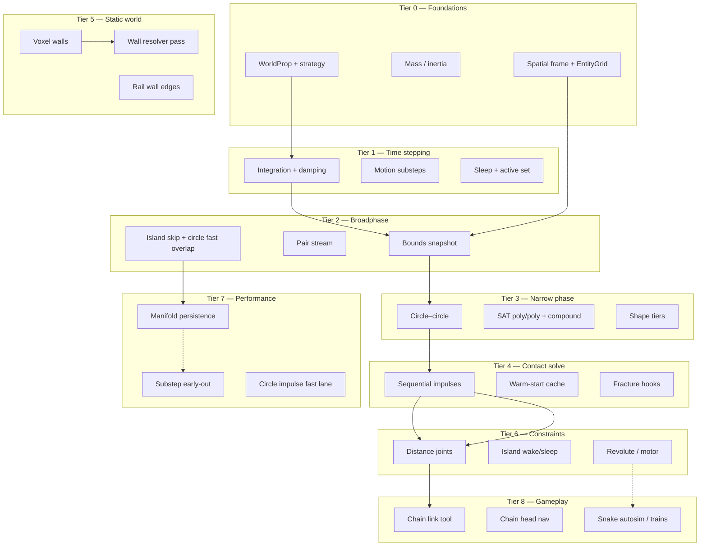

# Physics engine — research tree

Progress tracker for the sandbox kinetic physics stack. Read top-to-bottom like a tech tree: later tiers assume earlier ones. Percentages are **honest engineering completion** (not “we touched a file once”), updated after the first constraint/chain trilogy.

**Legend:** ✅ shipped · 🟡 partial · ⬜ not started · 🔜 planned (named PR set)

**Overall engine maturity:** ~**58%** of a full 2D rigid-body sandbox engine (not counting 3D, fluids, or networking).

---

## Tree overview



---

## Fundamentals checklist — textbook rigid-body coverage

A different lens from the feature tiers below: do the **CS / numerical-methods building blocks** of a 2D rigid-body engine exist in the codebase? `[x]` = implemented and used · `[~]` = present as a narrow/special case · `[ ]` = not in the codebase.

### Numerical integration
- [x] **Semi-implicit (symplectic) Euler** — velocity-then-position update; energy-stable for games (the Box2D/most-engines default).
- [x] **Fixed-timestep substepping** — `motionSubsteps.js` subdivides by max travel px/step (prevents large-step blow-ups).
- [ ] **Velocity Verlet / RK4** — not used; unnecessary given symplectic Euler + substeps.
- [ ] **Continuous collision (TOI / conservative advancement)** — absent (Tier 1); fast/small bodies can tunnel between substeps.

### Broadphase
- [x] **AABB overlap** + **uniform-grid spatial hash** — `EntityGrid` center-indexed buckets.
- [x] **Island internal-pair skip** — `shareKineticIsland` prunes intra-chain pairs.
- [ ] **Sweep-and-prune (SAP)** / **dynamic BVH (AABB tree)** — not present; grid is center-indexed, not swept.

### Narrowphase
- [x] **Separating Axis Theorem (SAT)** — poly/poly, circle/poly (`SatCollision.js`).
- [x] **Circle–circle analytic** — fast lane.
- [~] **Contact manifold generation** — mostly single-point; multi-point is partial (Tier 3).
- [ ] **GJK + EPA** — not present (SAT covers current convex shapes).

### Contact resolution (LCP)
- [x] **Sequential-impulse PGS** — velocity-level Projected Gauss–Seidel.
- [x] **Baumgarte position bias** — penetration push-out term.
- [x] **Coulomb friction** + [x] **restitution** — per-pair / material defaults.
- [~] **Warm-starting** — impulse-decay cache, not full feature-id manifold persistence.
- [ ] **Block / 2-contact LCP solver**, [ ] **split-impulse / NGS** — Baumgarte only.

### Constraints & joints
- [x] **Distance constraint** (chain links) via PGS.
- [ ] **Revolute / prismatic / weld / motor**, [ ] **soft (XPBD) compliance** — absent (Tier 5).

### Temporal coherence
- [x] **Per-body sleep** (velocity threshold + timer) and **active-set culling** (skip sleepers).
- [x] **Island sleep/wake** for linked bodies (`kineticIslands.js`).

### Rotational dynamics
- [x] **2D mass + scalar moment of inertia** (`kineticInertiaFromBody`), torque/angular integration, COM-aware impulses.

> **Read:** the **broadphase → SAT narrowphase → sequential-impulse PGS + Baumgarte → island sleep** spine is textbook-complete. The named gaps are exactly the "stacking stability" frontier: **multi-point manifolds + feature-id warm-starting** (Tier 3/7) and **CCD** for fast bodies (Tier 1).

---

## Tier 0 — Body model & spatial indexing

| Item | Status | % | Notes / modules |
|------|--------|---|-----------------|
| Kinetic `WorldProp` strategy | ✅ | 90 | `Entities/WorldProp.js`, prop assets |
| Shapes: circle, polygon, compound | ✅ | 85 | `Shapes.js`, `getCollisionParts` |
| Mass from density × footprint | ✅ | 85 | `bodyMass.js`, `syncKineticRigidBody` |
| Inertia (circle + polygon) | ✅ | 80 | `kineticInertiaFromBody`, compound |
| Pinned / infinite mass bodies | 🟡 | 60 | `bodyPinnedForContact`, buttons |
| Trigger vs kinetic spatial role | ✅ | 75 | triggers skip kinetic frame |
| `KineticSpatialFrame` lifecycle | ✅ | 85 | `begin`, `admitKineticProp`, `evictKineticProp` |
| Entity grid broadphase index | ✅ | 85 | `EntityGrid.js`, `_physId` |
| Neighbor queries + wall candidates | ✅ | 80 | `SpatialFrameCore`, wall cache |
| Mid-frame spawn / fracture admit | ✅ | 75 | `admitKineticProp`, `propFracture.js` |

**Branch progress: 81%**

---

## Tier 1 — Integration & time stepping

| Item | Status | % | Notes / modules |
|------|--------|---|-----------------|
| Force → velocity integration | ✅ | 75 | `applyAcceleration.js`, prop `update` |
| Linear + angular damping | ✅ | 70 | `applyDamping.js` |
| Fixed substeps by max step px | ✅ | 80 | `motionSubsteps.js` |
| Contact + wall per substep | ✅ | 85 | `kineticPhysicsPass.js`, `collisionPipeline.js` |
| Reindex after integration | ✅ | 90 | `reindexKineticBodies` |
| Sleep eligibility (velocity thresholds) | ✅ | 80 | `kineticSleep.js` |
| Active set (`_activeKineticBodies`) | ✅ | 85 | `syncActiveKineticBodies` |
| Mutual rest sleep (pile can sleep) | ✅ | 80 | resting overlap skips resolve |
| **Island sleep/wake (linked chains)** | ✅ | 75 | `kineticIslands.js`, PR 2 |
| Continuous collision detection (CCD) | ⬜ | 0 | substeps only, no sweep |
| Variable timestep clamping | 🟡 | 50 | engine caps dt |

**Branch progress: 72%**

---

## Tier 2 — Broadphase & pair generation

| Item | Status | % | Notes / modules |
|------|--------|---|-----------------|
| Per-body broadphase bounds cache | ✅ | 85 | `entityBroadphase.js` |
| Snapshot once per contact pass | ✅ | 90 | `snapshotActiveBroadphaseBounds` |
| Circle + OBB broadphase overlap | ✅ | 80 | `Broadphase.js` |
| **Canonical pair stream** | ✅ | 85 | `kineticPairStream.js`, PR 2 |
| Id-ordered pair policy (no duplicates) | ✅ | 90 | `allowsKineticCollisionPairSnapshotted` |
| Moving vs resting pair filter | ✅ | 85 | `shouldResolveKineticPairSnapshotted` |
| **Skip internal island pairs** | ✅ | 90 | `shareKineticIsland`, PR 2 |
| **Circle-tier fast overlap at gather** | ✅ | 70 | `pairCircleCircleOverlapSnapshotted` |
| Spatial grid as broadphase (full SAP) | ⬜ | 0 | grid is center-indexed, not sweep-and-prune |
| Pair stream persistence across substeps | ⬜ | 0 | 🔜 trilogy 2 PR 1 |

**Branch progress: 68%**

---

## Tier 3 — Narrow phase (geometry contact)

| Item | Status | % | Notes / modules |
|------|--------|---|-----------------|
| Circle–circle contact | ✅ | 90 | `SatCollision.js`, tier fast lane |
| Polygon–polygon SAT | ✅ | 85 | `_polygonPolygon`, `_projectPolygon` |
| Circle–polygon SAT | ✅ | 80 | |
| Compound part loops | ✅ | 75 | multi-part entities |
| **Shape tier classification** | ✅ | 80 | `kineticNarrowPhase.js`, PR 3 |
| Contact manifold generation (multi-point) | 🟡 | 40 | mostly single-point |
| Edge–edge / ghost collision handling | 🟡 | 50 | coincident circle unstack |
| Distance / ray cast queries | 🟡 | 30 | pick tests, not general engine API |

**Branch progress: 66%**

---

## Tier 4 — Contact resolution (impulses)

| Item | Status | % | Notes / modules |
|------|--------|---|-----------------|
| Sequential impulse velocity solve | ✅ | 80 | `kineticContactSolver.js` |
| Position correction (penetration) | ✅ | 80 | `penetration.js`, `separateAlongNormal` |
| Normal + Coulomb friction | ✅ | 75 | pair friction defaults |
| Restitution (pair + material) | ✅ | 70 | `collisionDefaults.js` |
| Warm-start impulse cache | 🟡 | 65 | decay cache, not full manifold |
| **Dedicated circle–circle impulse path** | ⬜ | 0 | narrow phase only · 🔜 trilogy 2 |
| Manifold persistence (feature ids) | ⬜ | 0 | 🔜 trilogy 2 PR 1 |
| **Pair stream persistence (outer iters)** | 🟡 | 40 | `collisionPipeline.js` reuses broadphase pairs when `kineticEarlyOut.persistPairs` |
| **Substep early-out when stable** | 🟡 | 55 | ε on constraint error + velocity; `kineticSolverStats` for debug |
| Contact callbacks (break, sound, VFX) | 🟡 | 55 | fracture uses pre-impact speed |

**Branch progress: 58%**

---

## Tier 5 — Constraints & joints

| Item | Status | % | Notes / modules |
|------|--------|---|-----------------|
| **Constraint registry (distance)** | ✅ | 70 | `kineticConstraints.js`, PR 1 |
| **Island rebuild dirty flag** | 🟡 | 50 | `markKineticConstraintsDirty`; skip union-find when topology unchanged |
| Local anchor frames → world | ✅ | 75 | `constraintAnchors.js` |
| **Post-contact constraint pass** | ✅ | 70 | `kineticConstraintSolver.js` |
| Position + velocity correction | ✅ | 65 | no compliance matrix yet |
| Constraint debug overlay (tension color) | ✅ | 75 | `kineticConstraintOverlays.js` |
| Constraint warm-start | ⬜ | 0 | |
| Stiffness / compliance tuning | ⬜ | 0 | fixed iteration count |
| Break force / breakable links | ⬜ | 0 | 🔜 trilogy 2 capstone |
| Revolute / pin joint | ⬜ | 0 | 🔜 trilogy 2 PR 2 |
| Motor / angle limits | ⬜ | 0 | 🔜 trilogy 2 PR 2 |
| Weld / fixed joint | ⬜ | 0 | |
| Chain topology editor | ✅ | 70 | `chainLinkWireTool.js`, PR 3 |

**Branch progress: 38%**

---

## Tier 6 — Static environment & boundaries

| Item | Status | % | Notes / modules |
|------|--------|---|-----------------|
| Voxel static walls (height levels) | ✅ | 80 | grid stamp, start demo h=1 |
| Rail wall edge segments | ✅ | 75 | `setBoundary`, rail caverns |
| Wall segment narrow phase | ✅ | 75 | `wallResolution.js` |
| Wall resolver (per active body) | ✅ | 80 | `WallCollisionResolver.js` |
| Wall hit wakes body | ✅ | 85 | |
| Grid belts / floor effects | 🟡 | 40 | separate from rigid pipeline |
| Forcefields / one-way | 🟡 | 35 | grid stamps, partial |
| **Chain swept volume vs walls** | ⬜ | 0 | head-only nav; tail clips |
| Chain-aware pathfinding | ⬜ | 0 | integration test idea only |

**Branch progress: 58%**

---

## Tier 7 — Destruction & special cases

| Item | Status | % | Notes / modules |
|------|--------|---|-----------------|
| Glass / prop fracture on impact | ✅ | 75 | `propFracture.js` |
| Shard spawn + admit to frame | ✅ | 70 | |
| `evictKineticProp` lifecycle | ✅ | 85 | no `isDead` in physics |
| Sleep blocking gameplay hooks | 🟡 | 60 | `blocksSleep` on state |
| Void sink | ⬜ | 0 | archived under `Deprecated/VoidSink` |

**Branch progress: 62%**

---

## Tier 8 — Performance & profiling

| Item | Status | % | Notes / modules |
|------|--------|---|-----------------|
| Active-set culling (sleep) | ✅ | 80 | big win for settled piles |
| Island internal pair skip | ✅ | 85 | chains |
| Circle narrow-phase bypass | ✅ | 75 | still pay gather broadphase |
| Iteration budget config | ✅ | 70 | `collisionDefaults.js` |
| Worker / HPA off main thread | ✅ | 90 | nav, not physics |
| Profile-friendly pipeline stages | ✅ | 80 | pair stream visible in traces |
| Manifold + pair cache | ⬜ | 0 | 🔜 trilogy 2 |
| SoA / SIMD bodies | ⬜ | 0 | AoS props today |
| Parallel pair solve | ⬜ | 0 | |

**Branch progress: 55%**

---

## Tier 9 — Tooling, persistence & tests

| Item | Status | % | Notes / modules |
|------|--------|---|-----------------|
| Collision settings per game profile | ✅ | 80 | `GameCollisionSettings.js` |
| **`kineticConstraints` in scene snapshot** | ✅ | 85 | schema v9 flat props + `collectKineticConstraintsSnapshot` |
| **`chainHead` in scene snapshot** | ✅ | 85 | `chainHeadProp` index in schema v9 |
| Unit: pair stream / sleep / islands | ✅ | 80 | `tests/kinetic*.test.js` |
| Unit: constraints | ✅ | 70 | `kineticConstraintSolver.test.js` |
| Unit: chain links | ✅ | 70 | `chainLinks.test.js` |
| Unit: wall resolution | ✅ | 75 | `wallResolution.test.js` |
| Integration: chain vs wall overlap | ✅ | 60 | `tests/chainVsWallGrowth.test.js` (baseline fixture) |
| Benchmark: start demo chain | 🟡 | 50 | manual profile slot |

**Branch progress: 72%**

---

## Tier 10 — Gameplay features (sandbox payoff)

| Item | Status | % | Notes / modules |
|------|--------|---|-----------------|
| Ground nav / HPA / flow behaviors | ✅ | 85 | existing sandbox |
| **Chain head steering only** | ✅ | 80 | `chainLinks.js`, PR 3 |
| **Link tool + inspector** | ✅ | 75 | PR 3 |
| **Stress demo: cavern chain** | ✅ | 70 | `sandboxStartScene.js` |
| Snake autosim (head → food → grow) | ✅ | 90 | `Libraries/Game/snake/`, `/?game=snake` |
| Mixed-shape chain / ragdoll | ⬜ | 0 | 🔜 trilogy 2 capstone |
| Crate train / linked props | ⬜ | 0 | 🔜 trilogy 2 capstone |
| Pool rack spawn groups | ✅ | 80 | `spawnPoolRack.js` (reference pattern) |

**Branch progress: 52%**

---

## Tier 11 — Advanced (future / out of scope for now)

| Item | Status | % |
|------|--------|---|
| Soft bodies / deformables | ⬜ | 0 |
| Fluids / buoyancy | ⬜ | 0 |
| Character controllers | ⬜ | 0 |
| Vehicle joints / suspension | ⬜ | 0 |
| 3D rigid body stack | ⬜ | 0 |
| Deterministic replay / rollback netcode | ⬜ | 0 |

**Branch progress: 0%**

---

## Completed PR sets (changelog anchors)

### Trilogy A — Contact pipeline & sleep (done)

| PR | Theme | Status |
|----|-------|--------|
| A1 | Sleep + active-set policy | ✅ |
| A2 | Pair stream pipeline refactor | ✅ |
| A3 | Shape-tier narrow phase (circle fast lane) | ✅ |

### Trilogy B — Constraints & chains (done)

| PR | Theme | Status |
|----|-------|--------|
| B1 | Constraint infrastructure (distance, debug draw) | ✅ ~70% of spec (no break/compliance) |
| B2 | Island policy + cheap circle gather | ✅ |
| B3 | Sandbox chain / snake tooling + stress chain | ✅ |

### Trilogy C — Professional depth (planned)

| PR | Theme | Status |
|----|-------|--------|
| C1 | Manifold persistence + substep early-out + circle impulse lane | 🟡 partial (early-out + pair persist + dirty islands) |
| C2 | Revolute + motor joints | 🔜 |
| C3 | Mixed-shape / breakable chains, crate train | 🔜 |

### Sideshow (optional, parallel)

| Item | Status |
|------|--------|
| Autonomous snake (HPA head, eat food, grow segment) | ✅ |

---

## Recommended next unlocks (short path)

1. ~~**Chain vs wall integration test**~~ — `tests/chainVsWallGrowth.test.js` documents growth overlap baseline.
2. ~~**Persist constraints + `chainHead` in scene snapshot**~~ — schema v9 export/import.
3. **Trilogy C PR 1** — biggest perf/clarity win for dogpile + chain whip.
4. **Snake polish** — HUD, head asset, optional head speed cap (`Libraries/Game/snake/`).

---

## Key file map

```
Libraries/Motion/          — integration, sleep, constraints, walls
Libraries/Spatial/collision/ — broadphase, pairs, SAT, contact, pipeline
Libraries/Sandbox/chainLinks.js — chain head, link API
Systems/World/KineticSpatialFrame.js — frame + active set
Apps/Editor/world/sandboxStartScene.js — stress chain demo
tests/kinetic*.test.js, chainLinks.test.js, activeKineticBodies.test.js
```

---

*Last updated: after trilogy B (constraints + islands + chain sandbox). Revisit percentages when trilogy C lands or snake autosim ships.*
