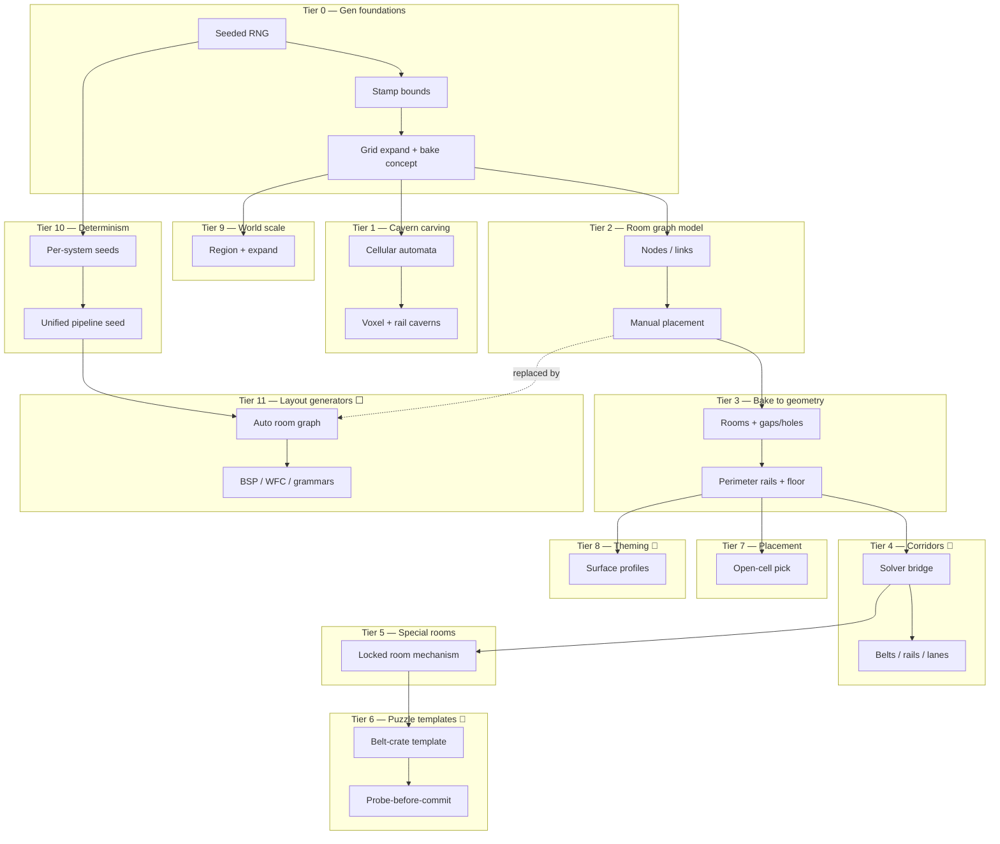

# Procedural & level generation — research tree

Progress tracker for world/level generation: seeded RNG → cavern carving → room-graph authoring → bake-to-geometry → corridors → special rooms → puzzles → placement → theming → world scale → reproducibility → layout generators. Read top-to-bottom like a tech tree. Percentages are **honest engineering completion** (generates real, used geometry) — not "a helper exists."

**Legend:** ✅ shipped · 🟡 partial · ⬜ not started · 🔗 owned by another doc (referenced here) · 🔜 planned

**Naming / doc map:** [glossary.md](./glossary.md) — read before “procedural” or maze discussions.

**Overall engine maturity:** ~**40%** of a full procedural level-generation stack. The honest one-liner: **strong procedural *resolution*, weak procedural *authorship***. The engine is excellent at turning authored-or-seeded *inputs* into real grid geometry (cellular-automata caverns, corridor A* bake, locked-room mechanisms, one puzzle template) — but it does **not** yet *decide* a level layout from a seed. Room placement is manual; there's no dungeon-graph generator, no WFC/BSP, and no unified world seed. The bones (seeded RNG, stamp/bake pipeline, expandable grid) are solid; the brain that arranges rooms is missing.

---

## Scope & ownership (read this first — it's why the docs stop overlapping)

These roadmaps bleed into each other. The rule: **each doc owns one layer; shared concerns are `🔗` references, not duplicated content.** This doc owns **generation of gameplay geometry and content layout** (the **world-gen pipeline**). Layout **algorithms** (R-DFS, V-CA, belt post-process, …) → 🔗 [Mazes.md](./Mazes.md). It explicitly does **not** own:

| Concern | Owner | Why it's not here |
|---|---|---|
| The corridor **solver** (cardinal A*, attachment search) | 🔗 `pathfinding.md` Tier 9 | It's a pathfinder; this doc only *calls* it to bake corridors |
| Whether a puzzle is **winnable** / **difficulty grading** | 🔗 `AI.md` Tier 10 | Solvability is decision analysis, not stamping |
| **Drawing** generated geometry (walls, floor textures) | 🔗 `rendering.md` Tiers 6, 8 | Wall atlas + surface texturing are render pipelines |
| Procedural **surface textures** (Perlin/Voronoi in `Libraries/Procedural/`) | 🔗 `rendering.md` Tier 8 | Confusingly named — that's *texture synthesis*, a visual concern |
| The **grid** representation (`canStep`, nav epoch) | 🔗 `pathfinding.md` Tier 0 | Generation *writes to* the grid; it doesn't define it |
| Layout **algorithms** (spanning trees, maze post-process) | 🔗 [Mazes.md](./Mazes.md) | This doc owns bake pipeline; Mazes owns CS generator catalog |

> **Naming trap:** see [glossary.md](./glossary.md) — `Libraries/Procedural/` (Perlin noise, Voronoi motifs) is **surface textures**, not level geometry.

So the boundary in one sentence: **this doc carves and arranges space; rendering draws it, pathfinding routes through it, AI judges it.** Grid edit contract → [foundations/grid-contract.md](./foundations/grid-contract.md).

---

## Where this sits vs procgen-heavy engines

The yardstick is the roguelike/procgen canon: NetHack/DCSS room-and-corridor dungeons, **Spelunky** room templates, Diablo random dungeons, **WFC** games (Townscaper, Bad North), No Man's Sky chunk streaming.

| Capability | This engine | Procgen canon (Spelunky · DCSS · WFC games · NMS) |
|---|---|---|
| Seeded RNG | ✅ LCG, reproducible per-system | Seeded master RNG, fully reproducible runs |
| Cave carving | ✅ cellular automata | CA / drunkard's walk / noise |
| Room representation | ✅ grid-rect node graph | Templates, BSP leaves, tiles |
| Room **layout generation** | ⬜ manual placement | BSP / packing / graph grammar / MST |
| Corridor routing | ✅ A* bake (🔗 solver) | Tunneling / L-corridors / A* |
| Templates / set-pieces | 🟡 one (belt-crate) | Large template libraries (Spelunky rooms) |
| Constraint-based layout | ⬜ none | WFC / CSP / answer-set |
| Biomes / theming | 🟡 authored per-region | Biome maps, climate fields |
| World scale | 🟡 single expandable region | Chunk-streamed / infinite |
| End-to-end seed → level | ⬜ no | Yes (whole run from one seed) |

**Takeaway:** the *primitives* (seeded carving, bake-to-geometry, template stamping) are real and at parity; the *arranger* (a generator that lays out a whole level from a seed) is the headline gap.

---

## Tree overview



---

## Fundamentals checklist — textbook procgen coverage

A different lens from the feature tiers below: which **CS procgen building blocks** exist in the codebase? `[x]` = implemented and used · `[~]` = present as a narrow/special case · `[ ]` = absent. (Remember the **naming trap**: `Libraries/Procedural/` noise is for *textures* — 🔗 `rendering.md`, not counted here as *geometry*.)

### Randomness & noise
- [x] **Seeded PRNG (LCG)** — `seededRandom.js`, `SeededRng.js`; `withSeededRandom(seed, fn)` scopes `Math.random`.
- [~] **Perlin / Voronoi noise** — exists but for **surface textures only** (🔗 `rendering.md` Tier 8), not level geometry.
- [ ] **Simplex / OpenSimplex**, [ ] **blue noise / Poisson-disk sampling** — absent; no spatial-distribution sampler for scatter/placement.

### Space carving & layout
- [x] **Cellular automata** — Moore-neighborhood majority smoothing (`cellularAutomata.js`, threshold ≥5) → caverns.
- [ ] **Drunkard's walk / random-walk tunneling** — absent (CA only).
- [ ] **BSP partitioning** — absent; the headline layout gap.
- [ ] **Wave Function Collapse (constraint propagation)** — absent.
- [ ] **Graph grammar / L-system** — absent.

### Graphs & connectivity
- [x] **Room-graph model** — rect nodes + directed links (`RoomGraph/`).
- [x] **Distance transform (BFS)** — shared with HPA region seeding (🔗 `pathfinding.md`).
- [~] **Voronoi partition** — used for nav regions + texture motifs, not room layout.
- [ ] **Minimum spanning tree (MST)** / [ ] **Delaunay triangulation** — absent; the natural "connect rooms sensibly" primitives for a layout generator.

### Search & solving (for the bake)
- [x] **Cardinal A\* corridor routing** — delegated to the pathfinder (🔗 `pathfinding.md` Tier 9); this doc only *calls* it.
- [x] **Backtracking attachment search** — room/door placement during bake.
- [ ] **Constraint satisfaction (solvability)** — 🔗 `AI.md` Tier 10; geometric stamping only, no validator.

### Reproducibility
- [x] **Per-subsystem seeding** — map seed, per-link corridor seed.
- [ ] **Unified root seed → derived sub-seeds** — absent; top recommended unlock (one seed ⇒ whole reproducible level).

> **Read:** the **carve (CA) → author graph → bake-to-geometry → route corridors (A\*)** pipeline is real and used — strong procedural **resolution**. The empty boxes cluster in one place: **layout *authorship*** (BSP/MST/WFC/graph-grammar) and a **unified seed**. That's the difference between "renders an authored level" and "invents a level from a number."

---

## Tier 0 — Generation foundations

| Item | Status | % | Notes / modules |
|------|--------|---|-----------------|
| Seeded RNG (LCG) | ✅ | 75 | `Libraries/Random/seededRandom.js`, `Libraries/Math/SeededRng.js` |
| `withSeededRandom(seed, fn)` patch | ✅ | 75 | scopes `Math.random` for a callback |
| Stamp bounds (rect / circle / donut) | ✅ | 80 | `Libraries/Sandbox/mapGenBounds.js` |
| Grid auto-expand to fit stamps | ✅ | 80 | `expandToCoverAabb`, `ensureLabObstacleGridCoverage` |
| Stamp-vs-bake distinction | ✅ | 75 | stamp = direct grid write; bake = graph→geometry |
| Wall-height clamping | ✅ | 75 | `WorldSurface/stampWallHeight.js` |

**Branch progress: 77%**

---

## Tier 1 — Cavern carving

| Item | Status | % | Notes / modules |
|------|--------|---|-----------------|
| Cellular-automata cave gen | ✅ | 80 | `Libraries/CA/cellularAutomata.js` (Moore, threshold ≥5) |
| Random fill (`fillChance`) | ✅ | 80 | default 0.45, 3 iterations |
| Shape masks (circle/donut/rect) | ✅ | 80 | `applyMapGenShapeMask` |
| Voxel wall stamp | ✅ | 80 | `stampStaticWalls`, additive + height level |
| Rail-edge caverns (CA on edge grids) | ✅ | 75 | `generateLabRailCaverns`, H/V seeds |
| Seeded + reproducible | ✅ | 75 | `withSeededRandom(state.mapSeed, …)` |
| Editor gen UI | ✅ | 75 | `mapGenInspector.js`, density/seed/generate |
| CA output tests | ⬜ | 0 | no golden-grid regression |
| Alternative carvers (walk / noise) | ⬜ | 0 | CA only |
| Multi-region / connected-cave guarantee | ⬜ | 0 | no connectivity post-pass |

**Branch progress: 60%**

---

## Tier 2 — Room graph model & authoring

| Item | Status | % | Notes / modules |
|------|--------|---|-----------------|
| Node model (grid-rect rooms) | ✅ | 80 | `roomGraphStore.js`, `RoomNode` |
| Link model (directed edges) | ✅ | 80 | `RoomLink`, corridor type/count/width/seed |
| Manual node placement + validation | ✅ | 75 | `roomGraphPlacement.js`, `stampRoomNodeAt` |
| Manual link wiring | ✅ | 75 | `sandboxRoomGraphSession.js` |
| Snapshot persistence | ✅ | 80 | `roomGraphSnapshot.js`, scene save/load |
| Editor overlay feedback | ✅ | 75 | `roomGraphOverlayCommands.js` |
| **Procedural layout generation** | ⬜ | 0 | rooms placed by hand — the big gap (Tier 11) |

**Branch progress: 52%** · *Model + authoring complete; automatic layout absent.*

---

## Tier 3 — Bake to geometry

| Item | Status | % | Notes / modules |
|------|--------|---|-----------------|
| Graph → bake layout | ✅ | 80 | `roomGraphBake.js`, `buildAuthoredBakeLayout` |
| Rooms with gaps/holes for openings | ✅ | 80 | `buildRoomsFromNodeGraph` |
| Perimeter rail walls | ✅ | 80 | `roomGraphClosedRooms.js` |
| Procedural floor texture bake | ✅ | 70 | `roomGraphFloorDraw.js` (🔗 visual) |
| Grid expand for footprint + search | ✅ | 80 | bake auto-grows grid |
| Quiet stamp passes | ✅ | 75 | `stampRailWallsQuiet`, belt/locked passes |
| Bake golden tests | ⬜ | 0 | mechanism tests only, no geometry goldens |

**Branch progress: 66%**

---

## Tier 4 — Corridor application 🔗

The solver math is owned by `pathfinding.md` Tier 9 (cardinal A* + backtracking attachment). This tier covers how the room graph *uses* it.

| Item | Status | % | Notes / modules |
|------|--------|---|-----------------|
| Solver bridge | ✅ | 80 | `roomGraphCorridorApply.js` → `solveCorridorBundle` |
| Per-lane width roll (seeded) | ✅ | 75 | `roomGraphLinkCorridor.js`, `createSeededRng(link.seed)` |
| Multi-lane corridors | ✅ | 75 | up to `MAX_CORRIDOR_COUNT = 100` |
| Corridor types (empty/open/conveyor/locked) | ✅ | 75 | `roomGraphCorridorTypes.js` |
| Belts along corridor path | ✅ | 75 | `roomGraphCorridorBelts.js` (A→B flow) |
| Corridor perimeter rails | ✅ | 75 | `roomGraphCorridorRails.js` |
| Probe-before-commit | ✅ | 75 | dry-run solve before stamping |

**Branch progress: 76%**

---

## Tier 5 — Special rooms & mechanisms

| Item | Status | % | Notes / modules |
|------|--------|---|-----------------|
| Locked-room bake | ✅ | 75 | `roomGraphLockedRoom.js` |
| Forcefield + passage power + button wiring | ✅ | 70 | sealed parent, egress button |
| Seal/unseal correctness tests | ✅ | 70 | `tests/lockedRoom.test.js` |
| Other mechanism rooms (pressure, timed, keyed) | ⬜ | 0 | only locked-room exists |

**Branch progress: 54%**

---

## Tier 6 — Puzzle templates 🔗

Generation/stamping only. Whether the puzzle is *solvable* or how *hard* it is → `AI.md` Tier 10.

| Item | Status | % | Notes / modules |
|------|--------|---|-----------------|
| Belt-crate template | ✅ | 70 | `puzzleTemplateBeltCrate.js` (3 rooms, A↔B belts, B→C locked) |
| Randomized room sizes/positions | ✅ | 70 | 6–10 cells, gap 3, shuffled order |
| Retry on failed layout (64 attempts) | ✅ | 70 | rejects bad corridor probes |
| Spawn-only template asset | ✅ | 70 | `puzzle_belt_crate.asset.js` |
| Game-launch + editor stamp | ✅ | 70 | `gameLaunchActions.js`, `sandboxScenePlaceables.js` |
| **Template library (>1)** | ⬜ | 0 | only one topology exists |
| Puzzle grammar / parameterized mechanics | ⬜ | 0 | fixed graph shape, not generative |
| Random prop/objective layout | ⬜ | 0 | balls at fixed offsets |

**Branch progress: 35%**

---

## Tier 7 — Placement & population

| Item | Status | % | Notes / modules |
|------|--------|---|-----------------|
| Open-cell collection | ✅ | 80 | `walkableCells.js`, `collectWalkableCells` |
| Uniform random pick + exclude keys | ✅ | 75 | `pickOpenCavernCell`, `excludeKeys` |
| Sequential spawn pool (growing exclude) | ✅ | 75 | `spawnSnakeCavernScene` snake placement |
| Explore destination pick | ✅ | 65 | `pickExploreDestination` (Chebyshev min dist) |
| **Distribution quality (Poisson / blue-noise)** | ⬜ | 0 | uniform random only — clumps |
| Weighted / rule-based placement | ⬜ | 0 | no "near wall / spread out" rules |
| Auto-populate rooms with content | ⬜ | 0 | only puzzle template places props |

**Branch progress: 49%**

---

## Tier 8 — Theming & biomes 🔗

Visual texture synthesis is `rendering.md` Tier 8. This tier is about *which* profile gets *assigned where* (a generation decision).

| Item | Status | % | Notes / modules |
|------|--------|---|-----------------|
| Per-node / per-link surface profile | ✅ | 70 | `roomGraphSurfaceProfile.js` |
| Profile resolution at cell | ✅ | 70 | node wins, else corridor link profile |
| Shipped profile catalog | ✅ | 70 | `Config/procedural/profiles.js` |
| Game-level profile routing | ✅ | 65 | `Core/GameProceduralDesign.js` |
| **Biome map (field → profile)** | ⬜ | 0 | profiles authored, not generated |
| Climate / temperature-moisture model | ⬜ | 0 | |
| Biome-driven geometry (not just texture) | ⬜ | 0 | |

**Branch progress: 42%**

---

## Tier 9 — World scale & expansion

| Item | Status | % | Notes / modules |
|------|--------|---|-----------------|
| Bounded play area (64–1024 cells) | ✅ | 75 | `TileLabEditorState.playConfig`, default 256² |
| Grid grows to fit stamps | ✅ | 75 | `expandToCoverAabb` |
| Single-region generation | ✅ | 70 | one stamp per generate action |
| **Chunk-streamed geometry gen** | ⬜ | 0 | only render-surface chunks exist |
| Infinite / endless world | ⬜ | 0 | |
| Hierarchical world (overworld + instances) | ⬜ | 0 | |
| Multi-dungeon per generate | ⬜ | 0 | |

**Branch progress: 42%**

---

## Tier 10 — Determinism & reproducibility

| Item | Status | % | Notes |
|------|--------|---|-------|
| Cavern CA seeded | ✅ | 75 | `state.mapSeed` |
| Per-link corridor seed | ✅ | 75 | `link.seed` |
| Snake/sandbox spawn seeds | ✅ | 70 | seed + offset |
| **Unified pipeline seed** (cavern+graph+props from one root) | ⬜ | 0 | only ad-hoc offsets today |
| Eliminate bare `Math.random` in gen paths | 🟡 | 30 | new links / reroll still use it |
| Full scene reproducibility from seed | ⬜ | 0 | manual edits + puzzle default RNG break it |
| Seed regression tests | ⬜ | 0 | |

**Branch progress: 36%** · *Per-system seeding works; there's no single root seed that reproduces a whole level.*

---

## Tier 11 — Layout generators (the headline gap) ⬜

This is what turns the engine from "procedural resolution" into "procedural authorship." Everything below feeds the **existing** bake pipeline (Tier 3) — you don't rebuild geometry, you just *generate the room graph* instead of placing it by hand.

| Item | Status | % | Notes |
|------|--------|---|-------|
| Random rect packing → room graph | ⬜ | 0 | simplest first generator |
| MST + extra edges (connectivity) | ⬜ | 0 | classic dungeon connectivity |
| BSP dungeon subdivision | ⬜ | 0 | |
| Wave Function Collapse (tile/room) | ⬜ | 0 | constraint-based layout |
| Graph grammars / rewrite rules | ⬜ | 0 | mission → space grammars |
| Constraint-satisfaction layout | ⬜ | 0 | |
| Template-stitching (Spelunky-style) | ⬜ | 0 | reuse puzzle-template pattern at scale |

**Branch progress: 0%**

---

## Tier 12 — Tooling & tests

| Item | Status | % | Notes / modules |
|------|--------|---|-----------------|
| Editor cavern gen UI | ✅ | 75 | `mapGenInspector.js` |
| Room graph editor session | ✅ | 70 | `sandboxRoomGraphSession.js` |
| Corridor solver tests | ✅ | 75 | `corridorWidthOne/MultiLane.test.js` |
| Puzzle template / locked-room tests | ✅ | 70 | `puzzleTemplateBeltCrate.test.js`, `lockedRoom.test.js` |
| Open-cell placement tests | ✅ | 70 | `walkableCells.test.js` |
| CA / `generateLabCaverns` tests | ⬜ | 0 | no carving coverage |
| Room-graph bake golden tests | ⬜ | 0 | |
| Seeded gen regression | ⬜ | 0 | |

**Branch progress: 53%**

---

## Tier 13 — Advanced (moonshots / out of scope)

| Item | Status | % |
|------|--------|---|
| Full seed → complete level pipeline | ⬜ | 0 |
| Infinite / chunk-streamed world gen | ⬜ | 0 |
| Mixed-technique gen (CA caves + graph rooms blended) | ⬜ | 0 |
| Difficulty-aware generation (🔗 AI Tier 10 feedback loop) | ⬜ | 0 |
| Designer co-pilot (generate + auto-grade puzzles) | ⬜ | 0 |
| Answer-set / SAT level synthesis | ⬜ | 0 |
| Narrative / quest-driven layout | ⬜ | 0 |

**Branch progress: 0%**

---

## What's strong vs what's missing

**Strong — procedural *resolution*:**
1. **Cellular-automata caverns**, seeded and shape-masked, stamping real voxel + rail-edge walls.
2. **Bake pipeline**: an authored room graph becomes correct grid geometry — rooms, openings, perimeter rails, corridors (A*), belts, locked-room mechanisms.
3. **Template stamping** with probe-before-commit retry (the belt-crate puzzle proves the pattern works).

**Missing — procedural *authorship*:**
1. **No layout generator (Tier 11).** Rooms are placed by hand; nothing emits a room graph from a seed. This is *the* gap.
2. **No unified seed (Tier 10).** Can't reproduce a whole level from one number.
3. **One puzzle template, uniform placement, no biome map.** Breadth gaps once a generator exists.

## The keystone: a room-graph generator that feeds the existing bake

The highest-leverage move is **Tier 11 rung 1** — a simple generator (random rect packing or MST-connected rooms) that outputs the *same* `RoomNode`/`RoomLink` structures the editor already produces. Because the bake pipeline (Tier 3–5) is complete, a generator only needs to *arrange* rooms — geometry resolution is free. That single addition flips the engine from "sandbox with procedural helpers" to "procedural level generator," and it composes with everything already built.

---

## Recommended next unlocks (short path)

1. **Unified world seed** — one root seed deriving cavern + graph + placement seeds (Tier 10). Cheap, and a prerequisite for reproducible generation.
2. **Room-graph generator v1** — random rect packing + MST connectivity → existing bake (Tier 11 rung 1). The keystone.
3. **Seed golden tests** — lock CA, room-graph bake, and maze helper output against known seeds before building generators on top.
4. **Poisson / min-distance placement** — replace uniform open-cell pick so content stops clumping (Tier 7).
5. **Second + third puzzle templates** — reuse the probe-before-commit pattern; grows the library (Tier 6).

> **On overlap:** when you build `levels.md` later, let it own *gameplay objectives, progression, and win/fail* — not geometry. This doc carves and arranges; a levels doc would say *what the player must do* in the arranged space, leaning on `AI.md` for solvability. Keep geometry here, goals there.

---

## Key file map

```
Libraries/Random/seededRandom.js, Libraries/Math/SeededRng.js — seeded RNG
Libraries/CA/cellularAutomata.js — cavern carving
Apps/Editor/world/mapWorld.js — generateLabCaverns / rail caverns (entry)
Libraries/Sandbox/mapGenBounds.js, mapGenInspector.js — stamp bounds + editor UI
Libraries/RoomGraph/                — the level-gen core
  roomGraphStore.js                 — node/link model
  roomGraphPlacement.js             — manual room stamping
  roomGraphBake.js                  — graph → grid geometry (the bake)
  roomGraphClosedRooms.js           — perimeter rails + openings
  roomGraphLinkCorridor.js, roomGraphCorridorApply.js — corridor rolls + solver bridge
  roomGraphCorridorBelts.js, roomGraphCorridorRails.js — corridor belts/rails
  roomGraphLockedRoom.js            — locked-room mechanism bake
  roomGraphSurfaceProfile.js        — theming assignment
  puzzleTemplateBeltCrate.js        — the one puzzle template
Libraries/Procedural/Mazes/walkableCells.js — open-cell placement helpers
Libraries/Procedural/Mazes/          — rail maze, belt-corridor, split-layout helpers
Config/procedural/profiles.js, Core/GameProceduralDesign.js — profile catalog/routing
tests/walkableCells.test.js, corridorWidthOne/MultiLane, puzzleTemplateBeltCrate,
  lockedRoom, railMaze*, snakeSplitLayout
```

Cross-doc: corridor solver → `pathfinding.md` Tier 9 · puzzle solvability/difficulty → `AI.md` Tier 10 · wall/floor rendering + surface textures → `rendering.md` Tiers 6, 8 · grid representation → `pathfinding.md` Tier 0.

---

*Last updated: roadmap sync after `Procedural/Mazes` audit and maze/split-layout tests. Strong procedural resolution (CA caverns, corridor bake, locked rooms, one puzzle template, maze helpers); weak procedural authorship remains manual room layout, no generator, and no unified root seed.*
