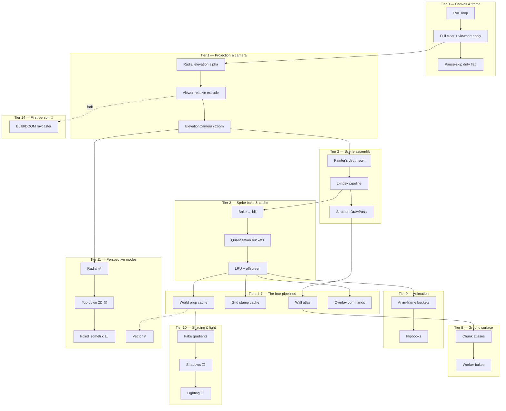

# Rendering engine — research tree

Progress tracker for the pseudo-3D rendering stack: a **Canvas 2D-only** renderer that fakes depth with camera-relative elevation projection, baked sprite caches, painter's-algorithm sorting, and affine-mapped wall textures. **No WebGL, ever** — that's a design constraint, not a gap. Read top-to-bottom like a tech tree: later tiers assume earlier ones. Percentages are **honest engineering completion** (working, wired, on-screen) — not "the file exists."

**Legend:** ✅ shipped · 🟡 partial · ⬜ not started · 🔀 divergent branch (not an upgrade) · 🔜 planned

**Overall engine maturity:** ~**52%** of a complete multi-perspective pseudo-3D canvas renderer. The *core* — radial elevation projection, the four bake/blit pipelines, depth sorting, wall atlas, mesh props, viewport culling — is genuinely production-grade and, in one respect, **unusual in a good way**: the projection is camera-*relative* (things lean away from the viewer) rather than fixed-axis isometric. The gap to "done" is **lighting/shadows, two more overhead perspective modes, dirty-rect perf, render tests**, and the entire **first-person branch**.

> **Naming note:** `Libraries/Spatial/iso/IsometricProjection.js` is misnamed — the math is **viewer-relative radial extrusion**, not fixed 30°/2:1 isometric. Read "iso" as "elevation" throughout this doc.

---

## Where this sits vs pro 2.5D engines

The honest yardstick is **not** Unreal — it's the lineage of sprite-isometric and 2.5D engines. This engine is a **distinctive hybrid**: it live-projects geometry *and* bakes sprites, with a camera-relative projection most iso engines don't bother with.

| Capability | This engine | Sprite-iso (Diablo · Factorio · RCT · SimCity 2000) | First-person 2.5D (Wolf3D · DOOM · Build) |
|---|---|---|---|
| Projection | **Radial camera-relative elevation** (dynamic) | Fixed dimetric / 2:1 isometric axes | First-person ray/column or BSP |
| Geometry source | Hybrid: live-projected verts **+** baked sprites | Pre-rendered sprite atlases | On-the-fly wall columns + sprite billboards |
| Depth resolution | Painter's algorithm (far→near `_distSq`) + per-face mesh sort | Painter's / tile order | Per-column z / BSP front-to-back |
| 3D-look for props | Extruded meshes + fake side gradients | Pre-baked shaded sprites | Billboarded sprites |
| Lighting | Fake fixed-angle gradients only | Baked into sprites | Sector light levels |
| Shadows | ⬜ math exists, **unwired** | Baked blob/contact shadows | Mostly none |
| Texture mapping | Affine quad slices (walls) | Direct sprite blit | Perspective-correct columns |
| Dynamic camera height | ✅ per-game `cameraHeight`/`strength` | Fixed | First-person eye height |
| Off-thread baking | ✅ surface/tile worker | Offline asset pipeline | N/A |

**Takeaway:** for **overhead** rendering, the core is at or above hobby/indie 2.5D parity, with a genuinely novel camera-relative projection. What separates it from a "complete" stack is **lighting/shadows** and **breadth of perspective modes** — and a first-person renderer would be a *new engine beside this one*, not an extension of it.

---

## Tree overview



---

## Fundamentals checklist — textbook real-time-rendering coverage

A different lens from the feature tiers below: which **CS graphics building blocks** exist in this **Canvas-2D-only** renderer? `[x]` = implemented and used · `[~]` = present as a narrow/special case · `[ ]` = absent (sometimes **intentionally** — flagged inline).

### Projection & transforms
- [x] **Camera-relative radial elevation projection** — `IsometricProjection.js` (viewer-relative extrusion, *not* fixed iso).
- [x] **2D affine viewport transform** — pan/zoom (`Viewport`).
- [ ] **True perspective matrix / homogeneous w-divide** — *intentionally absent*; the radial map approximates depth without a matrix pipeline.

### Visibility & depth
- [x] **Painter's algorithm** — far→near `_distSq` ordering + per-face mesh sort.
- [x] **Back-face culling** — `isOutwardFaceTowardViewer` (face-normal · view).
- [x] **View-frustum / AABB culling** — off-screen drawables skipped.
- [ ] **Z-buffer / depth buffer** — *intentionally absent* (no per-pixel depth on 2D canvas; painter's only).
- [ ] **BSP / portal / PVS / occlusion culling** — absent (relevant only to the first-person fork).

### Rasterization & texturing
- [x] **Affine (linear) texture mapping** — `AffineTexture.js`, `drawImageQuad` (wall atlas, sphere patches).
- [x] **Offscreen rasterization + blit** — bake to offscreen canvas, `drawImage` to screen.
- [ ] **Perspective-correct texture mapping** — absent; affine "swim" acceptable at this scale (would matter for the Doom/Build fork).

### Caching & batching
- [x] **Memoized sprite bake** — `getOrBakePropSprite`.
- [x] **Parameter quantization** — spatial/angular/zoom/viewer-offset buckets (`QuantizedSpriteCache.js`, `viewQuantize.js`).
- [x] **LRU eviction** — fixed caps (props 2560, overlays 1024, vector 256).
- [ ] **Dirty-rectangle / partial redraw** — *absent* (full clear+redraw each frame, Tier 12).
- [ ] **Draw-call batching / instancing** — per-prop draw; no atlasing of dynamic props.

### Geometry
- [x] **Convex extrusion / silhouette** — `getRadialSilhouette`, `drawExtrudedRadial`.
- [x] **Triangle-mesh tessellation** — sphere lat/lon, pipe elbow, flipper (`propMesh.js`, `sphereMesh.js`).
- [ ] **Mesh LOD** — single resolution per prop.

### Shading & light
- [~] **Fake directional shading** — Lambert-ish side gradients, fixed light direction (no real normals-to-light).
- [ ] **Planar projected shadows** — math exists (`shadowProjection.js`) but **unwired** — top recommended unlock (Tier 10).
- [ ] **Per-pixel / normal-mapped lighting, AO, GI** — absent.

> **Read:** the **projection → painter's depth → cull → bake/quantize/blit** spine is textbook-complete for an overhead 2.5D canvas renderer. The deliberate non-features (z-buffer, perspective-correct mapping, WebGL) are **design constraints**, not gaps. The real to-dos are **lighting/shadows** (wire `shadowProjection.js`) and **dirty-rect perf**.

---

## Tier 0 — Canvas & frame loop

| Item | Status | % | Notes / modules |
|------|--------|---|-----------------|
| `requestAnimationFrame` main loop | ✅ | 90 | `Apps/Editor/engine.js` |
| Single canonical sim draw path | ✅ | 90 | `Render/Render.js` → `renderSimulationScene` |
| Frame draw entry | ✅ | 85 | `Apps/Editor/ui/preview.js` → `drawLabFrame` |
| Full clear + `viewport.apply` each frame | ✅ | 85 | `ctx.clearRect` whole canvas |
| Pause-skip when idle | ✅ | 80 | `shouldRenderLabFrame`, `labViewDirty` |
| Screen-space post pass (vignette/letterbox) | ✅ | 80 | `setTransform(1,0,0,1,0,0)` reset |
| Dirty-rect / partial redraw | ⬜ | 0 | full clear every frame (Tier 12) |
| Decoupled fixed-step render vs sim | 🟡 | 40 | render reads `gameTime`; no interpolation layer |

**Branch progress: 78%**

---

## Tier 1 — Projection & camera (the pseudo-3D core)

| Item | Status | % | Notes / modules |
|------|--------|---|-----------------|
| Radial elevation alpha | ✅ | 90 | `resolveElevationAlpha`, `IsometricProjection.js` |
| Viewer-relative extrusion | ✅ | 90 | points lean away from `(viewerX, viewerY)` |
| Vertical projection + box extrude | ✅ | 85 | `projectVertical`, `extrudeBox`, `extrudeConvexFootprint` |
| Radial silhouettes (cylinders) | ✅ | 85 | `getRadialSilhouette`, `traceVisibleArc` |
| `ElevationCamera` from viewport | ✅ | 85 | `ElevationCamera.js` |
| Per-game perspective override | ✅ | 80 | `Core/GamePerspective.js`, `cameraHeight`/`strength` |
| Zoom-scaled wall perspective | ✅ | 80 | `resolveStructurePerspectiveStrength` |
| World→screen transform | ✅ | 90 | `Viewport.js`, `worldToScreen` |
| `viewerSource` config | 🟡 | 30 | declared, never read — always viewport-centered |
| Camera rotation / yaw | ⬜ | 0 | facing is a baked bucket, not a live camera rotate |

**Branch progress: 75%**

---

## Tier 2 — Scene assembly & depth sorting

| Item | Status | % | Notes / modules |
|------|--------|---|-----------------|
| z-index ordered pipeline | ✅ | 85 | ground -5 → floor 10.5 → structure 70 → HUD 100+ |
| Painter's sort (far→near) | ✅ | 85 | `_distSq` per drawable, `WorldSceneRenderer.js` |
| Per-face mesh sort (back→front) | ✅ | 80 | sphere/flipper/pipe faces by `face.depth` |
| Textured-quad cell depth sort | ✅ | 80 | `drawTexturedQuadCells` |
| Structure pass switch (radial/flat) | ✅ | 85 | `StructureDrawPass.js`, `WorldRenderMode.js` |
| Floor / debris / entity layer hooks | ✅ | 80 | `renderMode` per asset |
| Robust cross-pipeline z (props vs walls) | 🟡 | 55 | distance-sq heuristic, occasional overlap edge cases |
| True per-pixel depth buffer | ⬜ | 0 | painter's only (intentional for 2D canvas) |

**Branch progress: 73%**

---

## Tier 3 — Sprite baking & quantized cache

| Item | Status | % | Notes / modules |
|------|--------|---|-----------------|
| Bake recipe → offscreen → blit | ✅ | 90 | `QuantizedSpriteCache.js`, `getOrBakePropSprite` |
| World-anchored blit | ✅ | 90 | `blitAnchoredSprite` |
| Unified entry (`drawCachedPropSprite`) | ✅ | 90 | mandatory path for props + grid stamps; world props via `PropRenderer.drawProp` |
| Viewer-offset quantization | ✅ | 85 | step 30, clamp ±120 (`viewQuantize.js`) |
| Facing / roll angle buckets | ✅ | 85 | `quantizeAngleIndex`, footprint-scaled |
| Zoom buckets | ✅ | 85 | 1/8 steps, floor 0.25 |
| Dynamic state key hook | ✅ | 85 | `getCustomSpriteCacheKey(prop)` |
| LRU caps + offscreen no-smoothing | ✅ | 85 | props 2560, overlays 1024, vector 256 |
| Bake-scale resolution targeting | ✅ | 80 | `resolvePropBakeScale`, `propPixelSize` |
| Cache memory budget / eviction telemetry | 🟡 | 40 | fixed LRU caps, no adaptive sizing |

**Branch progress: 80%**

---

## Tier 4 — Pipeline 1: World prop cache

| Item | Status | % | Notes / modules |
|------|--------|---|-----------------|
| Recipe lookup by `render3DKey` | ✅ | 85 | `PropRenderer.js`, asset `id` wiring |
| Mesh projection + face cull | ✅ | 85 | `propMesh.js`, `projectPropVertexInto` |
| Sphere lat/lon mesh + roll quat | ✅ | 85 | `sphereMesh.js`, `sphere.js` |
| Box / radial extrusion primitives | ✅ | 85 | `SolidDraw.js`, `drawBox`, `drawExtrudedRadial` |
| Custom mesh props (flipper, pipe) | ✅ | 80 | `flipperPaddle.js`, `pipeElbow.js` |
| Textured sphere patches/decals | ✅ | 75 | `SurfaceTexturing/`, affine UV quads |
| Sprite draw modifiers (alpha/clip/scale) | ✅ | 80 | `spriteDrawModifier.js` |
| Flat props (button floor, goal star) | ✅ | 80 | `buttonFloorDraw.js`, `goalStarDraw.js` |

**Branch progress: 81%**

---

## Tier 5 — Pipeline 2: Grid stamp cache

| Item | Status | % | Notes / modules |
|------|--------|---|-----------------|
| `GRID_STAMP_RENDER_KEY` family | ✅ | 85 | `QuantizedSpriteCache.js` |
| Floor belts (animated) | ✅ | 80 | `floorOccupancy.js`, `conveyorDraw.js` |
| Forcefield edges | ✅ | 75 | `drawForcefields.js` |
| Passage power source stamps | ✅ | 75 | energized-state bucket |
| Prop-proxy + dynamic key pattern | ✅ | 80 | minimal proxy at grid anchor |

**Branch progress: 79%**

---

## Tier 6 — Pipeline 3: Wall atlas & structures

| Item | Status | % | Notes / modules |
|------|--------|---|-----------------|
| Voxel wall face collect + cull | ✅ | 85 | `StaticGridWallDraw.js`, `isOutwardFaceTowardViewer` |
| Projected wall faces (band subdiv) | ✅ | 85 | `ProjectedWallDraw.js` |
| Affine atlas UV mapping | ✅ | 80 | `AffineTexture.js`, `drawImageQuad` |
| Horizontal caps / roofs | ✅ | 80 | top-ring projection, cap chunks |
| Rail-wall edge boxes | ✅ | 80 | `StaticGridEdgeRailDraw.js` |
| Texture LOD (near/far subdiv) | ✅ | 75 | `wallSubdivNearPx/FarPx` |
| Procedural wall atlas bake | ✅ | 80 | `WorldSurface/`, `getOrEnsureWallAtlas` |
| Solid-color fallback (atlas pending) | ✅ | 70 | placeholder fill |
| Per-cell variable wall height | ✅ | 75 | z-level lists, `wallGridBake.js` |

**Branch progress: 78%**

---

## Tier 7 — Pipeline 4: Overlay commands (editor/sandbox feedback)

| Item | Status | % | Notes / modules |
|------|--------|---|-----------------|
| Command factories | ✅ | 85 | `overlayCommands.js` |
| Cached glyph bake (rings, arrows, dots) | ✅ | 85 | `overlayGlyphBake.js`, `OVERLAY_RENDER_KEY` |
| Live geometry (marquee, wire, polyline) | ✅ | 85 | `overlayAabb`, `overlaySegment`, `overlayAimSegment` |
| Path / nav debug overlays | ✅ | 80 | `pathOverlayCommands.js` |
| Aggregated collector | ✅ | 80 | `buildSandboxOverlayCommands.js` |
| World-unit overlay scaling under zoom | ✅ | 80 | no screen-stable hacks |

**Branch progress: 82%**

---

## Tier 8 — Ground surface & texturing

| Item | Status | % | Notes / modules |
|------|--------|---|-----------------|
| Chunked ground atlases | ✅ | 80 | `WorldSurfaceEngine`, 10000 LRU |
| Procedural surface profiles | ✅ | 75 | `Core/GameProceduralDesign.js` |
| Worker-offloaded surface bakes | ✅ | 80 | `TileWorkerCoordinator.js` |
| Roof / horizontal chunk draw | ✅ | 75 | `drawProjectedHorizontalChunk` |
| Surface texturing patches | ✅ | 70 | `SurfaceTexturing/texturedCells.js` |
| Floor shadow fill under walls | 🟡 | 50 | flat `floorShadow` color, not projected |

**Branch progress: 70%**

---

## Tier 9 — Animation

| Item | Status | % | Notes / modules |
|------|--------|---|-----------------|
| `animFrame` cache bucket | ✅ | 80 | `getOrBakePropSprite` key pack |
| Conveyor belt cycle | ✅ | 80 | 8-frame, `gameTime/60 % 8` |
| Animated surface zones (flipbooks) | ✅ | 75 | `animatedSurfaceDraw.js` |
| Worker flipbook bake (frame cap) | ✅ | 70 | `animatedSurfaceFlipbook.js` |
| Lab animation preview canvas | ✅ | 70 | `LabAnimationPreview.js` |
| Skeletal / tween prop animation | ⬜ | 0 | only frame-swap + physics pose |
| Render interpolation (sub-frame) | ⬜ | 0 | draws at sim `gameTime` directly |

**Branch progress: 62%**

---

## Tier 10 — Shading, shadows & lighting (biggest visual gap)

| Item | Status | % | Notes / modules |
|------|--------|---|-----------------|
| Fake directional side gradients | ✅ | 70 | `createSideGradient`, fixed light `-3π/4` |
| View-angle highlight placement | ✅ | 70 | `getSideHighlightT` |
| Per-recipe radial gradients | ✅ | 65 | buttons, flat props |
| Optional full-canvas bloom | 🟡 | 50 | `WORLD_SURFACE_DEFAULTS.bloom`, off by default |
| **Projected drop shadows** | ⬜ | 0 | `shadowProjection.js` math exists but **unwired** — zero call sites |
| Configurable light direction/color | ⬜ | 0 | hardcoded angle |
| Ambient occlusion / contact shadows | ⬜ | 0 | |
| Dynamic / point lights | ⬜ | 0 | |
| Day-night / time-of-day tint | ⬜ | 0 | |

**Branch progress: 24%**

---

## Tier 11 — Perspective modes (the ladder)

This is the headline roadmap for *your* vision. All **overhead** modes share Tiers 0–10 (one projection pipeline, one depth sort, one set of caches) — they're variations on camera-relative projection, so they form a **progression**. The first-person mode is a different beast → see Tier 14.

| Mode | Status | % | Notes |
|------|--------|---|-------|
| **Radial camera-relative perspective** (your "cool overhead" style) | ✅ | 85 | the default and most complete; `worldRenderMode: "radial"` |
| **Vector silhouette mode** (orthogonal debug overlay) | ✅ | 80 | `vectorProp.js`, toolbar toggle; not a camera mode but a draw mode |
| **Top-down flat 2D** | 🟡 | 45 | `flat2d` does flat wall-rail footprints, but 3D props still extrude; not a true orthographic top-down yet |
| **Fixed isometric** (true 2:1 dimetric axes) | ⬜ | 0 | despite folder name — would set `strength→fixed axis`, lock viewer direction, re-key sprite bakes by fixed angle |
| Mode switch infrastructure | 🟡 | 60 | `WorldRenderMode` swaps `StructureDrawPass` only; needs to also drive projection + sprite keys for full mode parity |
| Smooth runtime mode transitions | ⬜ | 0 | |

**Branch progress: 45%**

### Build order for the ladder (your priorities)

1. **Radial overhead** — ✅ already shipped; polish (Tier 10 lighting will sell it most).
2. **Top-down 2D** — finish `flat2d`: add a true orthographic projection (alpha→0, no radial lean) and a "props draw flat" path so it's a real top-down, not just flat walls.
3. **Fixed isometric** — lock viewer direction + fixed-axis projection; the sprite cache already buckets by angle, so this is mostly a projection + key change, not new infra.
4. **Build/DOOM** — see Tier 14; treat as a separate renderer.

---

## Tier 12 — Performance & culling

| Item | Status | % | Notes / modules |
|------|--------|---|-----------------|
| Viewport AABB culling (chunks/props) | ✅ | 85 | `boundsDraw`, `queryView`, padded bounds |
| Back-face culling (walls/meshes) | ✅ | 85 | toward-viewer dot test |
| Sprite/atlas/surface LRU caches | ✅ | 85 | avoid rebaking geometry |
| Bake quantization (cache pressure) | ✅ | 85 | viewer/angle/zoom buckets |
| Worker offload (surface/tile bakes) | ✅ | 80 | main thread blits only |
| Dirty-rect / region invalidation | ⬜ | 0 | full clear each frame |
| Sprite atlas packing (vs per-prop canvas) | ⬜ | 0 | each bake is its own offscreen canvas |
| Adaptive quality / frame budget | ⬜ | 0 | |

**Branch progress: 60%**

---

## Tier 13 — Tooling, debug & tests

| Item | Status | % | Notes / modules |
|------|--------|---|-----------------|
| Vector debug prop mode | ✅ | 80 | physics silhouettes |
| Minimap / map overview | ✅ | 75 | `labMapCaches.js`, own canvas |
| Path / HPA debug overlay | ✅ | 75 | toolbar toggle |
| Render-mode + bloom + vignette toggles | ✅ | 75 | editor toolbar |
| Mock canvas test harness | ✅ | 70 | `tests/mockCanvas2d.js` |
| Vector / cache-key unit tests | 🟡 | 50 | `vectorProp.test.js`, `propScale.test.js` (specs, not draw) |
| Projection / viewport transform tests | ⬜ | 0 | no `IsometricProjection`/`Viewport` coverage |
| Pipeline order / depth-sort tests | ⬜ | 0 | |
| Visual regression / golden-image tests | ⬜ | 0 | |

**Branch progress: 53%**

---

## Tier 14 — First-person / Build-style renderer (divergent branch) 🔀

**Not an upgrade over the overhead modes — a parallel renderer.** Wolfenstein/DOOM/Build put the camera *inside* the world at eye level and resolve depth per screen-column (ray march / BSP / portals). It shares almost nothing with the painter's-over-the-top overhead pipeline: no `_distSq` prop sort, no elevation extrusion, no baked top-down sprites. What it *could* reuse: the grid + wall-height data, the wall texture atlases, and entity positions (as billboards).

| Item | Status | % | Notes |
|------|--------|---|-------|
| Per-column ray march vs grid | ⬜ | 0 | DDA across `WorldObstacleGrid`, wall height → column height |
| First-person camera (pos + yaw + FOV) | ⬜ | 0 | brand-new camera model |
| Perspective-correct wall columns | ⬜ | 0 | sample wall atlas per column |
| Sprite billboards (props as flats) | ⬜ | 0 | depth-sorted billboards |
| Floor / ceiling casting | ⬜ | 0 | |
| Sector / variable floor height (Build) | ⬜ | 0 | true Build-engine scope |
| Mode toggle into FP renderer | ⬜ | 0 | swaps the whole draw path, not just `StructureDrawPass` |

**Branch progress: 0%** · *Reuses grid + wall atlas; everything else is a new pipeline.*

---

## Tier 15 — Advanced (future / out of scope for now)

| Item | Status | % |
|------|--------|---|
| Real lighting model (point/spot, normals) | ⬜ | 0 |
| Normal-mapped / multi-angle baked sprites | ⬜ | 0 |
| Dynamic projected shadows | ⬜ | 0 |
| Particle / VFX system | ⬜ | 0 |
| Reflections / water / transparency sorting | ⬜ | 0 |
| Weather / volumetric fog | ⬜ | 0 |
| Post-process chain (CRT, color grade) | ⬜ | 0 |
| `OffscreenCanvas` render worker (full frame) | ⬜ | 0 |

**Branch progress: 0%**

---

## What's genuinely strong here

1. **Camera-relative radial projection.** Most 2.5D engines lock to fixed isometric axes; yours extrudes height *away from the live viewer*, so the world subtly reframes as you pan. That's a distinctive, hard-to-fake look — and it's the most complete part of the stack.
2. **Four disciplined pipelines + one cache.** Props, grid stamps, walls, and overlays all funnel through bake→quantize→blit (or the wall atlas) with a single LRU and clear cache keys. This is the architecture your `rendering-pipelines.mdc` rule enforces, and it's genuinely clean.
3. **Worker-offloaded baking + aggressive culling.** Surface/tile bakes run off-thread; viewport AABBs, back-face culling, and quantized sprite keys keep the per-frame cost down despite a full clear each frame.

## What separates it from "done"

1. **Lighting & shadows (Tier 10).** Fake fixed-angle gradients only; `shadowProjection.js` is written but unwired. This is the single biggest visual upgrade available.
2. **Only one full perspective mode (Tier 11).** Top-down is half-done, fixed isometric is unbuilt, first-person doesn't exist.
3. **Full clear every frame, no render tests (Tiers 12-13).** Fine today; both become real once scenes or perspective modes grow.

---

## Recommended next unlocks (short path)

1. **Wire up projected drop shadows** — `shadowProjection.js` already has the math; routing it into the prop/wall pass is the highest visual-payoff-per-effort win and sells the radial look.
2. **Render cache-pressure telemetry** — hit/miss/eviction and unique-key counts for dense snake/sandbox scenes.
3. **Finish top-down 2D** — make `flat2d` a true orthographic mode (kill the radial lean, draw props flat), completing rung 2 of your ladder.
4. **Projection + viewport unit tests** — Tier 13 has zero coverage of the literal core math; lock it down before adding modes.
5. **Configurable light direction/color** — unhardcode the `-3π/4` angle; cheap, and unblocks day-night / per-game mood later.

> **On first-person (Build/DOOM):** it's a *divergent branch* (Tier 14), not the top of the ladder — a separate raycaster that reuses your grid + wall atlas but replaces the entire draw path. Worth it as a "wow" mode later, but don't sequence it as "after isometric"; sequence it as "a second renderer when you want it."

---

## Key file map

```
Libraries/Spatial/iso/              — projection & camera (read "iso" as "elevation")
  IsometricProjection.js            — radial elevation alpha, extrude, silhouettes
  ElevationCamera.js, perspectiveDefaults.js
Core/GamePerspective.js             — per-game cameraHeight / strength
Libraries/Viewport/Viewport.js      — pan / zoom / world↔screen
Render/Render.js                    — the one render loop (renderSimulationScene)
Render/StructureDrawPass.js, WorldRenderMode.js — radial vs flat2d switch
Libraries/Render/WorldSceneRenderer.js — depth sort + scene passes
Libraries/Canvas/QuantizedSpriteCache.js — bake→quantize→blit (the cache)
  BakedSpriteCache.js, offscreenCanvas.js, viewQuantize.js, AffineTexture.js
Libraries/Render/Props3D/           — PropRenderer, sphere/box/flipper/pipe meshes
Libraries/Render/Structure3D/       — projected wall faces, rails, atlas (pipeline 3)
Libraries/Render/overlays/          — overlay command pipeline (pipeline 4)
Libraries/Render/SurfaceTexturing/  — sphere/cell affine texture mapping
Libraries/World/                    — wall/grid bake helpers for render + surfaces
Libraries/Spatial/iso/shadowProjection.js — shadow math (UNWIRED — Tier 10)
Libraries/Render/vectorProp.js      — vector silhouette mode
Apps/Editor/engine.js, ui/preview.js — RAF loop + frame draw entry
tests/vectorProp.test.js, drawShapeParity.test.js, mockCanvas2d.js
```

---

*Last updated: roadmap sync after library audit refresh. Core radial-elevation projection + four pipelines are the mature half; lighting/shadows, cache telemetry, and the perspective-mode ladder are the headline gaps. First-person Build/DOOM remains a divergent branch, not a linear upgrade.*
