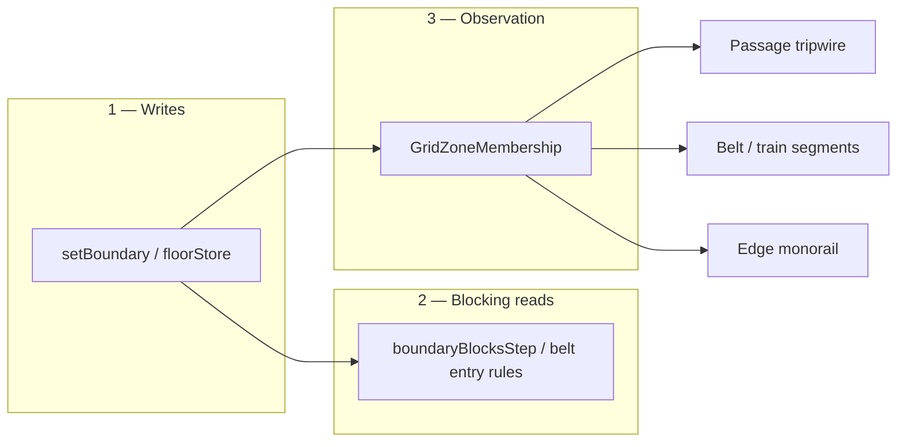

# todo

**Current focus:** **Passage power network (Layer D)** — Step 1–2 + Step 3 **core** shipped; optional Step 3 consumers (alarm, crossing links) do **not** block power flood. Interim `gridEdge` button links replaced in D.1.

**3-step plan (overall goal):**

| Step | Layer | Ship when |
|------|--------|-----------|
| **1 — Writes** | `setBoundary` / `floorStore` + `reconcileBeltBoundaries` | [x] `boundaryOccupancy.js`; editor + snapshot through writers; belt laterals derived |
| **2 — Blocking reads** | `boundaryBlocksStep` / `boundaryBlocksStepFrom` + belt entry rules + powered collision | [x] unified nav query + powered passage collision proxies; [ ] passage profiles (`oneWay` / `tripwire`) |
| **3 — Observation** | **`GridZoneMembership`** → belts, tripwire lasers, edge trains | Enter / on / exit events; consumers wired after core diff tick |

---

## Step 1 — Writes (boundary occupancy API) — **shipped**

**Problem:** Edge roles are split across direct `edgeStore` writes, `forcefieldPowered` Map, belt-derived rails, and separate nav vs collision paths. Forcefields v1 blocks **pathfinding only** — pushables pass through powered lasers because `appendStaticWallProxiesNear` never emits passage edges (only voxel fill + rail + beltRail).

**Two layers on `WorldObstacleGrid`:**

| Layer | Storage | Walkable? | Rules |
|-------|---------|-----------|--------|
| **Cell** | `grid[]` (voxel fill), `floorStore` (belts) | Belts: **yes** for `isBlocked` | Pathfinding: belt **entry/exit** sides (`_beltBlocksEntryFrom`) — no planning through a one-way belt against flow |
| **Boundary** | `edgeStore` (mirrored undirected global edge) | N/A | One **primary** per edge: `railWall` **or** `passage` (laser). **Derived** `beltRail` on railed belt **lateral** edges only — must not overwrite primary |

**Exclusivity:** rail + passage on same edge forbidden; laser on belt **exit** edge OK; laser on railed belt **lateral** forbidden.

**Implementation order (Step 1 only):**

1. **`setBoundary` / `getBoundary` + `reconcileBeltBoundaries`** — sole writer; migrate `gridWallEdit` + belt placement; central exclusivity.
2. **Migrate callers** — editor stamp/clear/pick, `applyStampedForcefieldsFromGlobal`, rail wall apply, belt lateral sync; no direct `edgeStore` writes outside boundary module.
3. **Scene JSON apply** — batch stamp through writers only; optional merge to `boundaries[]` later.

**Acceptance (Step 1):**

- [ ] Stamp rail OR passage; second kind rejected on same edge.
- [ ] Railed belt: laterals = `beltRail`; passage on lateral rejected; passage on belt exit allowed.
- [ ] Buttons + scene JSON round-trip still work (power map can stay separate until Step 2).

**Defer to Step 2:** `boundaryBlocksStep`, powered collision, HPA blocking, passage modes.

**Out of scope for edge-map lasers:** entities physically **breaking** or **interrupting** a beam (volume/ray occlusion, movable emitters). Cardinal edge stamps only — no “body blocks the line” sim.

**Step 1 done when:** all edge stamps go through `setBoundary`; belt placement calls `reconcileBeltBoundaries`; rail/passage/lateral exclusivity enforced in one place; scene JSON apply uses writers only. **Status: [x]**

---

## Step 2 — Blocking reads — **mostly shipped**

Unify **“can cross?”** for nav and physics — still no enter/on/exit events (that is Step 3).

**Work:**

1. [x] **`boundaryBlocksStep(fromCol, fromRow, toCol, toRow)`** — `boundaryOccupancy.js`; `canStep` uses `boundaryBlocksStepFrom`; belt entry folded in.
2. [ ] **Passage profile on boundary** — `mode` (`solid` / `oneWay` / `tripwire`), `allowedSide`; inspector + JSON field on stamped passage.
3. [x] **Powered passage collision** — `gridPassageEdgeShouldEmit` + static edge proxy when powered in `appendStaticWallProxiesNear`.
4. [ ] **Runtime on boundary** — fold `forcefieldPowered` into boundary record (same key); buttons/inspector through API.
5. [x] **HPA + `canStep`** — directional query only (forcefield callback retained for powered lookup until 4).

**Step 2 acceptance:**

- [x] HPA / `canStep`: powered passage blocks when on (solid default); unpowered open.
- [x] Belt entry rules unchanged (cell walkable).
- [x] **Pushables:** powered passage blocks movement on that edge (no pass-through).

**Step 2 done when:** one query module answers nav + physics; no ad hoc forcefield callback; passage modes behave as specified.

**Defer to Step 3:** tripwire alarms, belt segment events, monorail attach, crossing editor links.

---

## Step 3 — Observation (`GridZoneMembership`) — **core shipped**

Read-only **“who is on what?”** — never writes grid stores.

**Shipped:**

- [x] **`GridZoneMembership` core** — `gridZoneMembership.js`: packed cell + edge keys, entity prev set, enter/on/exit diff.
- [x] **`tickGridZones`** — engine hook after pushable physics; rebuilds sparse subscriptions on grid edits.
- [x] **Belt cell subscriptions** — enter/on/exit → `state.sandbox.beltZoneEvents` (log buffer; no gameplay consumer yet).
- [x] **Tripwire edge subscriptions** — powered filter via `isPassagePowered`; `tripwireTriggeredKeys` → red draw while crossed.
- [x] **`markGridZoneSubscriptionsDirty`** — wall/floor/belt/forcefield edits invalidate subscription cache.

**Still open (optional — does not block passage power network):**

- [ ] **Tripwire → alarm / behavior** — wire crossing events to props (needs target link JSON or ad hoc hook).
- [ ] **Belt segment gameplay** — consumers on `beltZoneEvents` (counters, train logic).
- [ ] **Crossing → target editor links** — prop-extras / scene JSON for edge subscriptions.
- [ ] **Unit tests** — synthetic diff moves in `gridZoneMembership`.
- [ ] **Edge train spike** — `edge` zone on `beltRail` + ride physics.

**Step 3 core done when:** [x] moving entities diff belt cells + armed tripwire edges without O(grid) scan.

**Note for Layer D:** When `networkPowered` flood ships, tripwire “armed” is just `isPassagePowered` reading flood output — **no GridZoneMembership rewrite**. Finish alarm/links whenever; power graph is independent of mode (solid / oneWay / tripwire).

---

## Current priorities (detail)

### Passage (laser) — profiles, crossing events, wiring

Same **boundary edge** as today’s forcefield, but three concerns stay **separate layers** (do not fold into occupancy writes):

| Layer | What it owns | When |
|-------|----------------|------|
| **A — Occupancy** | `setBoundary`, exclusivity, `boundaryBlocksStep`, powered collision emit | **Now** (current focus) |
| **B — Passage profile** | Per-edge **mode** + facing (placement blob, scene JSON) | After A |
| **C — Crossing tracker** | Enter / on / exit signals when entities cross a **zone** (cell or edge) | After B — via shared **`GridZoneMembership`** (see below) |
| **D — Wiring** | Button → power (interim: per-edge); **power network** (voxel source → corner taps → laser chain); crossing → alarm/behavior | After C + prop-extras JSON |

**Passage modes (profile on placement blob — like belt kind + facing):**

| Mode | Powered + blocks? | Typical use |
|------|-------------------|-------------|
| **`solid`** | Blocks **both** directions (nav + physics when on) | Current v1 default once collision ships |
| **`oneWay`** | Blocks crossing **against** declared `allowedSide` (into cell vs out of cell — same idea as belt entry/exit on an **edge**) | Airlock, one-way forcefield |
| **`tripwire`** | **Never** blocks movement; powered only affects **draw/alarm state** + crossing events | “Laser you can walk through either way” — sensor, not wall |

Unpowered: **`solid`** and **`oneWay`** behave as open edge (no block). **`tripwire`** still fires crossing events when powered (and optionally when off — TBD in inspector).

**Directional query:** extend occupancy with **`boundaryBlocksStepFrom(fromCol, fromRow, toCol, toRow)`** — same directional pattern as cell belts (`_beltBlocksEntryFrom`) but on boundary passage profile. **`solid`** = block both ways when powered; **`oneWay`** = block only forbidden direction; **`tripwire`** = never block.

**Crossing events (layer C — not occupancy):**

Use shared **`GridZoneMembership`** (below), not a one-off `PassageCrossingTracker`. Passage edges subscribe with zone kind **`edge`** + `packEdgeCellKey`.

- **`zoneEntered`** — membership began (cell or edge)
- **`zoneOn`** — still member this frame (hold / “is on laser”, “is on belt”, train on rail segment)
- **`zoneExited`** — membership ended

Passage-specific semantics (armed tripwire, direction of cross) are **filters on edge zones**, not a second tracker.

Consumers: alarm prop, sandbox script hook, future behavior graph. **Not** the same as button `gridEdge` power links — crossing is **output**; buttons remain **input** to `powered`.

**Wiring (layer D):**

- [x] **Button → `gridEdge` power (interim)** — `buttonLinks` + `syncForcefieldButtonPower` toggles each stamped edge’s `powered` directly. Works but wrong model long-term (buttons should feed a **source**, not arbitrary beam segments).
- [ ] **Passage power network** — see below; replaces per-edge button links once shipped.
- [ ] **Crossing → target** — link passage edge (or chain id) to alarm / spawner / behavior; editor wire mode analogous to buttons; persist in prop-extras / scene JSON when that ships.

**Passage power network (target — replaces per-laser button links):**

Today each laser is powered in isolation (`edge.powered` or a button wired straight to that edge). Target behavior:

**Flat plane (v1):** Lasers and power are **height-1** like cell belts — no `zLevel` / vertical stacking in sim rules. Rail walls and voxel fill may still have height for **draw/collision elsewhere**; passage **power graph + armed state** ignore height entirely.

**Two separate concerns on each passage edge:**

| Field | Meaning |
|-------|---------|
| **Profile (`mode`, `allowedSide`)** | Behavior when energized: solid / oneWay / tripwire — blocking, crossing events, draw style. |
| **`networkPowered` (derived)** | Whether this segment is **connected** to an energized source through the laser graph. No source path → cannot be armed regardless of mode. |

Buttons and scene defaults energize **sources**, not individual edges. `edge.powered` at runtime = **`networkPowered`** (after flood), not an author toggle per beam.

| Piece | Role |
|-------|------|
| **Power source** | One **cell** stamp that can energize corner taps. Buttons wire here — **not** to individual passage edges. See **where it lives** below. |
| **Corner tap** | Each source cell has four corners; the **two cardinal edges meeting at a corner** are tap points. A passage edge stamped on either tap edge can plug into that cell when the source is energized. |
| **Laser chain** | Connected passage edges (shared endpoints / collinear continuation — TBD). Flood from energized corner taps through the graph. |
| **Mirrored boundary** | `edgeStore` mirrors one physical edge to both cells. For **power graph only**, treat as **one undirected segment** (same as `canonicalEdgeCellKey`). **One-way** lasers still behave directionally for blocking/crossing, but for **connectivity** they occupy **both sides** of the shared boundary — not two independent power nodes. |

**Rough end goal:** Pathfinding-style **flood** on a graph of source cells + passage edges (undirected for wiring). Reachable passage edges get `networkPowered`; then existing mode rules (solid / oneWay / tripwire) apply on top. Lasers do not “self-power”; they only reflect upstream connectivity + source input.

**Where the power source lives (recommended — cell layer, not prop, not edge):**

Sandbox grid today:

| Layer | Store | Examples |
|-------|--------|----------|
| **Cell fill** | `grid[]` | Voxel blocks — **blocks** the cell, height levels for walls |
| **Cell overlay** | `floorStore` | Belts — **walkable**, stamped per cell, height-1 sim |
| **Boundary** | `edgeStore` | Rail walls, passage lasers, derived belt rails |
| **Entities** | `WorldProp` | Buttons, balls, flippers — free position, wire **from** buttons |

**Recommendation:** **`floorStore` kind** (e.g. `PassagePowerSource`) — same stamping UX family as belts: one cell, grid-native, scene JSON `powerSources[]` or extended `floorBelts`-style array. Corner taps derive from `(col, row)` cell bounds, not from prop AABB.

| Option | Pros | Cons |
|--------|------|------|
| **`floorStore` kind (preferred)** | Matches “height-1 cell stamp”; doesn’t block like voxel; exclusive with belt on same cell is easy; flood keys = cell index | New kind + writer; not a “block” visually unless draw says so |
| **`grid[]` voxel + flag** | Matches “block in corner” look | Voxels **block** movement/path unless special-cased; conflates with wall heightLevel |
| **WorldProp snapped to cell** | Reuses prop spawn | Wrong layer — props move, broadphase, not in scene grid JSON today; buttons already props **linking to** grid |
| **edgeStore** | — | Source is a **cell**, not a boundary |

Button links gain target type **`gridCell`** (or `powerSource` cell index) — parallel to existing `worldProp` and interim `gridEdge`. Input stays on floor buttons (WorldProp); output energizes cell(s), then flood sets passage edges.

**Open design (when implementing):**

- [ ] **Adjacency rule** — which edge-to-edge connections count as “connected laser” (endpoint meet? collinear only? T-junction?).
- [ ] **Source vs belt exclusivity** — same cell cannot be belt + source, or allow overlay rules.
- [ ] **Corner → edge mapping** — helper: given source `(col, row)`, list eight directed tap edges (two per corner) for flood seeds.
- [ ] **Graph sync** — `syncPassagePowerNetwork(state)`: energized sources → flood → write derived `networkPowered` on reachable passage edges; `onObstaclesChanged` when armed set changes blocking.
- [ ] **Split stored vs derived** — stop persisting `powered` on passage edges in JSON except debug; persist `defaultPowered` / button links on **source cells** only.
- [ ] **Editor** — Walls tab or Floors tab stamp “Power emitter”; wire mode picks **cell**, not edge; draw energized chain along reachable segments.
- [ ] **Scene JSON** — `powerSources: [{ col, row, defaultPowered? }]`; remove per-edge `defaultPowered` on `forcefields[]`.

**Supersedes:** optional `passageNetworkId` string tag — network is **connectivity-derived**, not author ids.

**Layer D — 3-part implementation (passage power network):**

Independent of passage **mode** (solid / oneWay / tripwire). Only answers: *is this segment connected to an energized source?* Flat height-1; mirrored boundary = **one graph node** (`canonicalEdgeCellKey`); one-way still directional for blocking/crossing.

| Part | Ship when | Blocks |
|------|-----------|--------|
| **D.1 — Sources + graph + flood** | Sources stampable; flood writes armed set; buttons target **cells** | Nothing from Step 3 consumers |
| **D.2 — Single read path** | Nav, collision, draw, tripwire all use derived power only | D.1 |
| **D.3 — Editor + JSON + chain draw** | Authoring UX + scene round-trip + visual energized chain | D.1 (D.2 can parallel) |

---

### D.1 — Sources, graph, flood (sim core)

**Goal:** Energized `floorStore` source cell(s) → corner taps → undirected passage graph → derived **`networkPowered`** on reachable laser edges. Buttons energize **source cells**, not `gridEdge`.

**Work:**

1. **`FLOOR_CELL_KIND.PassagePowerSource`** — extend `FloorCell.js` + `FloorCellStore` (kind only v1; optional `defaultPowered` byte like facing slot).
2. **Stamp writer** — `canStampPassagePowerSourceAt` / `setFloorPowerSource` (exclusive with belt on same cell); `markGridZoneSubscriptionsDirty` N/A (sources don’t zone-subscribe).
3. **Corner tap API** — `passagePowerCornerTapEdges(grid, sourceCol, sourceRow)` → canonical edge keys for the four cell corners (two cardinal edges per corner meeting at that vertex).
4. **Passage adjacency** — build undirected graph: nodes = canonical passage edge keys + source corner tap keys; edge connects two nodes when they share an endpoint (collinear continuation + corner meet — document rule in code). One-way passage still **one node** per physical boundary.
5. **`syncPassagePowerNetwork(state)`** — collect energized sources (`defaultPowered` OR any button `gridCell` link with active signal); BFS/flood from tap seeds through adjacency; diff vs current `edge.powered`; batch `setPassagePowered` + `onObstaclesChanged` on changed bounds.
6. **Button links** — new target type **`gridCell`** (global col/row of source); `syncForcefieldButtonPower` **deleted** or reduced to calling `syncPassagePowerNetwork` only (no `gridEdge` power path).
7. **Call sites** — invoke flood after button tick, source stamp/clear, scene apply, forcefield stamp/clear (graph topology change).

**Acceptance:**

- [ ] Source cell + collinear laser chain: button on source arms entire connected subgraph; breaking chain isolates downstream.
- [ ] One-way segment in chain: power flows through; blocking direction unchanged.
- [ ] Unlinked laser never arms (no source path) even if old JSON had `defaultPowered` on edge.
- [ ] Mirrored edge: powering from either cell’s view is identical.

**Open (resolve in D.1):**

- [ ] **Adjacency rule** — endpoint meet only vs allow T-junction through shared grid vertex.
- [ ] **Source vs belt exclusivity** — reject belt on same cell (match belt stamp guard pattern).

---

### D.2 — Consumers on derived power (delete interim model)

**Goal:** One boolean for gameplay — **`isPassagePowered` = flood result**. No author/per-edge toggle survives except debug.

**Work:**

1. **`isPassagePowered`** — read only post-flood state (rename stored field to `networkPowered` on edge record if helpful; stop persisting per-edge `defaultPowered` in JSON).
2. **Blocking + collision** — `boundaryBlocksStepFrom`, `gridPassageEdgeShouldEmit`, HPA callback: already use `isPassagePowered`; verify no bypass.
3. **Draw + tripwire** — `drawForcefields`, `gridZoneTick` `markTripwireTriggered`: armed = `networkPowered` (tripwire mode still required for crossing subscription).
4. **Remove dead paths** — `gridEdge` button power links; per-edge powered inspector toggle (source + flood is truth); `forcefieldPowered` Map if any remnant.
5. **Inspector** — passage edge shows **read-only** “network armed” or omits toggle; source cell shows `defaultPowered`.

**Acceptance:**

- [ ] Toggling button updates flood → nav, collision, draw, tripwire red in same frame batch.
- [ ] Stamping new laser mid-chain picks up power on next flood without manual edge toggle.
- [ ] Scene load: sources + lasers + buttons → correct armed set after one `syncPassagePowerNetwork`.

---

### D.3 — Editor, JSON, energized chain draw

**Goal:** Author sources and wires like belts; see flooded chain in editor.

**Work:**

1. **Floors tab** — mode: Belts | **Power source**; spawn asset / stamp at cell center; pick/delete like belts.
2. **Wire mode** — button link target **`gridCell`** (snap pick source cell); deprecate `gridEdge` for power in UI.
3. **Scene JSON** — `powerSources: [{ col, row, defaultPowered? }]`; strip `defaultPowered` from `forcefields[]` entries; bump schema version when cutover.
4. **`applySandboxSceneSnapshot`** — batch stamp sources; run flood after apply.
5. **Chain draw** — `drawForcefields` (or overlay): continuous beam along **networkPowered** connected components (collinear merge like rail draw); source cell icon at corner/center.

**Acceptance:**

- [ ] Export/import round-trips sources, lasers, button→cell links; armed topology matches in fresh session.
- [ ] Editor shows energized chain distinct from unpowered stamped lasers.
- [ ] Pick source cell in inspector; pick laser shows mode/facing, not power toggle.

---

**Implementation order (recommended):** D.1 → D.2 → D.3 (D.3 UI can start once D.1 writer exists). Step 3 alarm/belt consumers anytime in parallel.

**Implementation order (overall):**

1. [x] **Passage profile on boundary** — `mode`, `allowedSide`; inspector + JSON.
2. [x] **`boundaryBlocksStepFrom`** — solid + oneWay + tripwire; HPA directional query.
3. [x] **`GridZoneMembership` core** — enter/on/exit tick (see Step 3).
4. [ ] **Crossing consumers + editor links** — alarm, tripwire targets; optional parallel with D.
5. [ ] **Passage power network (D.1 → D.2 → D.3)** — floorStore source, flood, button → cell.
6. [ ] **Chain draw polish** — continuous beam along powered reachable segments (fold into D.3).

**Explicitly deferred:** beam break by prop volume; diagonal beam graphs; corner-mounted emitters as separate from voxel-corner taps (see corner backlog).

---

### Grid zone membership — enter / on / exit (shared infrastructure)

**Problem:** Lasers, belts, monorail/trains on boundary rails, and floor triggers all need “entered / still on / just left” — but today only **WorldProp floor shapes** track overlap (`processFloorShapes`), and belts only apply force with **no membership events**.

**What exists today (partial, not unified):**

| System | Tracking | Pattern |
|--------|----------|---------|
| Floor buttons / mass pads | `processFloorShapes` | Zone-centric: each prop AABB → broadphase candidates → `_occupants` / `_nextOccupants` Set swap → **enter / exit only** |
| Floor triggers | same + poll `_occupants` | **`occupied` / `empty`** trigger when (ad hoc “on”) |
| Cell belts | `tickFloorOccupancy` | **No enter/on/exit** — only `worldToGrid` + acceleration |
| Passage edges | — | **Not built** |

**Target: one entity-centric diff tracker** — O(entities), not O(entities × all grid cells). Scales for large prop counts.

**Zone kinds (packed id → metadata lookup on grid):**

| Kind | Key | “On” means | Examples |
|------|-----|------------|----------|
| **`cell`** | `colRowToIndex(col, row)` | Entity centroid (or foot) in cell **and** cell has subscribed overlay (belt kind, animated floor, …) | Conveyor enter/on/exit, belt chain logic |
| **`edge`** | `packEdgeCellKey(globalCol, globalRow, side)` | Entity straddles edge band **or** just crossed (config per zone type) | Tripwire laser, future **monorail / train on `beltRail` boundary track** |

**API sketch (`Libraries/Spatial/zones/gridZoneMembership.js` or extend `floorShapes.js` domain):**

- **`tickGridZoneMembership(spatialFrame, grid, subscriptions, handlers)`**
- Per tracked entity: store **`entity._gridZoneKeys`** (previous frame membership).
- Each frame: **`resolveEntityGridZones(entity, grid, subscriptions)`** → current key set; diff → **`onEnter` / `onOn` / `onExit`**.
- **`subscriptions`** — sparse: only cells with belt/animated floor and edges with passage/tripwire/track flags (bitset or side maps), not every empty cell.

**Efficiency notes:**

- Reuse **`EntityGrid`** / pushable list — only tick entities that moved or sleep/wake (skip sleeping pushables unless subscribed zones need hold signals).
- Cell zone: cheap — one `worldToGrid` per entity; emit enter/exit on **index change** or **floor kind change** at same index.
- Edge zone: compare prev/current cell + optional **edge-band test** (centroid near shared boundary) for “on laser” / riding edge rail without full SAT.
- Do **not** zone-centroid scan all belt cells each frame (contrast with `processFloorShapes` for rare WorldProps — keep that path for arbitrary AABB props).

**Consumers (same event bus, different filters):**

- [ ] **Passage tripwire** — edge zone + powered filter
- [ ] **Belt enter/on/exit** — cell zone where `floorStore.isBeltKind`; enables train-style “car entered segment”, counters, alarms
- [ ] **Boundary monorail / train** (future) — edge zone on `beltRail` or dedicated track boundary; attach physics to “on edge” membership
- [ ] **Optional:** migrate mass floor buttons to entity-centric cell lookup where grid-anchored (later; low priority)

**Implementation order:**

1. [x] **`GridZoneMembership` core** — packed keys, entity prev set, enter/on/exit dispatch.
2. [x] **Wire belt cell subscriptions** — `tickGridZones` + `beltZoneEvents`.
3. [x] **Wire passage edge subscriptions** — tripwire mode + powered filter.
4. [ ] **Edge rail / train spike** — “on edge segment” band + velocity along edge tangent.
5. [ ] **Unit tests** — synthetic diff moves.

**Relationship to occupancy API:** membership is **read-only observation** of grid + pose — never writes `edgeStore` / `floorStore`. Occupancy answers blocking; membership answers **who is where** for gameplay.

### Sandbox scene JSON export/import — schema v3

Copy/paste in Sandbox panel **Scene JSON** section (Props tab). **Replace mode only** — sufficient for layout sharing; merge/autosave not planned near-term. **No legacy schema migration** — bump `SANDBOX_SCENE_SCHEMA_VERSION` when the format changes (v1/v2 JSON is invalid after forcefields shipped).

- [x] **`collectSandboxSceneSnapshot`** — props, voxels, railWalls, **forcefields**, **floorBelts**, origin + cols/rows; pool racks collapse to `pool_rack_*` anchor
- [x] **`applySandboxSceneSnapshot`** — replace: clear props/floors/walls/forcefields, expand grid, batch re-stamp walls + forcefields + belts, spawn props / pool racks
- [x] **UI — Scene JSON** — Export, Copy, Load (replace) + validation errors

**When needed (not next):**
- [ ] **Prop extras** — behavior overrides, button links (faction already exported)
- [ ] **Decouple spawn groups** — editor action on a grouped spawn (e.g. pool rack): clear `spawnGroupId` / export meta so balls become individual props; scene JSON then round-trips **current** per-ball `x`/`y` instead of collapsing to `pool_rack_*` + re-rack on load. Cue `inputGates` tied to `spawnGroupId` would need a separate policy (drop, rewrite, or per-ball rules).

**Deferred (no near-term plan):** merge mode, debounced autosave.

**Long-term (beyond layout JSON):**
- [ ] **Sandbox runtime snapshot** — full prop state: position, facing, linear/angular velocity, sleep/rest, active behaviors, weapon/combat fields — not just placement layout.
- [ ] **Replay / playback** — deterministic or best-effort playback from runtime snapshots + input/event log; builds on runtime snapshot, not schema v2 layout export.

### Forcefields — edge graph v1 (shipped baseline, nav-only)

Stamped on cardinal edges like rail walls; **blocks pathfinding when powered**; **does not block pushable collision** (intentional v1 gap — fixed by boundary API step 4). Buttons drive powered state via `forcefieldPowered` Map + `syncForcefieldButtonPower`.

- [x] Core, editor, buttons, draw, scene JSON schema v3 (see milestone log).
- [ ] Manual acceptance: HPA when on/off; button modes; export/import placement + default powered.
- [ ] **Superseded by boundary API:** unified writer, `boundaryBlocksStep`, powered passage collision emit.

### Animated floor tiles (grid layer)

Fourth sandbox stamp layer alongside props / walls / belts: **one shared flipbook per profile**, **blit per cell** (true tiling). Uses `animatedSurfaceFlipbook.js` bake cache — not per-cell bakes, not arbitrary AABB zones.

**Prerequisite:** `animatedSurface*` library + draw hook on `sandbox.animatedSurfaceZones` (done). Zones stay for custom rects; **tiled floor** is the grid-native path.

- [ ] **`animatedFloorStore`** on `obstacleGrid` (or extend `floorStore`) — per-cell profile id / index; remap on grid resize like belts
- [ ] **Shared flipbook cache** — `Map<profileId, flipbook>` on state; bake once at tile size = `cellSize`; invalidate on profile revision change
- [ ] **Draw pass** — viewport-walk stamped cells; `drawBakedTexture` per cell with shared `gameTime` frame index (synced animation)
- [ ] **Editor — Floors tab** — modes: Belts (existing) | Animated surface; spawn assets e.g. `floor_animated_poolFelt` (`profileId`, `surfaceAnimation`)
- [ ] **Stamp / pick / delete** — mirror belt cell UX; scene list “Animated floor”
- [ ] **Seamless tile profile** — author or variant `poolTableFelt` at 1-cell period (circuit motif may seam at cell bounds until then)
- [ ] **Persist** — include in **Sandbox scene JSON export/import** (`animatedFloor: [{ col, row, profileId }]`)

**v1 scope:** flat `zLevel 0` cells only — no rail bands per cell.

### UI / architecture

- [ ] **Phase 2 — TileLab naming cleanup** — `EditorGameState`, `editor-shell.css`, drop `TILELAB_` prefixes, dead shell CSS/comments.
- [ ] **Phase 3 — dependency direction** — finish after Phase 2 naming.

### Floor occupancy belts

Grid-stamped cell belts on `obstacleGrid.floorStore` (not WorldProps). **Cell stays walkable** (`isBlocked` false) — belts add force + **pathfinding entry rules** (`_beltBlocksEntryFrom`), not cell occupancy. Railed variants derive **`beltRail` on lateral edges** (boundary layer; reconciled by boundary API). Draw via `conveyorDraw.js`; force via `applyPushableAccelerationAlongAngle` before pushable physics.

- [ ] **Polyline placement** — drag on grid; cardinal steps; chain stamp into `floorStore`.
- [ ] **Belt facing** — spawn-with-facing, rotate selected cell(s), inspector force default.
- [ ] **Belt enter/on/exit events** — via **`GridZoneMembership`** cell zones (train-style segment tracking; not force-only).
- [ ] **Corner autotile** — 4-bit junction detection on straight belt chains (optional polish).
- [ ] **Smoke test** — L-shaped path; ball rides through straight + elbow cells.
- [x] **Persist belts** — `floorBelts` in Scene JSON schema v2 (`floorStore`; railed belt edges restored via `syncFloorBeltRailEdges`).

**Deferred:** `EDGE_KIND.Conveyor` on `edgeStore` (boundary strips, directional crossing).

---

## Next — priority

### P1 — Ship gate

- [ ] **Acceptance checklist** — formal pass below.
- [ ] **Verify live profile edit** — sides and caps update on profile change.

### P2 — Editor / tooling

- [ ] **Editor labels** — “Solid fill” / “Edge line” → voxelBlock / railWall (optional with code rename).
- [ ] **Height edit for railWall** — extend `setStaticWallHeightInBounds` or edge-mode slider for `edgeStore`.
- [ ] **Map overview** — railWalls invisible in `bakeObstacleOverviewCache`; tint/overlay if needed.

### P3 — Polish / perf

- [ ] **Cap alignment regression** — radial camera pan (deferred).
- [ ] **Face-level AABB cull** — render perf backlog.

---

## Acceptance (hard gate)

- [ ] Fill voxel unchanged (height, chunk roof, damage, nav, collision).
- [ ] railWall: sides + ends show thickness; cap meets side tops in projection.
- [ ] Interior walkable through railWall-only cells (`canStep` + collision).
- [ ] Thickness 2 vs 4: visible width changes.
- [ ] 8×1 line: continuous after collinear merge (chunk boundaries blocked).
- [ ] Profile edit: side and cap motifs update.
- [ ] No parallel collision pass / teleport nudging.

---

## Migration / scope

- [ ] Grid-snapped content — audit remaining Segment stamp paths.
- [ ] **`segmentGrid`** — arbitrary-angle walls until baked.

---

## Backlog

### Edge / boundary API

**Active:** boundary occupancy API (see top). Remaining edge helpers fold into that work or follow after.

- [x] **`gridCellEdge` / `getCellEdge` / `hasCellEdge`** — any kind from store *(forcefields v1)*.
- [x] **`edgeBlocksStep`** — rail / belt rail / forcefield *(to be replaced by `boundaryBlocksStep`)*.
- [x] **`setBoundary` / `getBoundary` / `reconcileBeltBoundaries`** — `Libraries/Spatial/grid/boundaryOccupancy.js`; editor + grid delegates.
- [x] **`boundaryBlocksStep` + `boundaryBlocksStepFrom` + powered passage collision emit** — nav + physics unified.
- [ ] **`boundaryBlocksStepFrom`** — directional crossing; passage profiles (`solid` / `oneWay` / `tripwire`) *(after boundary writer + collision)*.
- [ ] **Passage profile on boundary** — mode + allowedSide on placement blob; inspector + JSON *(see Passage profiles section)*.
- [ ] **`GridZoneMembership`** — shared enter / on / exit for **cell** + **edge** grid zones *(see dedicated section)*; passage + belts + future edge trains.
- [ ] **Kind-aware `collectStructureZLevels`** — merge per-kind top-Z collectors when a kind contributes surface passes.
- [ ] **`forEachCellEdgeInAabb`** — kind-agnostic AABB walker (surface `edgeStore.forEachInAabb` via `wallGridCells`).

### Diagonal / corner cell edges (deferred)

Cardinal `edgeStore` (4 sides × mirrored boundary) stays the default. Add corner/diagonal topology only when a feature cannot be expressed as two cardinal edges or a derived corner query.

**Prerequisite:** ship **`EDGE_KIND.Forcefield`** (powered edge blocking) + directional cardinal crossing (`edgeBlocksStepFrom`) before expanding storage for corners.

- [ ] **Spike — corner ownership model** — pick one: `(cols+1)×(rows+1)` corner store (4 cells share a slot) vs derived corner index from 4 adjacent cardinal edges; document mirror/write rules (corners have no single “owner” cell).
- [ ] **Corner index API** — `gridCellCorner(col, row, corner)` where corner ∈ {NE, SE, SW, NW} or vertex at `(col, row)` grid intersection; neighbor lookup for the up-to-four cells meeting at a point.
- [ ] **Derived corner queries first** — helpers like `cornerBlocksDiagonalStep(fromCol, fromRow, toCol, toRow)` composed from existing cardinal `edgeBlocksStep` + fill occupancy before any new store (validate against current `canStep` corner-cutting).
- [ ] **Corner-mounted kinds (when store wins)** — corner posts, wire/pipe junctions, diagonal rail anchors; single stamp at a 4-cell intersection instead of duplicating on two sides.
- [ ] **True diagonal segments** — 45° boundary rails/pipes across a cell interior (not representable as one N/E/S/W edge); separate from “diagonal step” pathfinding (already two cardinal edges).
- [ ] **Editor + persist** — stamp/pick corner slots; save/load / map bake parity with `edgeStore` remap on grid resize.
- [ ] **Consumers audit** — list what actually needs corners vs cardinal-only: pathfinding (likely derived), collision emit, structure Z-levels, render overlay.

**Not in scope unless proven necessary:** 8 stored directions per cell (duplicates cardinal mirroring); diagonal adjacency as a third parallel graph alongside sides.

### Floor props

- [ ] **`button_bumper` 3D**
- [ ] **`poweredLinkId` on strategy**
- [ ] **Moving pit kinematics**
- [ ] **Floor prop resize from UI**

### Bounds / Box4 (deferred)

- [ ] **`Box4f` / `Box4i` math layer**
- [ ] **Redo `GridCellRect` as min/max**
- [ ] **Frame converters**
- [ ] **Migrate `Aabb2D` object API**
- [ ] **`boundsToCellRect(aabb)`**

### Entity registry

- [ ] **Hardening: sync pickups on state load**
- [ ] **Reduce dual array/registry scans**

### WorldProp / state shape

- [ ] **Combat as one owned object**
- [ ] **Type-specific state structs**
- [ ] **Locomotion agent boundary**

### Refactors

- [ ] **`voxelBlock` / `railWall` code rename** — one PR, no alias passthroughs.
- [ ] **Naming clarity (optional)** — editor labels, grep cleanup, proxy fields.
- [ ] **`drawKinematicsFrameToCanvas` bundle**
- [ ] **`NavigationContext`**
- [ ] **`getStaticRoofDrawCanvas` / mask bake**

### Render / bake perf

- [ ] **`blitWallFaceSubdiv` row/col band tables**
- [ ] **Face-level AABB cull**
- [ ] **`composeSurfaceImage` per-motif passes**
- [ ] **Batch static cell damage alpha**

### Vector overlay (later)

- [ ] Per-asset vector colors; skip kinematics in vector-only mode.

### Archive / never-wired

- [ ] **`Libraries/Radio/`**, **`Libraries/Inspect/`**, **`PersistentTriggers`**, **`createDebouncedStorage`**
- [ ] **`panelGrid` motif**

### Longer term

- [ ] **Interaction layers** — `drawLayer` + `collisionLayers` bitmask.
- [ ] **Grid wall extras** — doors, one-way edges, autotile trim; corner posts → see **Diagonal / corner cell edges**.

---

## Every-frame pipeline debt

Work that still runs globally (or scans the full prop list) when `EntityRegistry.queryView`, `SpatialFrame`, pushable sleep, or viewport visibility could scope it. Scaling is mostly getting these into the right pipelines.

**Pattern to prefer:** sim-wide only for things that must stay correct off-screen (physics, nav, persistence); presentation and expensive queries via `queryView` / `boundsVisibleWide` / active sets.

- [x] **Kinematics rig anim** — moved to `tickVisibleKinematicsAnim` + `queryView` (visible kinematics props only).
- [ ] **`runPushablePhysics`** — `state.worldProps` × motion substeps every frame; no active/sleeping/wide-bounds partition yet.
- [ ] **`WorldProp.update` kinematics facing / turret sync** — still runs for every kinematics prop in the physics loop (including off-screen).
- [ ] **`forEachOfKind("worldProp")` full scans** — used in combat, sandbox floor/button/effect passes, targeting, explosions, laser cast, drag launch, flippers, stand tips, auto-combat, etc.; most could be `queryView` or spatial-neighbor scoped.
- [ ] **`drawFloorProps`** — `forEachOfKind` + manual AABB test instead of `queryView` (3D/kinematics draw already uses `queryView`).
- [ ] **`drawSandboxLaserSights`** — all armed props, not viewport-filtered.
- [ ] **Dual iteration** — many systems walk `state.worldProps` directly *and* registry; consolidate on registry + spatial queries.
- [ ] **Navigation HPA clearance replans** — partially viewport-gated (`NavigationService`); extend the same visibility/active policy to sandbox HPA if paths get heavy.
- [ ] **Behavior / overlay ticks** — sandbox controller ticks selected prop only (fine); audit other per-frame editor overlays for global work.

---

## Milestone log

Major feature completions only (newest first). Not bugfixes or polish unless they shipped a user-visible capability.

| When | Milestone |
|------|-----------|
| 2026-06 | **Forcefields edge graph v1** — `EDGE_KIND.Forcefield`, button-linked powered nav gates, Walls tab + draw overlay, scene JSON schema v3. |
| 2026-06 | **Sandbox scene JSON schema v2** — `floorBelts` on `floorStore`; batch import; props + walls + belts copy/paste. |
| 2026-06 | **Sandbox scene JSON MVP** — `collectSandboxSceneSnapshot` / `applySandboxSceneSnapshot`; Props panel Scene JSON copy/paste (walls + props, replace mode). |
| 2026-06 | **Animated surface flipbook library** — `animatedSurfaceFlipbook/Draw/Zone.js`; worker bake + sim draw; `sandbox.animatedSurfaceZones` (no editor consumer yet). |
| 2026-06 | **Pool rack spawn props** — removed assembly cartridge system; `pool_rack_8ball` / `pool_rack_9ball` + `spawnPoolRack`; cue `inputGates` via `spawnGroupId`. |
| 2026-06 | **Viewport-scoped kinematics anim** — idle/walk rig ticks only for visible props via `queryView`; physics stays global. |
| 2026-06 | **Sandbox Props \| Walls editor** — grid stamp/pick/edit for voxelBlock + railWall; session + pointer routing. |
| 2026-06 | **Sandbox HPA move-to-cursor** — cell-center targets, path overlay trim, locomotion arrival release. |
| 2026-05 | **Four-way cell edge grid** — `CellEdgeStore` + mirrored railWall on `edgeStore`; thickness, caps, nav/collision integration. |
| 2026-05 | **Floor occupancy belts** — `floorStore` cell belts (straight, elbow, railed); force before pushable physics; belt rail edges. |
| 2026-05 | **Entity registry + `queryView`** — cached bounds queries over spatial broadphase; adopted for 3D/kinematics draw culling. |
| 2026-05 | **Editor dependency injection** — combat/render/playback/sandbox UI decoupled from `engine.js` junk drawer; `installEditorDefaults`, controller on state. |
| 2026-05 | **Shared UI in Libraries** — param fields, slider/select controls; Phase 1 UI refactor. |
